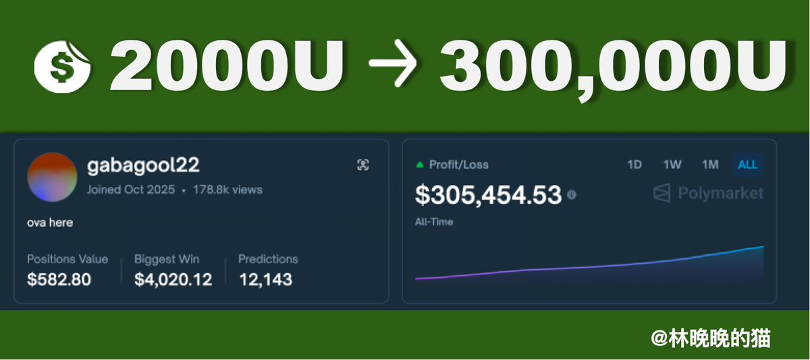

# Polymarket BTC 15分鐘盤口套利機器人策略分析

> **來源**: [@linwanwan823](https://x.com/linwanwan823/status/2001932533177721161)
>
> **日期**: Fri Dec 19 08:28:04 +0000 2025
>
> **標籤**: `量化交易` `價差套利` `預測市場`

---



## 案例背景

2024年10月21日，Polymarket 上線了「15分鐘 BTC 漲跌盤」功能。8天後，一個機器人地址開始以小倉位試水。52天後，該機器人以2000美元本金累計獲利30.5萬美元，回報率達150倍。

該機器人的交易特徵：
- 每分鐘可執行15筆訂單
- 明顯的程式化交易模式
- 不同於傳統雙向對沖策略

## 核心策略拆解

### 1. 分時低吸策略

機器人不採用同時買入 YES/NO 雙邊的傳統對沖方式，而是：

- 等待 **YES** 價格跌破 **35¢** 時買入
- 等待 **NO** 價格跌破 **35¢** 時買入
- 在不同時間點分別入場

### 2. 成本控制目標

核心目標是讓 **YES + NO 的加權平均成本 < $0.99**

- 不需要同一秒買入雙邊
- 只要最終持倉的加權平均成本低於 $1 即可鎖定利潤
- 利用散戶情緒波動造成的錯誤定價

### 3. 風險控制機制

如果無法成功對沖：
- 直接平倉退出
- 零虧損或微虧離場

## 市場錯誤定價原理

| 理論定價 | 實際市場 | 套利機會 |
|---------|---------|---------|
| Up + Down = 100¢ | 恐慌時 Up 跌至 30¢ | YES 成本 < 35¢ |
| 結算時正確選項 = 100¢ | 貪婪時 Down 跌至 25¢ | NO 成本 < 35¢ |
| 錯誤選項 = 0 | 雙邊加權均價 < 99¢ | 鎖定利差 |

## 策略邏輯總結

```
1. 等待 Up 跌破 35¢ → 買入
2. 等待 Down 跌破 35¢ → 買入
3. 不同時間點分時入場
4. 雙邊加權平均成本 < 99¢ → 利潤鎖定
5. 找不到對沖機會 → 平倉退出（零虧損）
```

## 實務觀察

### 不適合散戶跟單的原因

- **速度劣勢**：機器人賺的是毫秒級價差，每分鐘15單的執行速度
- **時機落差**：散戶看到機會時，機器人可能已經吃飽離場
- **技術門檻**：需要高頻交易基礎設施

### 市場意義

Polymarket 的量化時代已經開始：
- 傳統預測市場開始被程式化交易滲透
- 高頻套利策略在預測市場的應用案例
- 散戶情緒波動成為量化機器人的獲利來源
