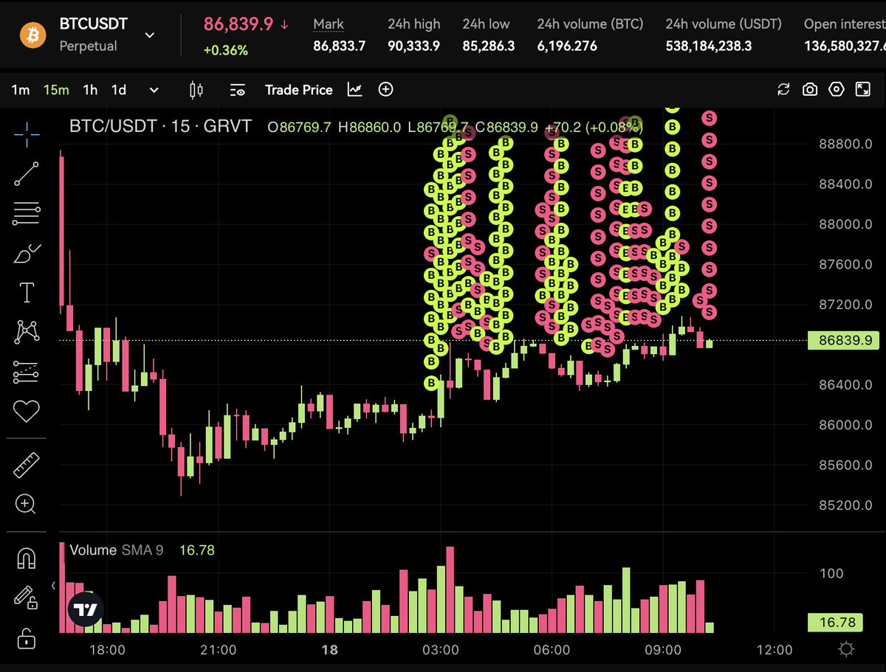
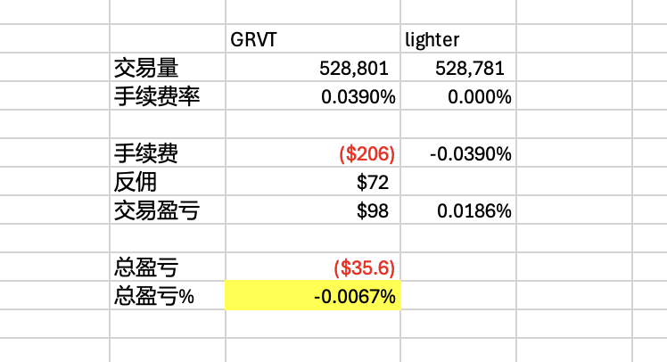

# GRVT 擇時對沖腳本：0.0067% 最低磨損策略

> **來源**: [@yourQuantGuy](https://x.com/yourQuantGuy/status/2001584115200520463) | [原文連結](https://grvt.io/exchange/sign-up?ref=QUANT)
>
> **日期**: 
>
> **標籤**: `對沖交易` `量化腳本` `交易所套利`

---




```markdown
## 概覽

| 項目 | 數據 |
|------|------|
| 策略類型 | 擇時對沖（Timing-based Hedging） |
| 磨損率 | 0.0067%（12小時測試） |
| 測試成本 | 35U 虧損 |
| 測試交易量 | 53萬 USDT |
| 測試時長 | 12小時 |
| 市價單手續費 | 0.039% |
| 測試本金 | GRVT + Lighter 各 1萬 U |
| 最大槓桿 | 4.5倍 |

---

## 策略原理

擇時對沖不同於傳統對沖策略的盲目掛單，而是透過數據收集與分析，等待最佳價差時機才執行對沖操作。程序啟動後需約 20 分鐘收集數據，半小時後開始實際交易。

---

## 優缺點分析

### 優點

1. **極低磨損率**：相比普通對沖策略，磨損僅 0.0067%，大幅降低交易成本
2. **高積分效率**：使用市價單（Taker Order）執行，GRVT 平台給予市價單更高的積分權重
3. **成本可控**：測試數據顯示用 35U 虧損完成 53 萬交易量，ROI 極佳

### 缺點

1. **交易量較小**：因需等待價差時機，交易頻率低於簡單對沖策略

---

## 實戰配置

### 運行指令

```bash
python hedge_mode.py --exchange grvt --v2 --ticker BTC --size 0.02 --iter 10 --max-position 0.5
```

### 參數說明

| 參數 | 說明 | 範例值 |
|------|------|--------|
| `--exchange` | 交易所 | grvt |
| `--v2` | 啟用擇時對沖模式 | - |
| `--ticker` | 交易標的 | BTC |
| `--size` | 每單開倉數量 | 0.02 BTC |
| `--max-position` | 最大持倉限制 | 0.5 BTC |
| `--iter` | 迭代次數（此模式下無實際作用） | 10 |

### 風險提示

- 最大槓桿 4.5 倍（測試配置），可依風險承受度調整
- 更高槓桿可提升交易量，但風險相應增加
- 建議先小資金測試，觀察實際磨損率與積分效率

---

## 活動福利

Your Quant Guy 與 GRVT 合作三週社群活動：

- **1.3X 積分加成**
- **全網最高反佣**
- 使用邀請碼註冊即可參加

> 私信作者加入 Telegram 社群獲取參賽碼

---

## 延伸思考

1. **資金效率**：53 萬交易量僅需 35U 成本，相當於每 1U 成本可產生約 15,142U 交易量
2. **積分套利**：市價單積分權重更高，適合追求平台積分的量化玩家
3. **雙交易所對沖**：GRVT + Lighter 組合，需考量兩邊流動性與價差穩定性

---

## 相關資源

- GRVT 邀請連結：[官方註冊頁面](https://t.co/L1jPEgtH7O)
- 腳本作者：[@yourQuantGuy](https://twitter.com/yourQuantGuy)
```
