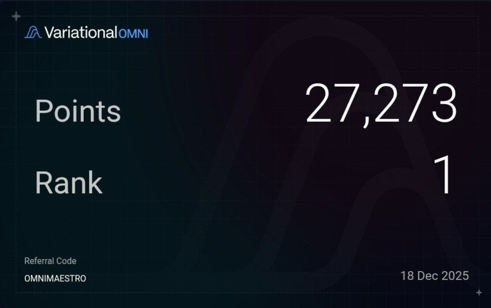

# Variational IO 積分農場策略與交易分析

> **來源**: [@Defi_Maestro](https://x.com/Defi_Maestro/status/2001491430586638434) | [原文連結](https://omni.variational.io/?ref=OMNIMAESTRO)
>
> **日期**: 
>
> **標籤**: `點數農場` `方向性交易` `交易量`

---

# Variational IO 積分農場策略與交易分析

> **來源**: [@Defi_Maestro](https://twitter.com/Defi_Maestro)
> **日期**: 2026-02-14
> **標籤**: `variational-io` `積分農場` `delta-neutral` `交易策略`

---

## 快速總覽

| 項目 | 說明 |
|------|------|
| **主要積分來源** | 方向性交易（85%）+ 轉介（15%） |
| **持倉週期** | 1-7 天短期交易為主 |
| **交易標的** | 40% BTC/ETH，60% 山寨幣 |
| **總交易量** | 9 位數美元等級 |
| **策略差異** | 純 BTC/ETH 帳戶積分效率較低 |

## 積分農場策略細節

### 交易配置

作者使用多帳戶策略，將不同風險偏好的交易分散執行：

- **主力帳戶**（排名第一）：執行方向性交易
- **其他帳戶**：執行 Delta Neutral（對沖策略）

這種分離有助於：
1. 風險隔離
2. 策略優化（發現純 BTC/ETH 交易積分效率較低）
3. 保持主力帳戶的高積分產出

### 持倉與交易頻率

- **持倉時長**：1-7 天（短期波段）
- **代幣選擇**：偏好山寨幣（佔 60%），利用波動性提高交易量
- **轉介收益**：約佔總積分 15%，顯示平台推薦機制的價值

### 關鍵發現

**同等交易量下，交易標的影響積分效率**：
- 混合交易（BTC/ETH + 山寨幣）積分產出 > 純 BTC/ETH 交易
- 可能原因：平台鼓勵多元化交易或山寨幣交易有額外積分加成

## Variational IO 平台展望

### 積分分配策略

作者觀察到平台保留大量積分用於後續賽季，推測原因：

1. **預期更高交易量**：隨平台成熟，吸引更多大型交易者
2. **新產品線激勵**：為多元產品預留積分池

### 即將推出的產品線

| 產品 | 說明 |
|------|------|
| **OLP** | Option Liquidity Pool（選擇權流動性池） |
| **Variational Pro** | 專業交易工具 |
| **Variational Omni** | RWA（真實世界資產）交易 |
| **Trading API** | 程式化交易接口 |

這些產品顯示 Variational 正從單純的交易平台轉型為綜合性 DeFi 基礎設施。

## 競爭態勢與挑戰

作者坦言：

> "將很難維持排名第一的位置，因為更大資金量的交易者將進場。"

這反映了積分農場的普遍現象：
- 早期參與者有先發優勢
- 但隨平台成長，大戶將主導排行榜
- 持續保持優勢需要不斷調整策略

## 實務啟示

### 對積分農場者

1. **多帳戶策略**：分離不同風險等級的交易
2. **標的選擇**：測試不同資產的積分效率
3. **轉介收益**：不容忽視的被動收入來源
4. **持倉週期**：短期波段可能比長期持有更有效率

### 對平台觀察者

1. **產品多元化**：注意新產品線的積分機制
2. **競爭加劇**：早期紅利窗口逐漸關閉
3. **積分經濟設計**：平台如何平衡早期用戶與新用戶激勵

---

**gVAR 代幣**：作者提及的治理代幣，可能與積分兌換或平台收益分享相關。
