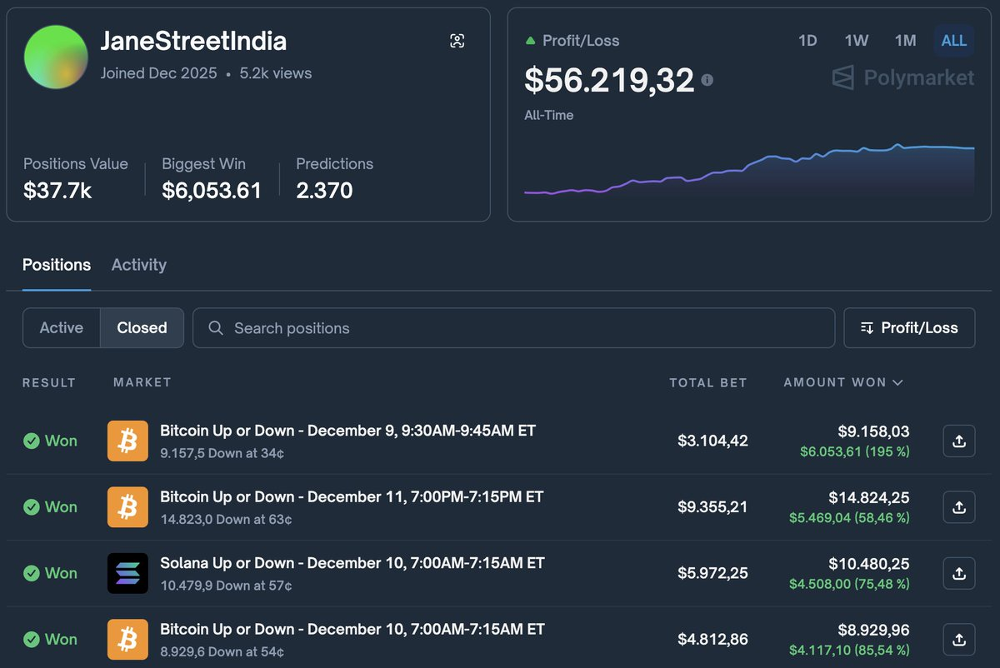

# Polymarket 15分鐘錯價套利：交易延遲而非幣種

> **來源**: [@carverfomo](https://x.com/carverfomo/status/1999839092545093809)
>
> **日期**: Sat Dec 13 13:49:29 +0000 2025
>
> **標籤**: `短線交易` `市場微觀結構` `套利策略`

---

# Polymarket 15 分鐘錯價套利策略

## 核心策略概覽

| 項目 | 說明 |
|------|------|
| 交易標的 | Polymarket 15 分鐘時間框架預測市場（BTC、ETH、SOL、XRP） |
| 套利來源 | 現貨價格快速波動與 Polymarket 盤口報價之間的延遲差異 |
| 進場時機 | 現貨價格突破後，15 分鐘盤口尚未重新計算時 |
| 出場時機 | 盤口賠率回歸至合理水平時立即平倉 |
| 累積收益 | $56K+ (All Time) |
| 核心優勢 | 交易延遲而非幣種方向，避免持倉風險和敘事風險 |

## 策略機制分析

### 延遲窗口套利原理

這個策略並非預測加密貨幣的漲跌方向，而是捕捉市場結構性的延遲機會：

1. **現貨市場快速移動**：BTC、ETH、SOL 或 XRP 在現貨市場已經突破關鍵價位
2. **Polymarket 盤口滯後**：15 分鐘時間框架的預測市場盤口尚未即時反應
3. **錯價窗口出現**：在盤口重新計算前，形成短暫但可重複的套利機會

### 執行特徵

交易記錄顯示清晰的執行模式：

- **大倉位集中在動能確認後**：只有在現貨價格移動被確認後才加大倉位
- **薄盤口進場**：選擇流動性較低、價格調整較慢的時段進場
- **快速平倉**：一旦賠率回歸正常水平立即退出

**關鍵原則**：
- ✅ 不持有部位過夜
- ✅ 不承擔敘事風險（narrative risk）
- ✅ 只交易重新計算的時間差

## 案例實例

執行範例可參考交易員 JaneStreetIndia 的即時倉位：
- Market: Down - Bitcoin Up or Down (15m)
- 操作邏輯：Bitcoin 現貨價格向下突破後，15 分鐘盤口尚未調整前做空

## 策略總結

> **這不是在交易幣種的方向，而是在交易延遲本身。**

這個策略的可重複性來自於：
1. Polymarket 15 分鐘框架的固有延遲特性
2. 加密貨幣現貨市場的高波動性
3. 盤口重新計算前的系統性錯價窗口

交易員通過嚴格的風險控制（快進快出、不持倉過夜）和精準的時機把握，將這個結構性機會轉化為穩定的現金流。
