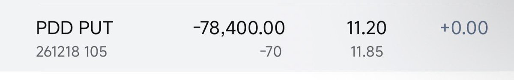

# PDD 賣空期權策略：雙贏的保險公司套利

> **來源**: [@WinForKakei](https://x.com/WinForKakei/status/2000137075228889474)
>
> **日期**: Sun Dec 14 09:33:34 +0000 2025
>
> **標籤**: `期權售賣` `現金擔保看跌期權` `套利策略`

---

以下是整理後的文章內容：

---

## 策略概述

本週 PDD 因小作文導致股價下跌，作者趁機賣出 2026 年 12 月 18 日到期的看跌期權（Put Options），建立一個雙向獲利的策略結構。

## 部位結構

| 項目 | 數值 |
|------|------|
| 賣出 Put 數量 | 70 張（7000 股） |
| 對應本金 | $735,000 |
| 每張權利金 | $11.85 |
| 總權利金收入 | $82,950 |

## 情境一：未行權（看跌期權到期作廢）

如果到期時 PDD 股價高於履約價，期權不會被行權，本金不需購買股票。此時收益來源：

| 收益項目 | 計算方式 | 金額（美元） |
|---------|----------|-------------|
| 本金理財收益 | $735,000 × 8% APR | $58,800 |
| 權利金收入 | $11.85 × 70 張 | $82,950 |
| 權利金再投資 | 權利金投貨幣基金一年 | $3,000 |
| **總收益** | | **$144,750** |
| **年化報酬率** | $144,750 / $735,000 | **19.7%** |

> 💡 **關鍵假設**：本金放在 Aave、Spark、CEX 等低風險理財平台，可獲得約 8% 的穩定年化收益。

## 情境二：行權（被迫以履約價買入股票）

如果到期時股價低於履約價，期權被行權，需以約 $105/股（$735,000 ÷ 7000 股）買入 PDD 股票。此時獲得的資產：

### PDD 基本面分析（2026 年預估）

| 指標 | 數值 |
|------|------|
| 市值 | 1,300 億美元 |
| 非受限淨現金 | ~700 億美元 |
| 年度盈利 | ~150 億美元 |
| **扣除現金後 PE** | **(1,300 - 700) / 150 = 4** |

> 📊 **估值邏輯**：以 PE = 4 的價格買入一家每年賺 150 億美元、帳上有 700 億現金的公司股權，屬於深度價值投資機會。

## 策略核心：保險公司式思維

這個策略展現了「雙贏結構」：

1. **未行權情境**：賺取 19.7% 年化報酬，相當於保險公司收取保費後未發生理賠
2. **行權情境**：以低估值價格買入優質資產，相當於保險公司用理賠金購置價值資產

無論市場走向如何，策略設計者都能獲得合理回報，這正是保險公司經營的本質——**收取風險溢價，並在最壞情況下仍能獲得有價值的資產**。

## 風險提示

儘管策略設計精巧，仍需注意：

- **股價大幅下跌風險**：若 PDD 基本面惡化，被迫接股後可能面臨帳面虧損
- **流動性風險**：本金被鎖定至到期日，期間無法靈活調配
- **理財收益假設**：8% APR 並非保證收益，實際可能因市場環境變化
