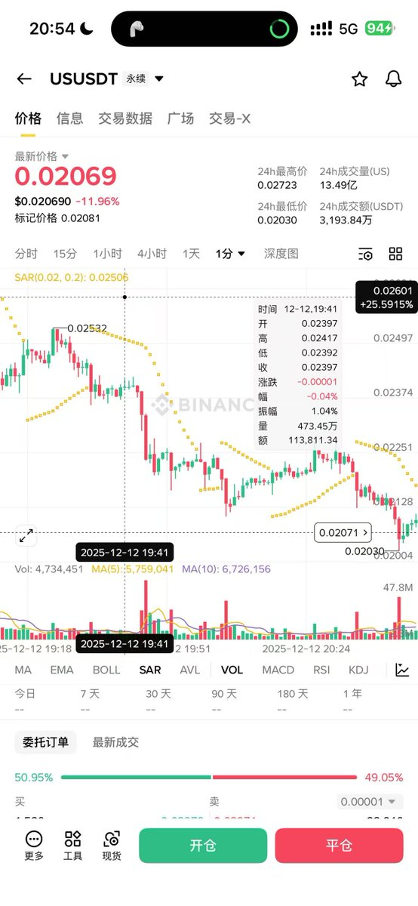
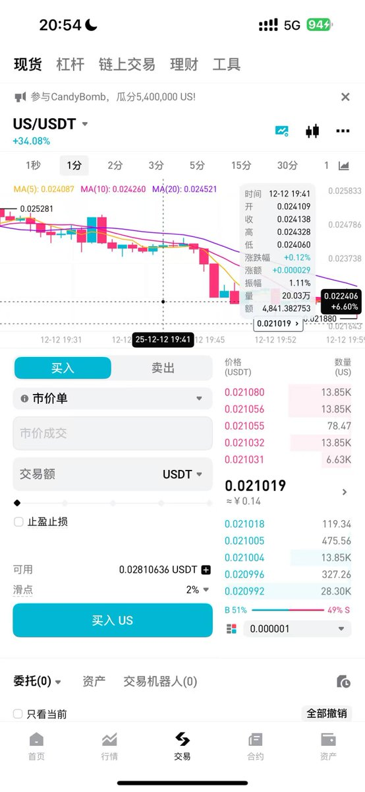

# 幣安 US 合約上市套利機會分析

> **來源**: [@fivepointwater5](https://x.com/fivepointwater5/status/1999465556798591055)
>
> **日期**: Fri Dec 12 13:05:11 +0000 2025
>
> **標籤**: `跨交易所套利` `現貨合約價差` `資金費率`

---

> **來源**: [@fivepointwater5 (五点水)](https://x.com/fivepointwater5)  
> **日期**: 2024-12-12  
> **標籤**: `套利` `合約` `Launchpool` `資金費率` `幣安` `Bitget`

---

## 核心策略概覽

| 項目 | 說明 |
|------|------|
| **套利邏輯** | 利用現貨 Launchpool 高年化 + 合約負資金費率套保 |
| **執行平台** | Bitget 現貨 + 幣安（或其他）合約 |
| **盈利來源** | Launchpool 利息收益 + 負資金費率收益 |
| **風險點** | Bitget 提現風險、跨鏈橋流動性、價格偏差 |

---

## 事件背景

2024 年 12 月 12 日 19:00，幣安宣布上線 US 合約。同時期 Bitget 正在進行 US 的 Launchpool 活動。觀察兩個平台的價格：

- Bitget 現貨價格與幣安合約價格大致相同
- 價差僅約 0.1%
- 這為套利創造了低風險入場機會

---

## 盈利點分析

**核心邏輯**：

1. Bitget Launchpool 年化收益率極高
2. 大量資金湧入現貨市場買入 US 參與 Launchpool
3. 為規避價格波動風險，投資者會在合約市場開空對沖
4. 導致合約市場空方力量增強，資金費率轉負
5. 最終形成：**現貨價格 > 合約價格**（負溢價）

**雙重收益**：
- Launchpool 質押利息
- 合約負資金費率收入（空方收取多方的費用）

---

## 風險評估

| 風險項 | 檢查點 |
|--------|--------|
| **提現風險** | 確認 Bitget US 提現功能是否正常運作 |
| **跨鏈流動性** | 檢查是否有跨鏈橋支援 US 轉移 |
| **指數價格風險** | 分析幣安合約指數價格成分與權重 |
| **價格偏離** | 監控現貨-合約價差是否過大 |

**風險偏好建議**：
- 高風險承受者：可執行完整策略
- 保守型投資者：建議觀望或降低倉位

---

## 策略執行流程

### 步驟一：建倉
1. 在 Bitget 買入 US 現貨
2. 在幣安（或其他合約平台）開等量空單對沖

### 步驟二：持倉管理
1. 將 Bitget 現貨轉入 Launchpool 賺取利息
2. 監控合約資金費率變化
3. 等待合約出現負溢價（現貨價 > 合約價）

### 步驟三：平倉
1. 在資金費率結算前平掉合約空單
2. 贖回 Launchpool 質押的 US
3. 計算總收益：Launchpool 利息 + 負資金費率收益 + 價差收益

---

## 實際驗證

作者雖未親自執行（資金在鏈上 + 伺服器過期問題），但向他人提供建議後，市場確實按預期發展：

✅ 合約資金費率轉負  
✅ 現貨價格高於合約價格  
✅ 套利窗口如期出現

---

## 策略要點總結

- **時機選擇**：新幣種上線合約 + Launchpool 活動同時期
- **風險對沖**：現貨多頭 + 合約空頭完全對沖價格風險
- **收益疊加**：質押收益 + 資金費率收益 + 可能的價差收益
- **關鍵監控**：提現功能、跨鏈流動性、資金費率走勢
