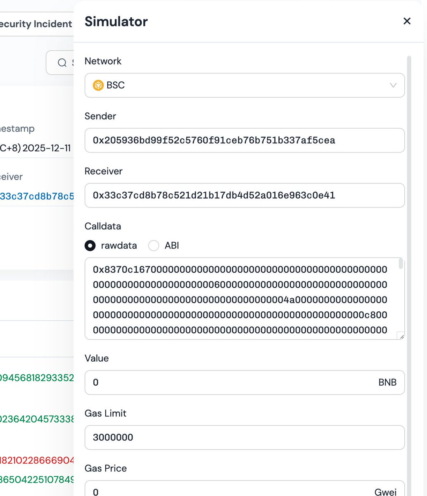
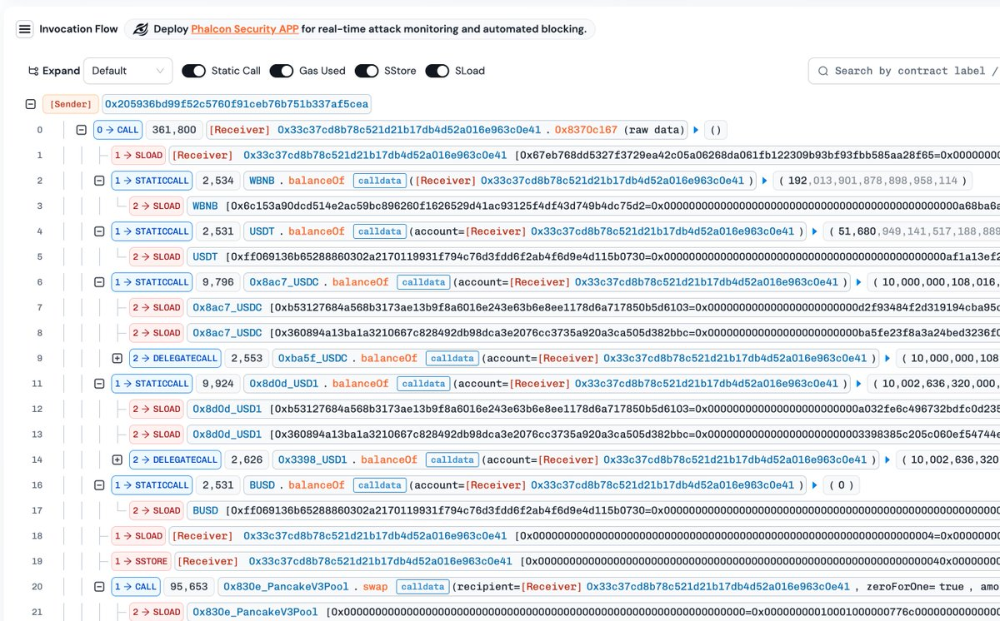
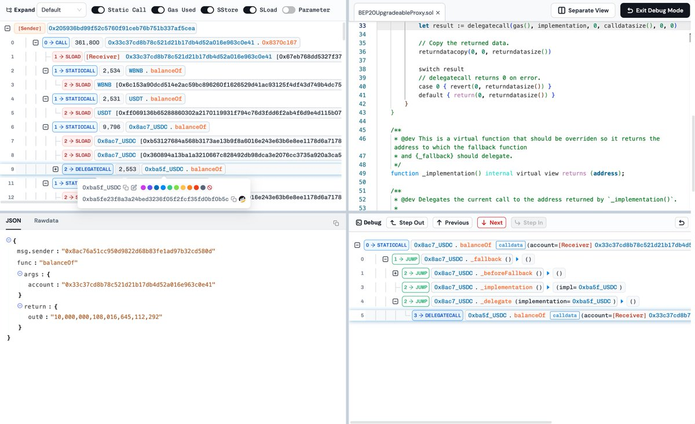
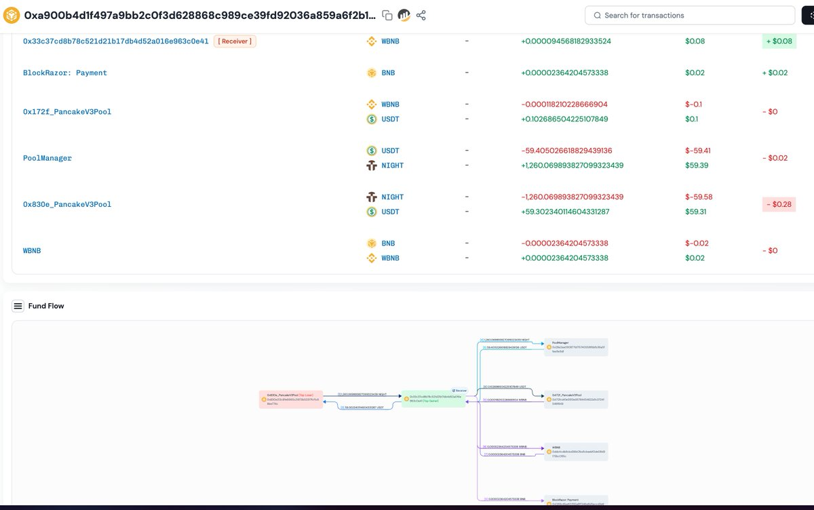

# Phalcon：鏈上套利機器人的調試與模擬工具

> **來源**: [@0xmomonifty](https://x.com/0xmomonifty/status/1999147873825591388)
>
> **日期**: 
>
> **標籤**: `套利機器人` `交易模擬` `鏈上開發`

---

> **來源**: [@0xmomonifty (0xMomo🕊️)](https://x.com/0xmomonifty)
> **日期**: 2026-02-15
> **標籤**: `Phalcon` `鏈上套利` `交易模擬` `調試工具` `BlockSec`

---

## 概述

Phalcon 是 BlockSec 推出的免費鏈上套利 Bot 開發與調試工具，相較於常用的 Tenderly，Phalcon 提供了更靈活的交易模擬與調試功能，特別適合學習與開發鏈上 Bot 使用。

## 核心功能

### 🔸 Simulator（交易模擬器）

**特色**：允許用戶在任意區塊的任意位置模擬交易

**使用場景**：
- 發現套利機會（如 V2/V3 套利）時，無需上鏈實測即可驗證策略
- 可模擬在特定交易之前或之後插入自己的交易（如測試三明治攻擊效果）
- 精準計算扣除 Gas 後的實際盈利

**可自定義參數**：
| 參數 | 說明 |
|------|------|
| Sender | 發送者地址 |
| Receiver | 接收者地址 |
| Calldata | 調用數據 |
| Value | 交易金額 |
| Gas | Gas 設定 |
| Block Number | 指定區塊高度 |
| Position in Block | 在區塊中的位置 |

### 🔸 Debugger（調試器）

**特色**：樹狀結構展示合約調用流程（Call Trace）

**功能亮點**：
- 分級展示複雜合約的執行細節
- 支援過濾器搜索、Gas 消耗追蹤、Static Call 標記
- 地址操作：複製/添加標籤/高亮/跳轉到區塊鏈瀏覽器
- Single-step debug 逐步調試
- 顯示合約源代碼調用位置
- 展示調用參數與返回值

### 🔸 余額變化 & 資金流動圖

**特色**：視覺化呈現代幣變化與資金流向

**優勢**：
- 圖形化展示資產流動，取代區塊鏈瀏覽器的生硬 in/out 記錄
- 快速分析錢包資產變化
- 直觀檢查套利 Bot 的流程是否正確與是否盈利

## 實用工具推薦

### MetaSuites 瀏覽器插件

安裝 MetaSuites 後，可在 Etherscan 查看交易時一鍵跳轉至 Phalcon 進行模擬，提供更流暢的開發體驗。

## 適用對象

- 鏈上套利 Bot 開發者
- 智能合約安全研究員
- 需要精準交易模擬與調試的開發者
