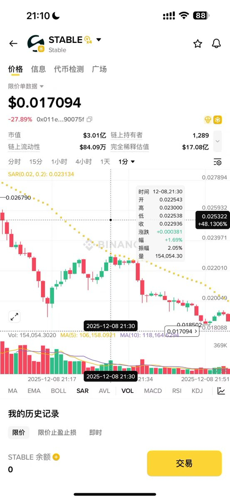
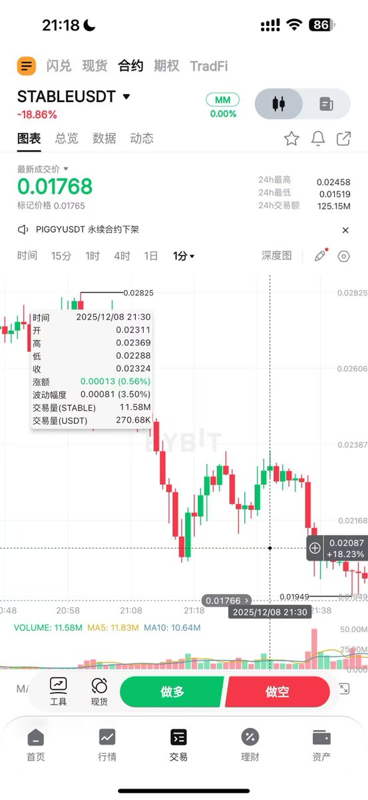
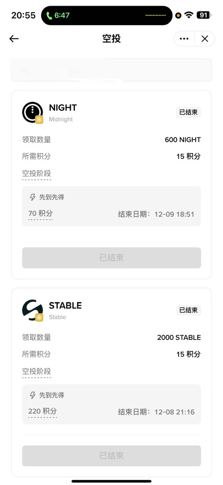
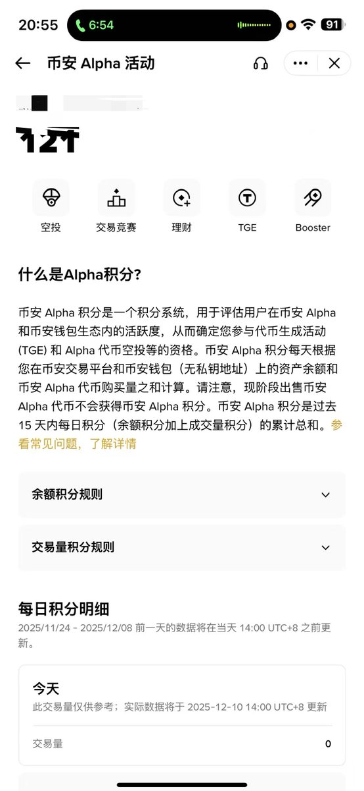

# 穩定幣 Alpha 交易套利實戰分析 - 現貨合約價差機會

> **來源**: [@fivepointwater5](https://x.com/fivepointwater5/status/1998383681954853292) | [原文連結](https://x.com/fivepointwater5/status/1991486483379953990)
>
> **日期**: 
>
> **標籤**: `套利策略` `穩定幣交易` `現貨合約價差`

---

★ Insight ─────────────────────────────────────
**處理知識庫文章整理任務**
- 這是一篇加密貨幣套利實戰分析，應歸類到 `quant-trading` 分類
- 內容包含具體案例分析（Stable 代幣 Alpha 交易）、盈利點識別、風險評估和執行決策
- 核心價值在於展示多市場價差套利的完整思考框架
─────────────────────────────────────────────────

根據原始內容，這篇文章適合整理成結構化的案例分析。以下是正文內容：

---

## 案例背景

2024 年 12 月 8 日上午 9 點，Stable 代幣在幣安 Alpha 交易開放，同時在其他交易所同步開放現貨交易。這為觀察三個市場（合約、現貨、Alpha）的價格差異提供了機會。

## 市場觀察與盈利點

### 價格差異分析

| 市場類型 | 價格表現 | 價差範圍 |
|---------|---------|---------|
| 合約 vs 現貨 | 價格接近 | 0.5 點以內波動 |
| Alpha 市場 | **負溢價** | 1-2 個點 |

**核心發現**：儘管合約和現貨價格差異不大，但 Alpha 市場存在 1-2 個點的負溢價，這是主要的套利空間。

## 風險評估

### 主要風險因素

1. **現貨不確定性風險**
   - 幣安未公布上線現貨的明確消息
   - 若現貨無法上線，可能導致價差無法收斂

2. **跨鏈橋風險**
   - Alpha 的 Stable 代幣在 BSC 鏈上
   - 其他交易所的 Stable 都在 Stable 鏈上
   - 未找到可用的跨鏈橋工具
   - 可能出現類似 AIA 的價格不收敛情況

3. **溢價規模風險**
   - 1-2 點的溢價相對有限
   - 相比明確上線現貨的情況，風險報酬比不夠吸引人

## 執行決策

**最終選擇：不執行**

決策理由：
- 幣安帳戶資金不足
- 風險不夠可控（跨鏈橋不明確 + 現貨上線不確定）
- 溢價空間相對較小
- 若幣安明確上線現貨，會果斷執行

## 經驗總結

1. **多市場比價**是發現套利機會的關鍵
2. **跨鏈橋的可用性**直接影響價差收斂預期
3. **交易所明確公告**（如現貨上線）可大幅降低風險
4. 風險報酬比不足時，即使有機會也應選擇不執行

> 作者後記：因長時間未關注 Alpha，錯過空投領取（僅 70 分），損失 20 多 USDT。
