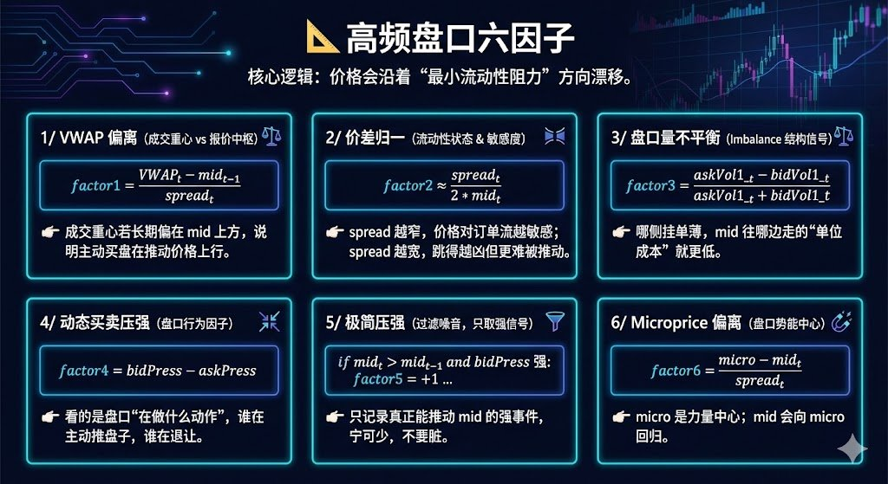

# 盤口微觀結構：高頻交易的 6 個因子模型

> **來源**: [@0xYuCry](https://x.com/0xYuCry/status/1995775488149860748) | [原文連結](https://twitter.com/safety/unsafe_link_warning?unsafe_link=http://nova-btc.xyz)
>
> **日期**: 
>
> **標籤**: `盤口分析` `高頻交易` `訂單流`

---



## 盤口微觀結構：高頻交易的 6 個因子模型

> **來源**: [@0xYuCry (YuCry)](https://twitter.com/0xYuCry)  
> **日期**: 2026-02-17  
> **標籤**: `高頻交易` `盤口微觀結構` `量化因子` `訂單流`

---

每個人都知道市場總是往「阻力最小」的方向走，但在高頻中，這種「阻力」反而是最難描述的。

以下分享在百億私募實習時接觸到的 6 個盤口因子，給有一定基礎、願意思考市場微觀結構的人參考。

## 0/ 符號解釋（L1 數據）

**買賣一檔價格與掛單量**：
- `bid1_t` / `ask1_t`：買一價 / 賣一價
- `bidVol1_t` / `askVol1_t`：買一 / 賣一掛單量

**中間價與價差**：
```
mid_t    = (bid1_t + ask1_t) / 2
spread_t = ask1_t - bid1_t
```

**成交重心（短窗口 VWAP）**：
```
VWAP_t = 成交量加權成交價
```

## 1/ VWAP 偏離：成交重心 vs 報價中樞

```
factor1_t = (VWAP_t - mid_{t-1}) / spread_t
```

- `mid_{t-1}` 是報價系統認為的公平中點
- `VWAP_t` 是資金「真實把成交落在哪」

若 VWAP 長期在 mid 上方，說明**主動買盤在挑戰當前報價共識**——多頭在用真金白銀抬價。

歸一到 spread 後能在不同標的、不同價格區間下保持可比性，也能弱化微小價差噪音。

👉 **本質是行為層面的 order flow 信號**，比分成交量或買賣手數更穩。

## 2/ 價差歸一：流動性狀態 & 波動敏感度

```
factor2_t = (ask1_t - bid1_t) / (ask1_t + bid1_t)
         ≈ spread_t / (2 * mid_t)
```

**spread ≠ 交易成本**，而是**市場狀態變量**：

- **spread 收窄** → 做市商貼近 → 小單也能推 mid → 價格對訂單流更敏感
- **spread 拉寬** → 做市商怕 adverse selection → mid 更難推，但一旦動起來跳得更猛

👉 因此 factor2 不是直接交易信號，常用於 **regime 分桶**：不同 spread 桶裡 IC 完全是兩種世界。

## 3/ 盤口量不平衡（Imbalance）：結構性信號

```
factor3_t = (askVol1_t - bidVol1_t) / (askVol1_t + bidVol1_t)
```

**本質不是「買一多 → 要漲」**。真正含義是：**哪一側的流動性更脆弱，mid 往哪裡走更省力**。

當 `bidVol1` 遠大於 `askVol1` 時：
- 向下砸盤成本高（厚 bid）
- 向上吃盤成本低（薄 ask）

👉 **imbalance 描述的是 mid 的「最小阻力方向」**。但它非常容易被「假掛單 + 高頻撤單」擾亂，因此必須配合時間維度。

## 4/ 動態壓強：從截面到「盤口動作」

**靜態**只看這一刻盤口形狀（如 factor3）；**動態**要看盤口實際在做什麼動作。

偽代碼：
```python
if ask1_t > ask1_{t-1}:      # 賣一抬價
    askPress_t = -(askVol1_t - askVol1_{t-1})
elif ask1_t < ask1_{t-1}:    # 賣一降價
    askPress_t = +askVol1_t
else:
    askPress_t = askVol1_t - askVol1_{t-1}

# 買一類似
factor4_t = bidPress_t - askPress_t
```

- **bid 抬價 + 補量** = 真買力
- **ask 下移 + 減量** = 真退讓

**價格方向 + 掛單變化同向時，才是「有效壓強」**。

與 factor3 的本質區別：
- factor3 = 靜態結構
- factor4 = 行為結構（誰在主動推盤子）

👉 高頻裡，如果你只用靜態指標，很容易被 mean reversion 打臉；**行為因子能過濾掉「只是掛著但不想成交」的假信號**。

## 5/ 極簡壓強：只記錄能動價格的事件

思路：把所有弱動作、噪音都抹掉，只保留**足夠動 mid 的強事件**。

```python
if mid_t > mid_{t-1} and bidPress_t 顯著為正:
    factor5_t = +strong_buy
elif mid_t < mid_{t-1} and askPress_t 顯著為正:
    factor5_t = -strong_sell
else:
    factor5_t = 0
```

即：**價格真跳了 + 盤口真出力 → 才算信號**。寧可少，不要髒。

適合超高頻——觸發就下單，不觸發就空倉。

👉 factor5 也常用於做模型 **gating（過濾低質量時刻）**。

## 6/ Microprice 偏離：盤口的「勢能中心」

**Microprice（權重用對側量）**：
```
micro_t = ask1_t * (bidVol1_t/(askVol1_t+bidVol1_t))
        + bid1_t * (askVol1_t/(askVol1_t+bidVol1_t))
```

**因子**：
```
factor6_t = (micro_t - mid_t) / spread_t
```

**直覺至關重要**：
- `bidVol1` 大 → micro 靠向 ask（上推傾向強）
- `askVol1` 大 → micro 靠向 bid（下推傾向強）

- **mid 是幾何中心**
- **micro 是「買賣力量計算出來的勢能中心」**

若 `micro > mid`：買方勢能更大，mid 向上漂移是回歸平衡的自然路徑。

👉 在很多市場裡，**sign(factor6) 單獨就是一個不錯的短期方向預測器**。尤其是在**窄 spread + 正常流動性**的 regime 下。

---

歡迎感興趣的一起研究。

DEXs 資金費面板公測中：https://t.co/3KQYdmrWBM
