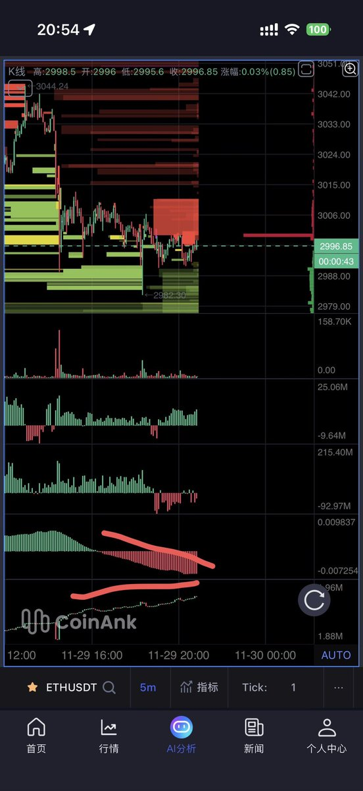

# 市場主力操盤技巧：網格託單與謊騙單模式

> **來源**: [@hazenlee](https://x.com/hazenlee/status/1994754041302450406)
>
> **日期**: Sat Nov 29 13:03:18 +0000 2025
>
> **標籤**: `盤口分析` `主力操盤` `謊騙單`

---

> **來源**: [@hazenlee](https://twitter.com/hazenlee)
> **日期**: 2026-02-17
> **標籤**: `盤口分析` `操盤技巧` `網格交易` `訂單簿`

---

## 市價推單技巧

另外還有一種就是市價推出大單區間。

市價推出區間的資金和掛單的也可以是一個人，這樣左手倒右手推盤只浪費點市價手續費而已。

關注李哥，帶你看懂市場主力的操盤小技巧🤪別問我為什麼懂這麼多，我可能是一個良心發現的主力吧🤭

## 謊騙單模式解析

單從掛單的角度確實可能會比較迷惑，但是這個就是常見的謊騙單模式。

就是極大概率下方網格託單和上方空單為一個主力，在 3000 心理關口進行右側建倉模式。

### 觀察重點

著重觀察上下大單的成交及是否撤單情況。

如果關注我比較久看過之前我的講解教學的朋友應該知道了：

- **持倉量增加價格下跌 + 費率為負下降** = 空頭主力開倉
- 所以關注下方網格多單什麼時候撤單即可
- **撤單就代表空倉建倉完成**，可以下放了

### 工具推薦

看盤口大額訂單就用 coinank [@CoinankCN](https://twitter.com/CoinankCN)

用我的邀請鏈接有免費會員同時黑五 1 刀返現免費秒殺活動！
https://t.co/i0X4YCIPBc
