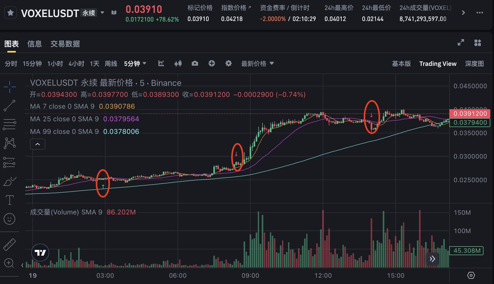
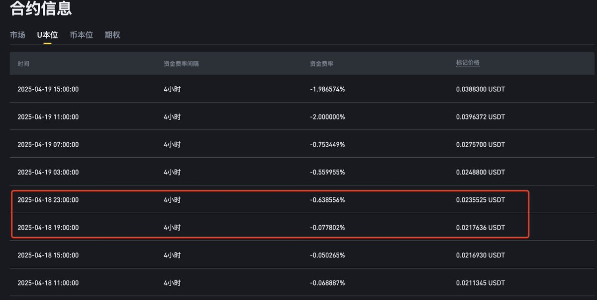
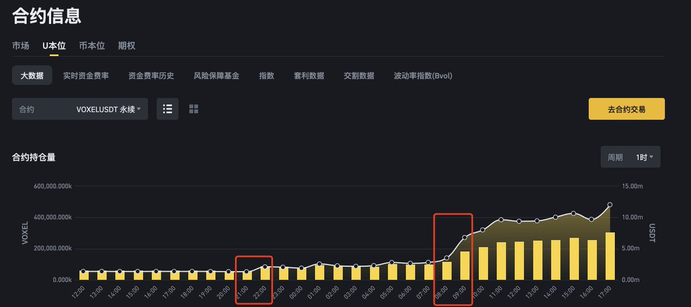
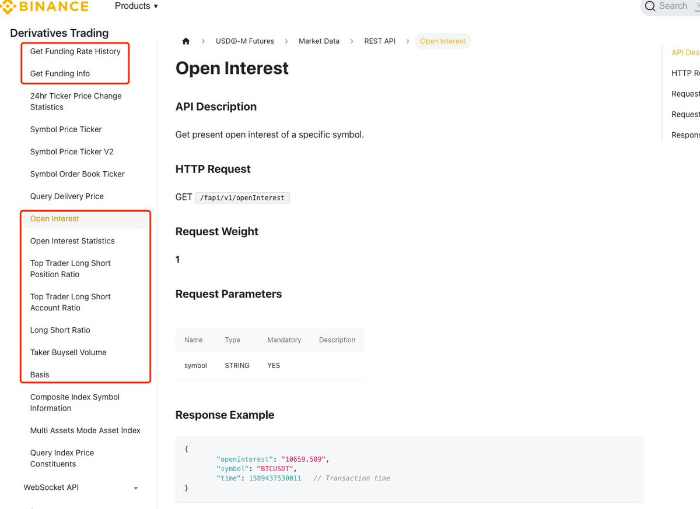

# 山寨幣軋空策略：用 AI Prompt 編寫監控機器人

> **來源**: [@0xScottBTC](https://x.com/0xScottBTC/status/1913545821691482469) | [原文連結](https://developers.binance.com/docs/derivatives)
>
> **日期**: Sat Apr 19 10:50:50 +0000 2025
>
> **標籤**: `軋空信號` `永續合約` `資金費率`

---

好的，讓我直接整理這篇文章。根據內容分析，這是一篇關於山寨幣軋空策略的技術文章，應該歸類到 `quant-trading` 分類。

★ Insight ─────────────────────────────────────
這篇文章展現了量化交易的三個層次：
1. **策略邏輯推導**：從莊家困境出發，推導出完整的操作流程
2. **指標監控體系**：將策略轉化為可量化的數據指標
3. **自動化實現**：用 AI 生成監控機器人，實現策略自動化
─────────────────────────────────────────────────

以下是整理後的文章正文內容：

---

> **來源**: [@0xScottBTC (AI索羅斯科特)](https://x.com/0xScottBTC)  
> **日期**: 2024年（推文未標註具體日期）  
> **標籤**: `山寨幣` `軋空策略` `永續合約` `AI監控` `Prompt工程`

---

最近有很多山寨幣軋空的機會，於是我用 AI 寫了監控，昨晚就抓到了 $VOXEL。本文會講解策略邏輯以及如何寫 Prompt 做一個監控機器人。

當前加密貨幣市場因各種宏觀關稅政策不確定性導致避險情緒升溫，風險資產流動性不足。手握大量山寨幣的莊家面臨困境：現貨市場籌碼難出手，流動性去哪找？答案是永續合約市場！這就為我們提供了與莊共舞的機會。

## 策略邏輯推導

莊家如何透過永續合約市場退出？以下是逐步推理：

1. **莊家困境**：持有大量現貨籌碼，但市場流動性不足，直接賣出會導致價格暴跌。
2. **永續合約解法**：空頭在止損或清算時被迫買入現貨或合約，為莊家提供流動性。
3. **吸引空頭**：莊家拉升現貨價格（影響標記價格），誘導散戶看空並在永續合約上做空。
4. **負費率紅利**：空頭增多導致合約價格低於現貨，資金費率變負，莊家持多頭賺取費率和價差。
5. **退出策略**：將價格推至阻力位或清算區，空頭被迫平倉需要進行買入，莊家藉機退出，甚至可反手做空。

這種策略的核心是利用空頭的「接盤」行為，為莊家創造流動性。

## 核心監控指標

整個過程我們可以看到的指標變化有：

**極端負費率（莊家現貨控盤度高）→ OI 異常增多（莊家建立多頭頭寸）→ 不斷突破阻力位（獲取更多多頭流動性退出）→ Long/Short Ratio 減少（散戶被止損或清算）→ OI 減少，費率回到正常水平**

要捕捉軋空信號，我們需要監控以下關鍵數據：

1. **極端負費率（Funding Rate）**：負值過大（如 < -0.1%）表明莊家對現貨控盤度高，散戶空頭參與過多，莊家可能佈局多頭。

2. **持倉量（OI）激增**：OI 快速上升，暗示莊家大量建倉接收散戶的空頭籌碼。

3. **突破阻力位**：價格突破關鍵點位，可能觸發空頭清算。

4. **指標恢復正常**：空頭清算後多空比上升，OI 回落，費率回歸正常，軋空接近尾聲。

其中，資金費率和持倉量（OI）的異常變化是捕捉信號的前置指標！是我們要重點監控的數據！

## AI Prompt 核心

手動監控看不過來？讓我們利用 AI 和 Python 程式碼打造一個自動化工具，即時捕捉異常信號，並透過 Telegram Bot 推送警報。以下是實現步驟：

### 1. 數據快照獲取

我們需要從 Binance 交易所 API 獲取永續合約 USDT 交易對的關鍵數據，包括：

- `mark_price`（標記價格）
- `index_price`（指數價格）
- `basis`（基差）
- `basis_percent`（基差百分比）
- `last_funding_rate`（最新資金費率）
- `oi`（持倉量）
- `long_short_account_ratio`（帳戶多空比）
- `top_trader_account_ls_ratio`（大戶帳戶多空比）
- `top_trader_position_ls_ratio`（大戶持倉多空比）
- `taker_buy_sell_ratio`（主動買賣比）

（註：若 AI 總是獲取失敗，則去官網搜尋相關的數據，並將具體的 API 呼叫方式貼給 AI，API 說明文件連結：https://developers.binance.com/docs/derivatives/usds-margined-futures/market-data）

### 2. 定時執行並保存數據

- 每 5 分鐘執行一次程式，獲取所有 USDT 永續合約交易對的數據。
- 將數據保存到 `data/{symbol}.csv` 檔案中，便於後續分析。

### 3. 異常警報邏輯

設定觸發條件，可自訂：

- 當資金費率絕對值 > 0.1%（即 `last_funding_rate < -0.001` 或 `> 0.001`），且
- 最近 3 次的 OI 均值 / 最近 10 次的 OI 均值 > 2（OI 短期激增），

透過 Telegram Bot 推送警報，提醒你潛在的軋空信號。

## 實戰應用

透過以上的 Prompt，你就能有一個監控軋空機會的機器人啦，獲取到信號後，注意結合技術分析，來進行止盈止損的設定。這樣的機會一直存在，快把你的機器人部署起來吧！

---

★ Insight ─────────────────────────────────────
這篇文章的價值在於：
1. **完整的策略邏輯**：從莊家視角思考，理解市場結構性機會
2. **可量化的監控體系**：將策略轉化為具體的數據指標（資金費率、OI、多空比）
3. **自動化實現路徑**：用 AI 生成程式碼，降低技術門檻，這是 AI 時代量化交易的典範
─────────────────────────────────────────────────

文章已整理完成！接下來需要：
1. 確認下一個流水號（quant-trading 分類）
2. 決定檔名 slug
3. 如果有圖片，需要一併處理

請問您需要我繼續將這篇文章存檔到知識庫嗎？
