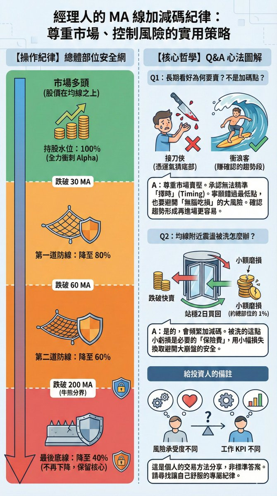

# 經理人的 MA 線加減碼紀律：尊重市場、控制風險的實用策略

> **來源**: [@Daniel_Chang411](https://x.com/Daniel_Chang411/status/1994330350202355981) | [原文連結](https://twitter.com/Daniel_Chang411/status/1994330350202355981/photo/1)
>
> **日期**: Fri Nov 28 08:59:43 +0000 2025
>
> **標籤**: `移動平均線` `加減碼策略` `風險控制`

---

★ Insight ─────────────────────────────────────
成功抓取到完整的推文內容！這是一篇關於基金經理人使用移動平均線（MA）進行倉位管理的實戰策略。內容包含完整的 Q&A 對話，展示了如何透過技術指標建立交易紀律，重點是「尊重市場」而非試圖完美擇時。
─────────────────────────────────────────────────

以下是整理好的知識庫文章正文：

---

> **來源**: [Daniel Chang (@Daniel_Chang411)](https://x.com/Daniel_Chang411/status/1987075527077994978)  
> **日期**: 2025-11-08  
> **標籤**: `量化交易` `風險管理` `技術分析` `倉位管理`

---

一個很喜歡的 Buy side 經理人對於加減碼的策略，自己覺得蠻實用的，解答我對於 time the market 的問題，分享給大家參考，也推薦大家訂閱他的專欄。

## 總體部位管理策略

紀律是：**大盤跌破 30 MA 就降總部位至 80%、跌破 60 MA 降總部位至 60%、跌破 200 MA 就降總部位至 40%，隨後 40% 不再下降。**

## 讀者提問

### Q1: 關於您在 30/60/200 MA 跌破時分批減碼的策略，有些問題想請教：

1. 如果是長期看好且走多的股票，跌破這些均線時，不是反而是好的加碼點？大盤亦然，像 2020 ~ 2021 那段上漲，事後看破季線後反而是回檔的買點
2. 如果碰到剛好在均線附近上下震盪的行情該怎麼處理，得跟著頻繁的加減碼嗎？

### A1: 策略背後的理念

**第一個問題的回答：**

原因在於，我尊重市場，也不認為自己比華爾街那些人聰明，我的能力比較是在多頭時去盡可能創造超額報酬 (Alpha)，但不認為我在空頭來臨時，我是否有那麼強的擇時能力去立刻轉空。

白話來說，就是我自認自己的擇時能力沒有這麼強，我無法做到準確的 time the market，如果真的有偶爾做到，那也只能稱的上是運氣，我認真的，不是謙虛或在假，我真的覺得只是運氣。

所以，回來您的問題，如果跌破均線，我尊重市場賣壓，股票是一買一賣，賣的人一定也有自己的看空論述，我擔心我自己只傻抱自己的多頭論述，只懂做多頭、但空頭來的時候只會無腦吃損。

至於 2020 ~ 2021 那段，或是其他很多的波段，我承認我這種做法沒辦法買在最低點，或是可能只會買在已經漲了一段我才跟上，但**我更在乎下檔風險，而非是想要買在最佳進場點**。

因為如上所述，我無法做到時時的準確 time the market，所以只能給自己設下紀律，當然這是我個人的做法，其實我拿出來分享，也不是希望別人學我，就只是單純分享而已。

另外也想跟您分享一件事，是我在對沖基金的一位前輩分享：

> 假設一檔股票從 $100 漲到 $1000，不一定要去追 $100~150 的漲幅，更重要的是，我們能夠確認 $150 到之後 $500 甚至更高的這段漲幅，**賺趨勢的錢、會比找第一波進場容易**。

**第二個問題的回答：**

是的，舉例來說，大盤跌破 30 MA 就降總部位至 80%，而我手上目前 90% 持股，所以如果大盤跌破 30 MA，我勢必開始調降部位，而如果跌破 30 MA 沒多久就漲回來，那就補回來這 10%，沒錯。

所以被洗的其實就是這 10% 資金，然後跌破後很快賣出，**站上後 2 個交易日不破，我就買回來**。

而我的經驗是，其實短波的來回，股價差距通常不會很多，假設這樣一檔股票來回一趟被洗 5 ~ 10%，其實也就是總部位的 10% 然後裡面的 5 ~ 10% 股價差距虧錢，而我願意這樣控制我的下檔風險。

上面說的這些都是個人的交易方法，因為有讀者問，我才拿出來分享，所以值得注意的是，方法真的每個人都不同、因為風險承受度、工作 KPI 也不一樣，所以以上是我個人的交易方法，還是希望大家找到屬於自己舒服的方式就好，不用參考我的。

## 單一標的操作策略

### 1. 建倉策略（以均線為依據）

我會觀察是否站上均線，譬如說，AXXX 現在靠近 120 MA 位置，假設我手上沒倉位，我可能建 30% 左右倉位，因為 60 MA 以下我通常不喜歡做多，然後站上 60 MA 再進行下一次加倉，30 MA 以上就需要將部位加到至少 80%。

### 2. 停損策略（基本面沒問題的前提下）

如果該檔股票的基本面認為沒問題，那麼：
- **跌破 30 MA**：將該檔持股部位降至目標部位的 80%（我個人每檔目標部位佔總持股部位為 10%）
- **跌破 60 MA**：將該檔持股降至目標部位的 60%
- **跌破 200 MA**：降至 40%，隨後不再調降，因為我認為基本面沒問題，我反而會等待重新加倉機會

---

★ Insight ─────────────────────────────────────
這篇文章的核心價值在於展現專業投資人的「紀律優先於預測」思維：

1. **承認能力邊界**：明確區分自己的優勢（多頭創造 Alpha）與劣勢（空頭擇時），不追求全能
2. **下檔保護優先**：寧可錯過最佳買點，也要避免無腦抱股造成重大損失
3. **趨勢跟隨哲學**：「賺 $150→$500 比搶 $100→$150 容易」，放棄底部摸頂的執念
4. **可量化的紀律**：具體的 MA 數值（30/60/200）與倉位比例（80%/60%/40%），避免主觀判斷

這種方法特別適合需要穩定績效的專業投資人，因為他們的 KPI 是「長期穩定報酬」而非「單次抄底成功」。
─────────────────────────────────────────────────
