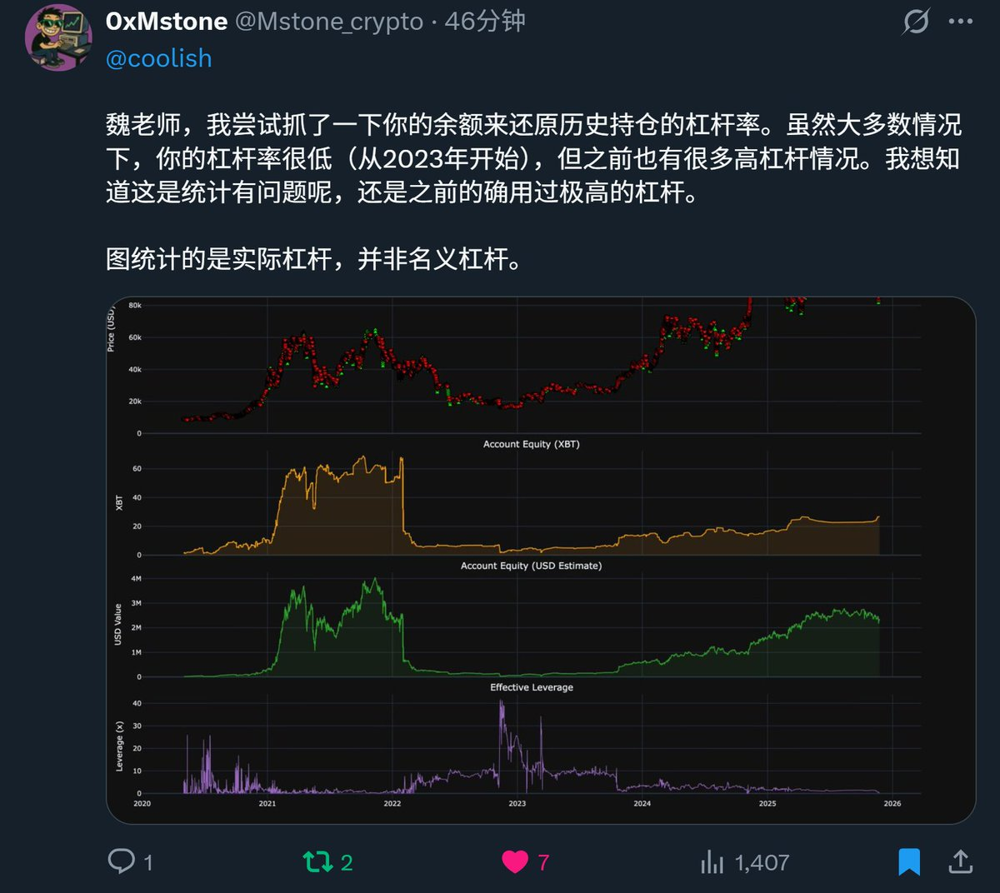
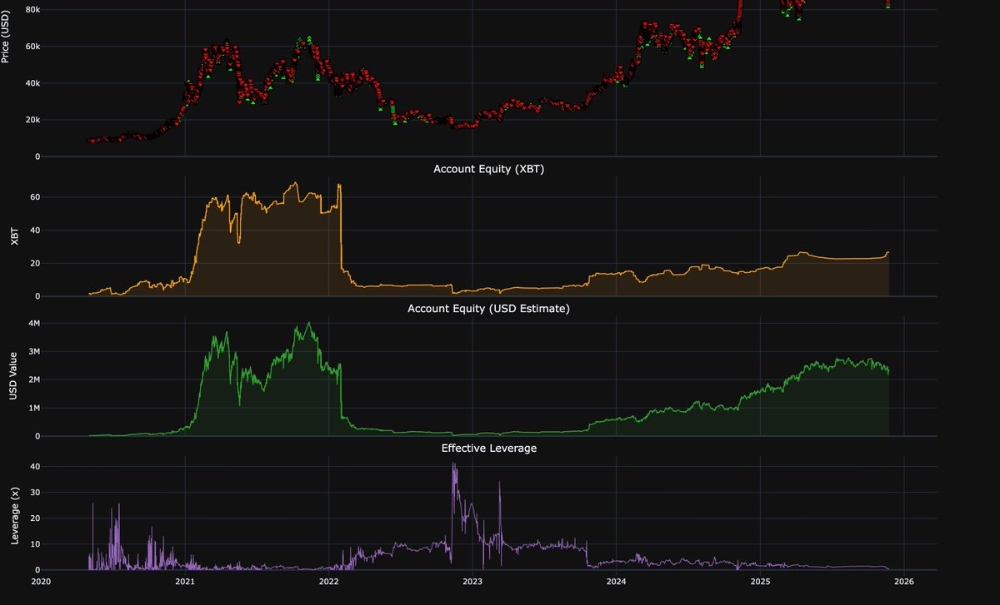
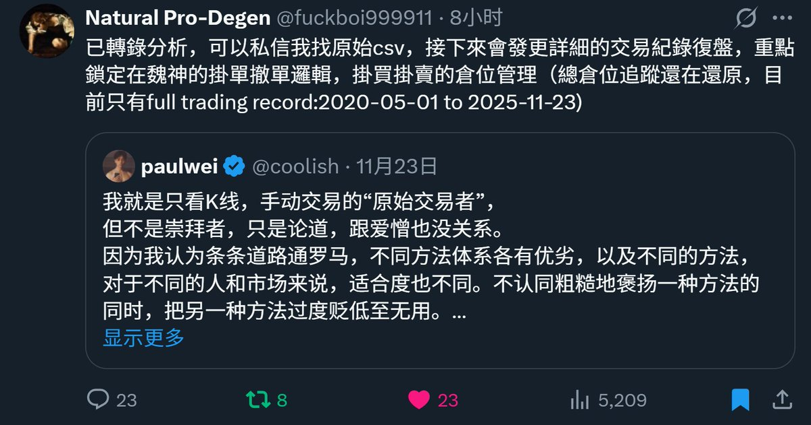
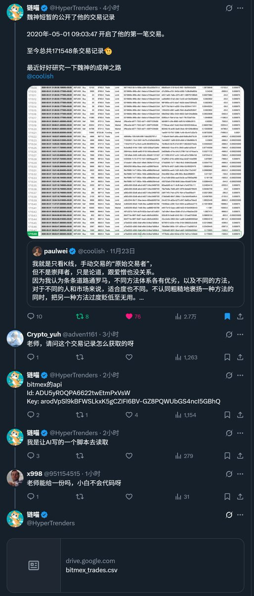

# 公開實盤 API 與交易數據的社群協作價值

> **來源**: [@coolish](https://x.com/coolish/status/1993190610745098589) | [原文連結](https://x.com/Mstone_crypto/status/1992943911682318563)
>
> **日期**: 
>
> **標籤**: `開放數據` `實盤分析` `社群智慧`

---

> **來源**: [@coolish (paulwei)](https://twitter.com/coolish)
> **日期**: 2025-02-17
> **標籤**: `實盤交易` `開放數據` `社群協作` `交易分析`

---

## 公開實盤 API 的先行實驗

我應該是第一個把自己 CEX 實盤只讀 API 直接公佈於眾的人。

一兩天的工夫，已經有好幾個推友公開分享，把我 2020 年 5 月～2025 年 11 月，長達 5 年半、每天不間斷的交易數據，扒了底朝天。

## 社群自發的數據分析

### @Mstone_crypto 的槓桿率可視化

- 連結：https://t.co/jYMB5M7ZLl
- 獨到的 2020 年～2025 年「實際槓桿率」可視化

### @fuckboi999911 的原始數據分享

- 連結：https://t.co/fo6543skav
- 導出 60 多 MB 原始數據 CSV
- 事先詢問過後，放到網盤分享給推友

### @HyperTrenders 的公開下載

- 連結：https://t.co/tktreSIc3S
- 直接把 20 多 MB 的 CSV 公開下載鏈接

跟這些推友都素不相識，事先也沒有私聊過，但對公開事物真相的認真研究求索、分享精神不謀而合。

## 其他基於實盤的深度分析

### @wendy_2026 的迭代式分析

- 連結：https://t.co/FGI5BpUeqR
- 已經是第 7 篇分析
- 相對前面幾篇的洞察深度、角度有明顯的迭代進步

### @bitares 的 Vibe Coding 實踐

- 連結：https://t.co/g0VnHRj0vF
- 用我的 HyperLiquid 實盤練習 Vibe Coding 可視化需求
- 甚至可視化到 TradingView 上

## Open Intelligence 的魅力

這是一種我眼中「Open Intelligence」的魅力。

也關聯呼應我之前的一些推文：

- https://t.co/6gZZS89xyu — 關於公開實盤的想法
- https://t.co/9Ifv4WVxJe — 對新一代 +AI、community-driven 實盤平台的期待

希望以此拋磚引玉，引起更多人在實盤這件事上挖掘、創造價值的興趣。
