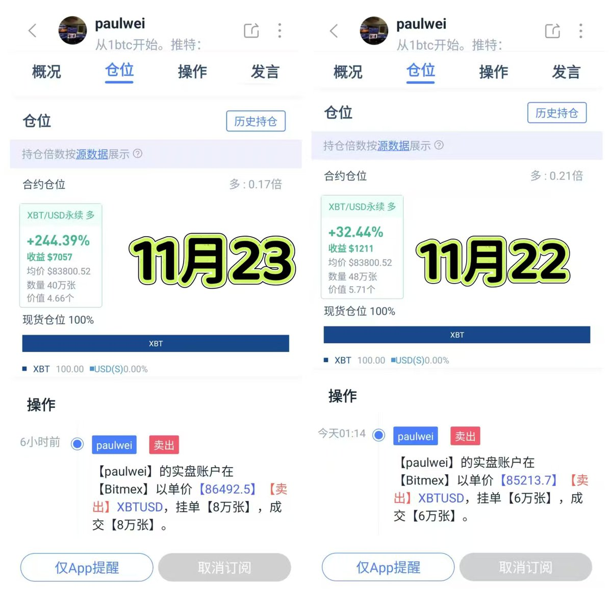
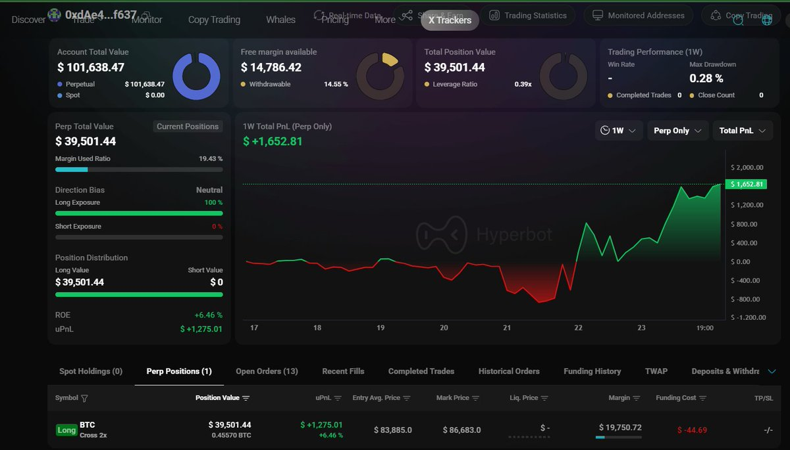
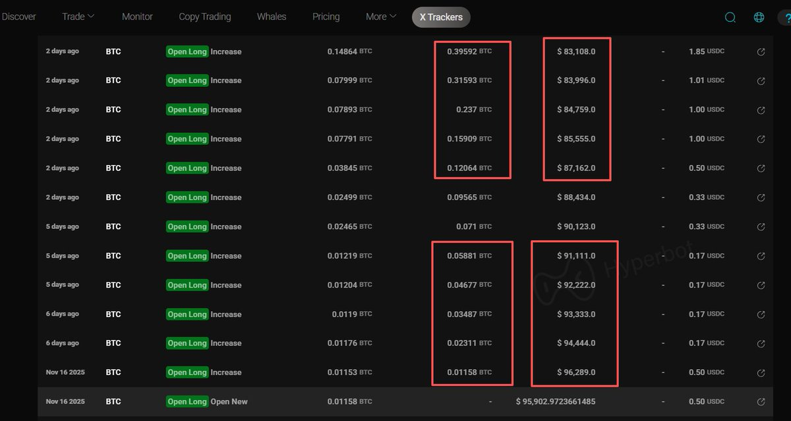

# 魏神金字塔五層防御體系：實盤風控解析

> **來源**: [@wendy_2026](https://x.com/wendy_2026/status/1992635279358984557)
>
> **日期**: Sun Nov 23 16:44:06 +0000 2025
>
> **標籤**: `金字塔接單` `風險管理` `倉位結構`

---

> **來源**: [@wendy_2026 (wendy文迪)](https://x.com/wendy_2026)
> **日期**: 2026-02-17
> **標籤**: `風控` `金字塔加倉` `震盪交易` `倉位管理`

---

## 魏神實盤學習筆記 06：金字塔的力量 × 五層防禦體系

看了下面那段魏神的引用文，再結合對他兩個實盤的學習，我被魏神的風控體系之牛逼震撼到了。今天就簡單談談我的理解。

## 一、兩個實盤的情況

### ① BitMEX 實盤

**今日關鍵詞：多 0.17 倍**

延續以往思路,可以看出魏神又止盈了 8 萬 U，讓合約持倉倍數從前兩天進一步降到 0.17 倍。

現貨倉長期看多，合約倉專門撸震盪，動態止盈，不斷降低風險敞口。

### ② Hyperliquid 新實盤

**今日關鍵詞：多 0.39 倍**

- 合約持倉價值：39,462 U
- 佔用保證金：19,731 U
- 帳戶總值：101,600 U
- 整體敞口：0.39 倍

我仔細看了整個交易記錄，發現他其實是從 96,000 附近就開始買了。但短短不到一週，他把整體持倉均價壓到 83,885。

看到這，我終於理解了他為什麼說：**「這就是金字塔的力量。」**

越往下，買得越多，價格越低、效益越強；價格越高，越輕倉試單。空間拉得足夠大，成本就能被拖得足夠低。

關於金字塔掛法，我會單開一帖講。

## 二、五層防禦體系

最讓我驚歎的是他強大的風控體系，10.11 那天血流成河，而他的合約單毫髮無傷。我們一起來看看他都做了什麼？

我認為他有五層防禦：

### 1、不預測，只對策

他尊重市場的隨機性，比如不去等跌破 8 萬或者腰斬了再行動。他兩個實盤都是從 96000 左右就開始佈局了。

### 2、金字塔接單，用耐心對抗 PVP 的市場

- 越跌買的越多，快速拉底均價
- 有成交就能做震盪
- 沒成交證明上漲了，更不必擔心

金字塔不是為了「全部成交」，而是為了：**任何行情，都讓你有籌碼、有位置、有行動空間。**

而在 PVP 市場裡，「耐心」就是天然優勢。

### 3、倉位結構 = 長線底倉 + 短線震盪倉

這個比例提前就想好，比如 7:3 或 6:4。

- 底倉不動等大行情
- 震盪倉專門做短波減成本、降爆倉位

這兩個結構提前就想好，不是行情來了臨時反應。

### 4、永遠讓自己待在安全區（爆倉價永遠非常遠）

他把成本壓得足夠低，遠離籌碼密集區。這樣一來：

- 別人剛回本要砸盤，他已經在賺錢
- 別人開始恐慌，他可以接近無損減倉

他一直用震盪降低爆倉價，哪怕極端行情，他都比大多數人安全得多。

### 5、盈利要提走

老實盤裡，他提走了 272 萬 U。這意味著：

- 就算遇到類似 312 的極端行情
- 就算整個帳戶歸零
- 他依然能憑提走的盈利繼續打 N 次

這就是專業交易員的「多條命系統」。

**他雙手插兜，閒庭信步，怎麼輸？**

## 三、wendy 今日操作

掛了 7 個金字塔單子，拿住一小部分比例開始學習魏神的「撸震盪」，這是一門新功夫，等我更有心得了就持續分享。

**每日一句：要想賺，先學會少虧。—— 芒格**

---

## 魏神原文引用（@coolish）

觀察很細。價格沒跌破的話，其實也不一定盈利可觀，因為也有可能沒跌多少，金字塔就接不到多少。

價格跌破下限的話，會有中間過程，過程中會去嘗試以一部分持倉撸震盪，像現在就正在做。整個掛單在一開始就盡量有數，總接單量（像你說的一共用了 2.6x）裡的大概多少 % 比例，分別是會用來做短期震盪的和拿更久的。

金字塔的其中一個本質就是，**自然提升交易的耐心度，PVP 市場裡，往往光是比別人更耐心，就能積累競爭優勢了**。尤其是最近三年的行情，可以看到基本每次主升浪前，都會給足超過大家平均耐心度的震盪、下蹲作為鋪墊。

以及隨著行情動態走出新的資訊，掛單其實是也會根據新資訊動態調整的，這個如果持續觀察也應該看到的。

可能你想問的是，假如在極端情況下，像 312 那樣 BTC 也一天跌 50% 的情況？

這個一方面是，**行情變化超出自己預期的時候，肯定是要減倉**，你問的「對沖還是減倉」在我看來本質上一樣，都是減少 net exposure 淨敞口。越脫離自己預期，淨敞口越應該小，這個具體多少對應多少，應該自己盡量量化評估有數。

另一方面，如果是考慮連反應都無法反應，或來不及反應的最極端情況，那只能說，**大部分盈利都是在非極端情況下實現的，適時提盈才能提升在市場生存時長的底線**，然後從「已投入這個帳號的資金/其他未投入資金」角度看自己有「幾條命」來承受這種情況。
