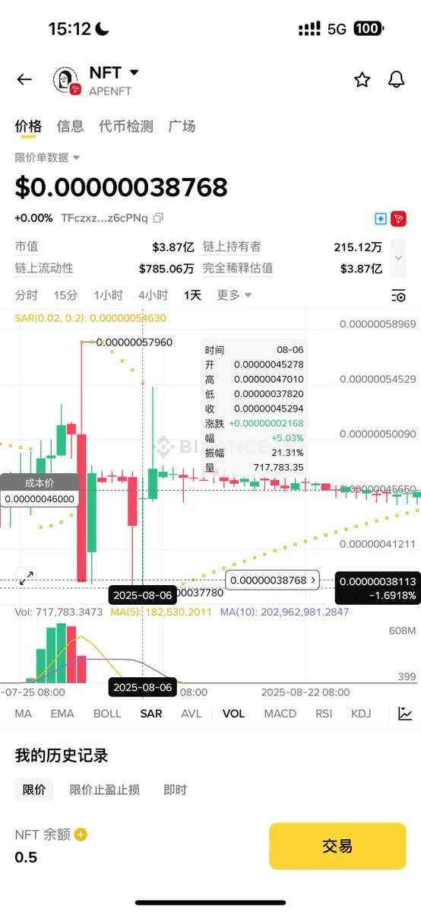
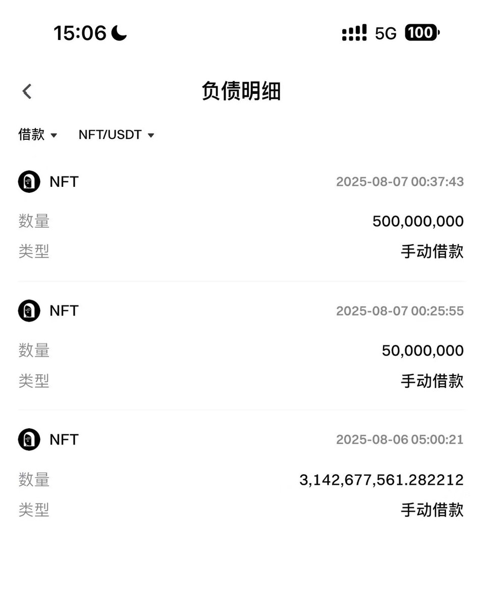
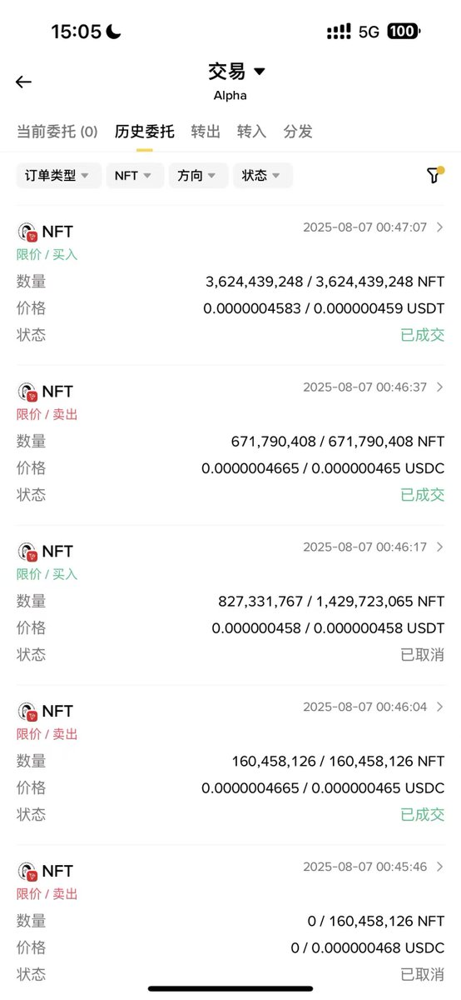

# 幣安 Alpha TRX 交易賽套利案例：跨交易所借幣鎖價獲利 20%+

> **來源**: [@fivepointwater5](https://x.com/fivepointwater5/status/1992229135360663904) | [原文連結](https://x.com/fivepointwater5/status/1991746628743803216)
>
> **日期**: Sat Nov 22 13:50:14 +0000 2025
>
> **標籤**: `套利` `借幣策略` `市場微觀結構`

---

> **來源**: [@fivepointwater5 (五点水)](https://x.com/fivepointwater5)
> **日期**: 2026-02-17
> **標籤**: `幣安Alpha` `TRX` `套利` `跨交易所借幣` `限價單搬磚`

---

## 事件背景

幣安 Alpha 舉辦 TRX 鏈交易賽期間，幣安並未開放 TRX 即時交易功能，獎勵發放時出現買盤不足（只能用限價單進行撮合），許多人為了脫手而折價賣出。

## 獲利點分析

1. **賭幣安後續開放即時交易**：參考過往案例（如 SUI 一開始沒有即時交易，後續也開放了），判斷幣安最終會解決此問題
2. **限價搬磚機會**：在等待過程中發現 USDT 和 USDC 對價格脫錨，可以透過限價單進行搬磚套利

## 風險評估

1. **主要風險**：幣安最終不開放即時交易（可能性較小）
2. **次要風險**：在等待開放的不確定期間，幣價大幅下跌

## 操作流程

### 思考過程

尋找可以借幣的交易所來鎖住價格，最終找到 Gate.io 可以借 NFT（當時考慮很多選項，最後只操作 NFT，因為鏈上池子最大、風險最小，且當時本金只有幾千 U）。

### 執行步驟

1. **在幣安 Alpha**：用限價單買入其他人的低價籌碼
2. **在 Gate.io**：借幣後賣出，鎖定價格
3. **等待**：等待幣安解決流動性問題並開放即時交易

### USDC/USDT 搬磚實例

透過兩種穩定幣之間的價差進行限價單搬磚套利。

（註：原推文提到有搬磚截圖，但未提供實際數據）

## 總結與啟發

1. **危機即機會**：當大家都遇到問題時，往往也是利潤最大的時候，但需合理評估風險
2. **窗口期**：這次套利窗口期接近 1 天，不知道有多少人抓住了
3. **學習重點**：即使錯過這次機會，理解這個思路後，未來出現類似情況時能夠大膽操作

## 關鍵要素

| 要素 | 說明 |
|------|------|
| **時機** | 幣安 Alpha 交易賽期間，TRX 未開放即時交易 |
| **套利方式** | 幣安限價買入低價籌碼 + Gate 借幣賣出鎖價 |
| **風險對沖** | 借幣鎖定價格，避免等待期間幣價下跌 |
| **獲利率** | 20%+ |
| **窗口期** | 約 1 天 |
