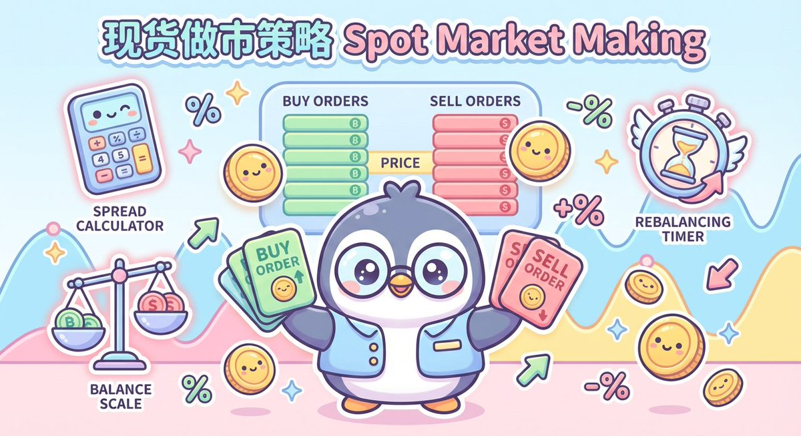

# 五個最流行的做市策略運作方式

> **來源**: [@wquguru](https://x.com/wquguru/status/1992059859916018146) | [原文連結](https://twitter.com/wquguru/status/1992059859916018146/photo/1)
>
> **日期**: Sat Nov 22 02:37:35 +0000 2025
>
> **標籤**: `做市策略` `量化交易` `市場微觀結構`

---

> **來源**: [@wquguru (WquGuru🦀)](https://twitter.com/wquguru)
> **日期**: 2026-02-17
> **標籤**: `做市策略` `market-making` `量化交易` `交易策略`

---

五個最流行的做市策略各自是怎麼運作的，剛好最近市場不太行，一起來學習學習。

## 策略概覽

以下是五種常見的做市策略，每種策略都有其獨特的運作方式和適用場景：

1. **基礎做市策略 (Basic Market Making)**
2. **Avellaneda-Stoikov 策略**
3. **庫存管理策略 (Inventory Management)**
4. **跨交易所做市 (Cross-Exchange Market Making)**
5. **純粹做市 + 對沖 (Pure Market Making + Hedging)**

## 策略詳細說明

### 1. 基礎做市策略

最簡單的做市策略，在買賣兩側掛單，賺取買賣價差。

### 2. Avellaneda-Stoikov 策略

基於學術研究的動態做市策略，考慮市場波動率、庫存風險等因素，動態調整報價。

### 3. 庫存管理策略

重點在於控制持倉風險，當庫存偏離目標時調整買賣報價，引導庫存回歸中性。

### 4. 跨交易所做市

在不同交易所之間套利，利用價差進行做市，同時需要管理跨所風險。

### 5. 純粹做市 + 對沖

在現貨做市的同時，使用衍生品進行對沖，降低方向性風險。

---

**註**: 原推文提到「策略代碼和信息圖製作方法放在最後」，但原始內容中未包含這部分詳細資訊。完整的策略代碼和信息圖需要參考原推文的後續內容或圖片。
