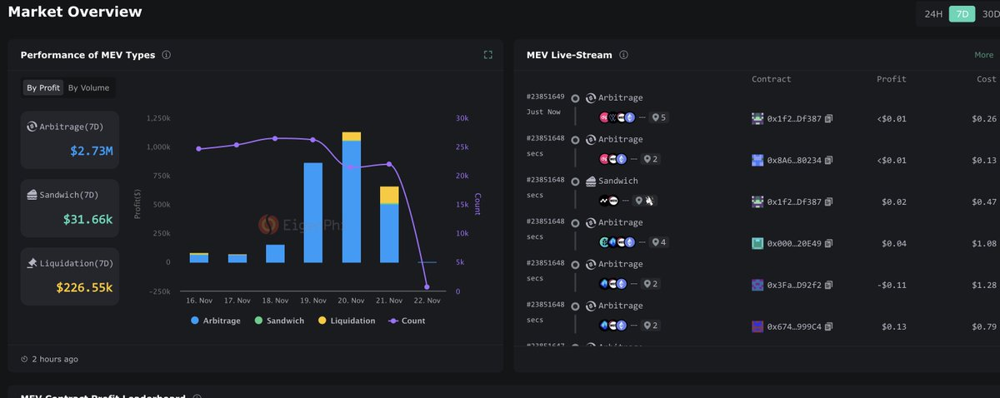
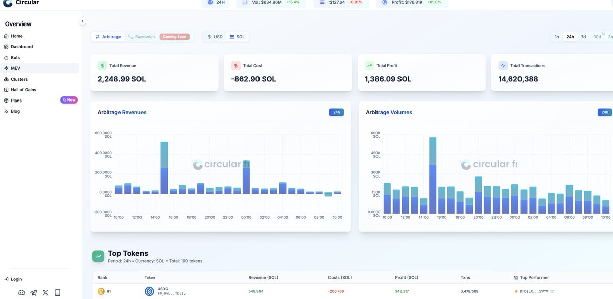

# MEV 套利學習資源整理 — EigenPhi、Circular、Jito、Flashbots

> **來源**: [@richengfeng03](https://x.com/richengfeng03/status/1992064115091939814) | [原文連結](https://twitter.com/richengfeng03/status/1992064115091939814/photo/1)
>
> **日期**: Sat Nov 22 02:54:30 +0000 2025
>
> **標籤**: `MEV` `套利` `學習資源`

---

> **來源**: [@richengfeng03 (冯日成)](https://twitter.com/richengfeng03)
> **日期**: 2026-02-17
> **標籤**: `MEV` `套利` `學習資源` `工具平台`

---

## MEV 套利學習平台整理

給大家介紹幾個學習 MEV、套利的網站：

### 1. EigenPhi (@EigenPhi)
實時監控以太坊主網上的各種套利、MEV、清算交易。

### 2. Circular (@Circular_fi)
Solana 上 MEV 數據的統計平台，似乎還有套利機器人服務（需進一步研究）。

### 3. Jito Labs 與 Flashbots 文件庫
推薦翻閱這兩家的官方文件，裡面有很多學習資料。

---

## 相關資源連結
- [Tweet 來源](https://t.co/zO6dSx7NZA)
