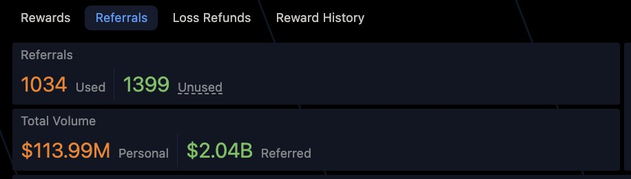

# 永續合約跨所套利姿勢：OLP 國補、價差舔盤、費率理財與交易量收益

> **來源**: [@Metabape](https://x.com/Metabape/status/1991944885021356513) | [原文連結](https://omni.variational.io/?ref=OMNIMETABAPE)
>
> **日期**: Fri Nov 21 19:00:43 +0000 2025
>
> **標籤**: `套利` `永續合約` `正向現金流`

---

我會幫你將這篇文章整理成知識庫格式。讓我先分析這是一篇關於永續合約跨所套利的實戰策略文章，屬於 `quant-trading` 分類。

★ Insight ─────────────────────────────────────
1. 這篇文章介紹了在 Variational 和 Lighter 兩個去中心化永續合約平台進行跨所套利的四種實戰姿勢
2. 核心價值在於揭示了 OLP（Omnidirectional Liquidity Pool）機制下的國庫補貼套利機會
3. 文章提供了具體的風險控制策略和資金管理方法
─────────────────────────────────────────────────

以下是整理後的內容：

---

> **來源**: [@Metabape (Meta 猿 🦍)](https://twitter.com/Metabape)
> **日期**: 2025-02
> **標籤**: `永續合約` `跨所套利` `OLP` `費率套利` `Variational` `Lighter`

---

這個月因為行情波動大，跨所套利號的收益率基本都跑到了 10% - 15% 之間。

分享我在 @variational_io 和 @Lighter_xyz 盤口上套利的幾種姿勢，希望能幫助推友們在市場不好的時候，多搞點有正向現金流的小農經濟，一起猥瑣發育。

## 套利姿勢 1：爽吃國補

這是 OLP 特有的機制。受限於目前國庫的資金體量，所以經常會出現 OLP 用負點差鼓勵用戶進行單邊開倉，幫助國庫 de-risk 倉位的情況。

**最狠案例：$ZEC**

最狠的一天是 $ZEC 這個幣，做空的滑點直接幹到 -1.8%。

這是什麼概念？就是你能夠比 mark price 高 1.8% 的價格去空它。所以當時一個 $ZEC 在 LG 和 VAR 之間的價差是 8U，而且 VAR 還是超高的正費率。

這就是屬於純純的送錢局，OLP 明擺著發錢讓用戶來做空，從而平衡掉他的頭寸。

那天我和群友真的是吃爽了，如果你開個 5 倍槓桿，會先吃一波大費率支付，然後幾個小時後，國補停止，價格幾乎完全收斂。一點點平倉完，你的本金就整體上漲了 9%+。

**國補機制說明**

當然像這種印鈔局，迄今為止只吃到過這麼一次大的，不能當成日常，畢竟 OLP 對某個方向的開倉獎勵就是對另外一個方向的懲罰，這種事會隨著國庫資金體量的不斷上漲，而越來越少。這樣才能保持對交易員的長期吸引力。

不過逆天國補雖少，常規國補在波動劇烈的行情下，還是非常高頻的。

**常規國補案例**

比如這兩天的 $BTC，你可能前 10 分鐘，做多是 -0.03% 點差，後十分鐘，就變成了做空 -0.02%。

那麼相應的，在兩個所的價差上，就會出現快速的大開大合，你前腳剛在 VAR 買入，LG 賣出，持倉沒一會，就可以平倉，一個 $BTC 賺個幾十美金走。

這就是監控國補的魅力，因為國補的出現通常會快速拉開或拉近價差，同時它也是個幫助你對當前價差走勢下判斷的重要信號，方便你做套利姿勢 2。

## 套利姿勢 2：高頻舔價差

在兩個沒有手續費的交易所做套利，最大的好處就是，你只用看你的 entry price，而不用先「回本」。

比如你是 +5U 進的 $ETH，那麼就算 -4.9U 出，你還賺 0.1U。

**經驗積累建議**

這兩個所的套利，我玩了得有 7 個月了，導致我對大部分主流幣的價差開合規律，都已經形成了肌肉記憶。

這裡建議新手，可以先從 $BTC 開始玩起，感受每日的價差變化，記錄極端行情的特殊情況。然後慢慢開荒到 $ETH $BNB $HYPE 和其他的小幣種。

**幣種選擇提醒**

像 $SOL，能不碰就不碰吧，很多時候價差收斂不了，費率被吃得肉疼。

## 套利姿勢 3：費率做理財底倉

我平時有別的事，沒有那麼多時間盯盤，所以自己控的號，我不會把全部子彈都用來做高頻套價差，這樣資金利用效率太低了。

**策略原理**

得益於 VAR 的費率基本是按照 CEX 的節奏走的，也就是主流幣費率該正的時候，不會正得很離譜，該負的時候，立馬就切負。

所以我會選一些 LG 上經常會飆正費率的幣，在價差足夠大的時候開空，同時在 VAR 上做多。然後這個倉位就扔在那裡不動了。

**實際操作案例**

比如最近我的底倉裡就是 $UNI 和 $BNB 這兩個幣，開個 1 倍多點倉位，放在那裡當餘額寶。

大家可以去看看它們在 LG 上的歷史費率，就知道這玩意有多香了。

而當我能坐在電腦前的時候，就玩玩高頻，看看哪個幣監控報警有補貼，哪個幣價差拉到了大概率能快速收斂的位置。

## 套利姿勢 4：交易量本身帶來的收益

這裡，我說的不是積分。

**關於積分的態度**

作為「現金流」的信徒，積分這個東西，從來不在我計算收益的範圍內，我也一直非常警惕磨損換分的行為。

Perps 這個賽道都這麼久了，到現在還靠燒錢換分，我覺得真的是在用戰術上的勤奮來掩蓋戰略上的懶惰。

**交易量收益的三個來源**

這裡說的交易量收益，主要是三部分：

### a. 上級反佣

目前普通用戶邀請好友，可以獲得好友點差支付的 5% 作為推廣佣金。而我的碼，會有 10% 的佣金。

因為我選擇全部返還給群友，所以就算你套利水平再菜，交易過程中分毫沒賺，但你刷個 1 億的交易量，也能從我這摳出個 1000 U 左右。

### b. 虧損返水

有交易，就一定有虧損。目前每個地址每 24 小時最多可以觸發三次虧損返水。

比如這幾天，群友基本都是在 VAR 做多，LG 做空，那麼每天挑幾個看著不順眼的單，拆分平倉，本金不太大的情況，隨隨便便也是幾百 U 的收益。

### c. 虧損返水的邀請獎勵

而當你觸發虧損返水的時候，你的邀請者，會得到額外的一筆獎勵，百分比大小根據他的帳戶等級。

我會把我拿到的 5% 的 cut，100% 返還給群友。

## 總結

所以玩 VAR 這個項目，如果你都會被人忽悠，抱著用手續費來換積分的心態，那真的是起手就無限落後了。

群裡的這幫套利佬，自己搓著腳本，吃著國補，舔著價差，吸著費率，拿著 100% 反佣，順便擼走了 LG 和 VAR 的積分。
