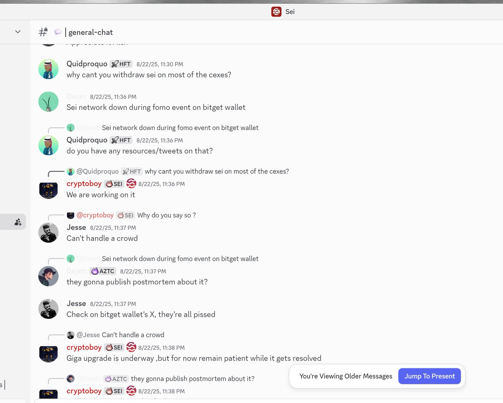

# Cloudflare 宕機時的套利機會意識

> **來源**: [@LumaoDoggie](https://x.com/LumaoDoggie/status/1991030084786913423)
>
> **日期**: Wed Nov 19 06:25:38 +0000 2025
>
> **標籤**: `套利` `鏈故障` `市場微觀結構`

---

> **來源**: [@LumaoDoggie (撸毛小狗)](https://twitter.com/LumaoDoggie)
> **標籤**: `套利` `cloudflare` `鏈故障` `套利意識` `跨鏈套利`

---

## 事件背景

昨晚 Cloudflare 掛掉的時候，相信大部分人是在吃瓜的心態，但是往往最優秀的選手，這時候會像禿鷲一樣，尋找機會。

昨晚受影響的幣圈相關的服務有：
- Coinbase、MetaMask、Hyperliquid、Pengu、WiFi、Tron、Aave、Curve、OP、Sui
- Glassnode、Coinalyze、DefiLlama、Solscan

不過仔細看一下，要麼掛的就是不影響交易的網站（比如說 DefiLlama），要麼就是只掛了前端頁面，後端交易接口正常工作。這種情況下，市面上的 MEV 機器人還是正常工作，會維護價格平衡（Curve 之類的池子）。

## 尋找機會的過程

我昨晚是把幾個主流的鏈的 Discord 都看了一圈，沒發現有相關的信息（Discord 本身服務也受到影響）。然後趁著 Twitter 可用的時候，也是用 `chain + disruption + cloudflare` 關鍵字去搜，沒看到有用信息。

可惜轉了一圈，沒發現什麼套利機會。不過這也很正常。畢竟嘗試一下還有機會，坐著吃瓜那機會等於 0。

一般來說**小鏈 + 跨鏈橋掛掉**，或者**大一點的鏈整體故障**，這種機會就會出來。因為這種突發場景，機器人不太好處理，需要人工介入搬磚。

## 案例：Sei Chain 故障套利

這讓我想起了上一次我大倉位搬磚套利的事情。

上一次是 8 月 22 日，Sei Chain 故障，鏈上交易基本都會失敗，但是轉帳是正常的。結果導致外部（幣安一類的 CEX）裡的 SEI 代幣本身在大跌，但是鏈上池子裡的 SEI 價格不變，最後是比外面高 20%。因為鏈上買賣會失敗。

### 發現機會

我是當天剛好在 Sei 一個協議裡搞穩定幣套利，總是交易失敗。看到 Sei 官方 Discord 裡在報故障，然後又有活雷鋒在 Discord 裡說到把 gas 上限拉升到 5U 左右的一個離譜的範圍，就可以交易成功（平時大概 0.0001U 一次）。

### 執行流程

1. **小資金測試**：我小資金嘗試了一下，成功了
2. **可行性評估**：SEI 代幣可以正常提到各大 CEX 裡賣掉（不同 CEX 到賬時間還不一樣）
3. **風險計算**：算了一下到賬時間、利潤空間和幣價波動範圍，覺得風險可控
4. **大倉位進場**：再大倉位進去

### 結果

最後因為我本身資金容量有限，池子大小有限（幾個 SEI 代幣池子一共 10M 左右），還有競爭者，我搬了三輪後，鏈逐漸恢復正常，價格馬上也被搬平了。最後算下來賺了 1 萬多 U。

## 反思

其實後來想想，很多時候就是運氣。

你要是真花時間寫個腳本來監控 SEI 代幣和幣安的差價，超過 2% 了就報警，結果 3 年可能才觸發這麼一次。一般都是有專門的跨鏈/跨所套利的機器人腳本的人，平時就在搬磚的，可能才能夠即時發現這個消息。

## 總結

雖然這次 Cloudflare 事故沒看到什麼套利機會（應該在某個協議的某個角落有，我沒發現而已），但是我覺得**培養這個意識，多看看，多思考，還是很必要的**。
