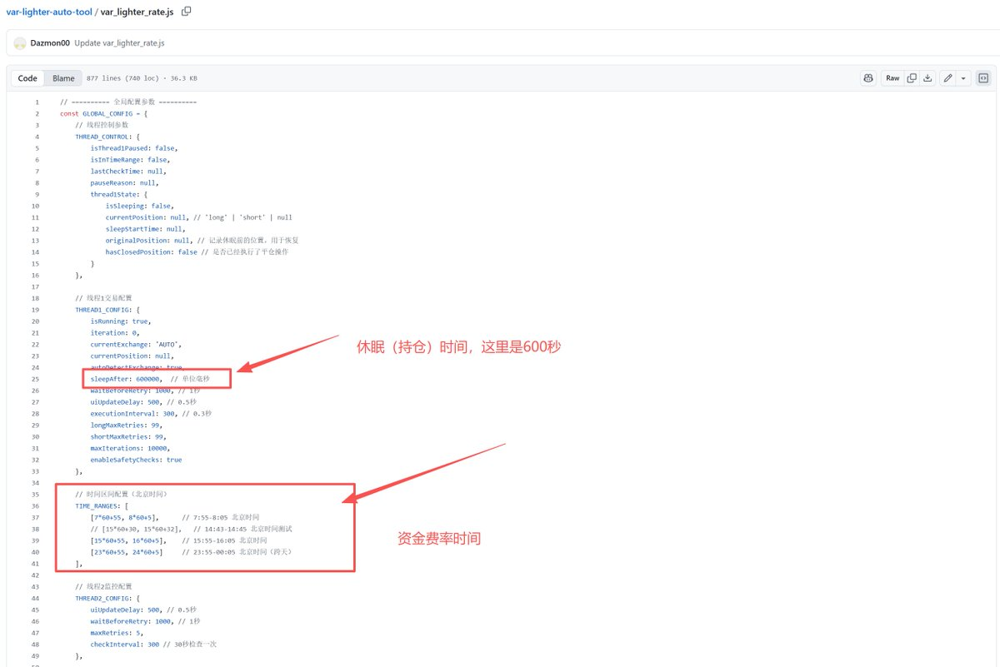

# Variational-Lighter 資金費率套利自動化對沖腳本

> **來源**: [@ddazmon](https://x.com/ddazmon/status/1991426393083990141) | [原文連結](https://github.com/Dazmon00/var-lighter-auto-tool/blob/main/var_lighter_rate.js)
>
> **日期**: 
>
> **標籤**: `資金費率套利` `永續合約對沖` `自動交易腳本`

---

> **來源**: [@ddazmon (Dazmon💢)](https://twitter.com/ddazmon)  
> **日期**: 2026-02-17  
> **標籤**: `量化交易` `資金費率套利` `Variational` `Lighter` `自動化腳本`

---

## 概述

在 Variational 和 Lighter 兩個交易所之間進行資金費率套利的自動化對沖腳本。核心策略是利用兩個交易所的資金費率結算時間差異，在 Variational 做多、Lighter 做空，並在特定時間點平倉以避開 Variational 的資金費率支付，從而賺取 Lighter 的資金費率收益。

## 套利邏輯

### 資金費率差異

- **Variational**：8 小時結算一次，費率約 0.0025%
- **Lighter**：1 小時結算一次，費率約 0.01%（每 8 小時累計）
- **價差**：每 8 小時可獲得約 0.0075% 的資金費率價差

### 操作策略

以 BTC 為例：
- 同時在 Variational 做多 BTC
- 在 Lighter 做空 BTC
- 在每天 0、8、16 點（Variational 結算時間前）關閉所有倉位
- 避免支付 Variational 的資金費率，同時收取 Lighter 的資金費率

### 收益計算

假設開啟 10,000 U 的倉位：
- 每 8 小時獲得 0.75 U 利潤
- 一天結算 3 次，共 2.25 U 利潤
- 適合長時間持有的玩家

## 腳本更新

### 新增功能

1. **多個時間區間監控執行緒**
   - 控制主邏輯是否進行交易
   - 當時間落入設置區間時，主執行緒停止交易
   - 如果主執行緒已經開倉休眠則直接平倉
   - 等待時間區域結束後重新開倉
   - 避開資金費率結算時間

2. **程式碼整合**
   - 將兩個交易所的程式碼合併在一起
   - 只做單向操作：Variational 做多、Lighter 做空

### 使用說明

- 源碼地址：https://github.com/Dazmon00/var-lighter-auto-tool
- 複製同一套程式碼到開發者工具 console 使用
- 可自行增加不開倉時間區間，增加多樣性
- 測試了兩天，已解決大部分問題

## 注意事項

★ Insight ─────────────────────────────────────
1. **市場環境**：作者提到當前市場很差，預計 Variational 不會很快發幣，建議做好持久戰準備
2. **倉位管理**：持倉時間盡量拉長，靠資金費率和虧損返現抵消虧損
3. **邀請碼**：作者提供邀請碼 `OMNIBGZ4ETT9`，並承諾私聊定時返還手續費
─────────────────────────────────────────────────
