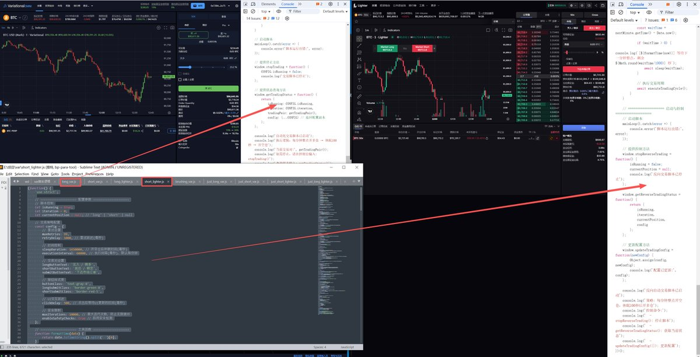

# Variational 與 Lighter 資金費率套利策略

> **來源**: [@ddazmon](https://x.com/ddazmon/status/1991056561830343074)
>
> **日期**: Wed Nov 19 08:10:51 +0000 2025
>
> **標籤**: `資金費率套利` `跨交所對沖` `前端自動化腳本`

---

> **來源**: [@ddazmon (Dazmon💢)](https://twitter.com/ddazmon)
> **日期**: 2026-02-17
> **標籤**: `資金費率套利` `Variational` `Lighter` `對沖策略` `永續合約`

---

## 核心策略邏輯

打算再添加一個套資金費率邏輯在 variational 對沖腳本。

一直玩 @variational_io 和 @Lighter_xyz 的兄弟肯定會發現，@variational_io 的資金費率是 8 小時結算一次，@Lighter_xyz 的資金費率是 1 小時結算一次，並且 @variational_io 的資金費率明顯比 @Lighter_xyz 的低。

## BTC 套利範例

以 BTC 為例子：

同時做多 @variational_io BTC，做空 @Lighter_xyz BTC，在 @variational_io 每 8 小時支付 0.0025% 資金費率，在 @Lighter_xyz 每 8 小時收穫 0.01% 資金費率，資金費率價差在 0.0075%。

## 套利進階技巧

@variational_io 的資金費率是 8 小時結算一次，@Lighter_xyz 的資金費率是 1 小時結算一次，也就是說，如果在每天的 0、8、16 點關閉所有倉位，能夠有效避免 @variational_io 的資金費率支付，從而白嫖 lighter 的資金費率。

邏輯就是這麼一個邏輯，假設開啟的是 10000U 的倉位，每 8 小時能獲得 0.75U 的利潤，一天結算 3 次，也就是 2.25U 的利潤，適合長時間持有的玩家。

後面會把套利邏輯加進對沖腳本，減少損耗，目前還在測試，晚點開源。

## Variational 全自動對沖前端腳本

### 為什麼做 Variational

幾個比較經常高質量的老師，在沒接廣子都在推，找不到理由不做，好比 lighter，早期不做後悔莫及。

@variational_io 暫時沒有提供 API 接口,只做了前端,對沖交易所是 lighter。做前端還有一個好處,不會涉及到私鑰等隱秘的東西,也不會被 API 降權,但缺點也很明顯,就是不能掛後台自動跑,服務器不可用的時候得自行刷新跑,腳本只能做一個輔助作用。

@variational_io 返虧損餘額的機制,其實已經可以 cover 大部分點差帶來的虧損,一天最多返還 3 次,需要大於 1U 才有機會觸發。返虧損池：https://t.co/Cf6XDYe159

### 腳本邏輯

這個是比較重要的,腳本邏輯很簡單,整點（每一分鐘）開倉,休眠一段時間,關倉。

**注意**,該腳本沒有任何風險控制,不會止盈止損,也就是說如果突然黑天鵝,救不了一點,所以盡量找 BTC、ETH 等流動性好的幣種去開單,DYOR。

### 參數說明

直接複製源碼到本地編輯器編輯,調整休眠時間參數（其他可以直接使用默認）,單位是毫秒,如果你想設置 100 秒,參數則是 100000（這參數不一樣,你們用的時候設置成一樣）。

### 演示說明

使用腳本前,需要提前把界面調整為中文界面（重要）,然後按以下步驟使用腳本：

1. 打開前端開發者工具,電腦快捷鍵 F12,打開 Console,複製調整好參數的對沖前端腳本進去
2. 設置好開倉大小,查看時間,整點開始,如現在時間 11:47:31,啟動後腳本開始時間 11:48:00,在這之前把腳本運行起來。啟動後不要關閉窗口,也不要最小化,系統做了監控最小化關閉與服務器之間的鏈接
3. 一共 4 份代碼,分別是做多 var、做空 var、做多 lighter、做空 lighter,自行選擇自己喜歡的返現做多做空,源碼地址：https://t.co/y5H34tdY0s

## 邀請碼與返現

目前在和官方聊聯盟碼,用碼的兄弟後續也能拿到不錯加成,最後的最後,打個廣告,歡迎大家用我的邀請鏈接,私聊定時返還手續費：OMNIBGZ4ETT9
