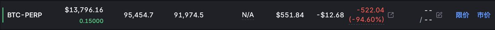
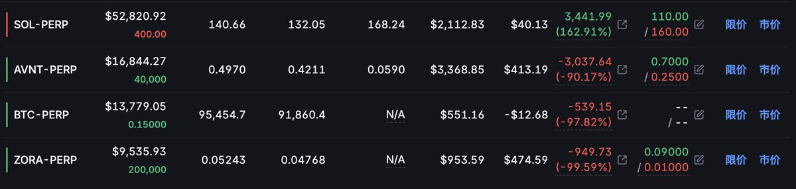
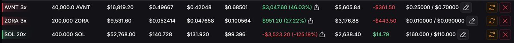

# 槓桿對沖交易：如何在波動市場中安心入睡

> **來源**: [@ra60069](https://x.com/ra60069/status/1990600169092755465)
>
> **日期**: 
>
> **標籤**: `風險管理` `對沖策略` `心態管理`

---

> **來源**: [@ra60069 (MotorTu馬達先生)](https://x.com/ra60069)
> **日期**: 2026-02-17
> **標籤**: `槓桿交易` `對沖策略` `風險管理` `Lighter` `SOL`

---

## 核心策略：槓桿對沖套利

感謝各位小夥伴的支持，昨天那篇黃金文章的熱烈回應，我會更用心實測數據來回報大家。

今天一起床看到行情持續下跌，我相信大家也不好受。我也有套牢的部位，小夥伴們很清楚我前幾天在 95,000 抄了一筆多單，目前還在找機會進第二筆。

會不會輸不知道，但目前砍掉真的不明智，要砍也是等反彈起來再處理會有尊嚴得多。

## 為何在波動行情下依舊睡得香甜

### 1. 嚴設停損停利
這個必須要做到，我寧願斷手斷腳，也不要一把畢業。

### 2. 明確目標
你想在這個項目上面得到什麼，自己要很清楚。我很明白的就是擼積分，講白的資費是多餘的，有也好沒有也罷。

### 3. 時常關心倉位變化
不是買了就不理他，要時常應變。該補的、該反向操作都要第一時間處理，我習慣睡覺前會變動一次。

### 4. 找到最舒服的槓桿
開槓桿不是不好，而是不要讓這個工具變成你的負擔。試著去試出你最適合的倍數。

## 實戰覆盤：@Lighter_xyz 對沖倉位

**平台**: @Backpack、@Lighter_xyz

**目前資費**: 擼了 137.7，較昨日成長，不需要變動

### 實戰技巧

1. **$SOL 穩如狗，大倉位必備**

2. **進階技巧：同 DEX 多空平衡**
   - 在一個 DEX 裡面多空都會有倉位
   - 盡可能做到平衡你就睡得著了

3. **建議小倍數**
   槓桿不需要太大

4. **歡迎照抄**
   如果你覺得我開倉開得還不錯，我不介意你照抄

---

如果各位夥伴有任何問題歡迎私信我或者留言討論，我都會回。我也會持續精進自己來回報給我的支持者。
