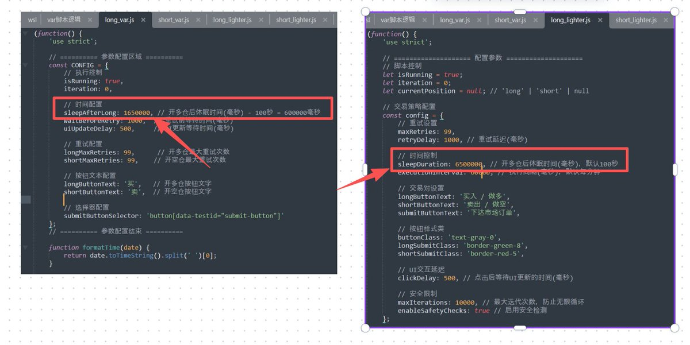
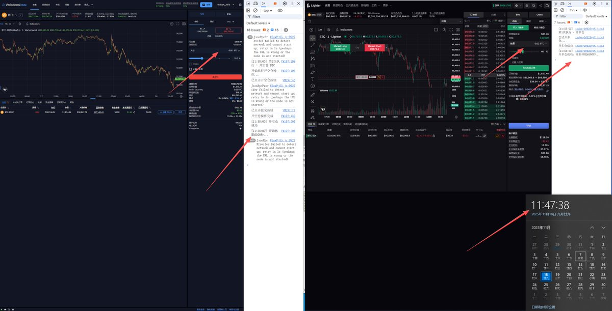

# Variational 全自動對沖前端開源腳本教程

> **來源**: [@ddazmon](https://x.com/ddazmon/status/1990629703238271318) | [原文連結](https://arbiscan.io/address/0xc47756133753280c37b227c24782984e021c4544#tokentxns)
>
> **日期**: 
>
> **標籤**: `自動化交易` `對沖策略` `前端腳本`

---

> **來源**: [@ddazmon (Dazmon💢)](https://x.com/ddazmon)
> **日期**: 2026-02-17
> **標籤**: `DeFi` `Variational` `全自動對沖` `Lighter` `套利腳本`

---

## 專案概述

Variational 全自動對沖前端開源腳本教程。多位高質量內容創作者推薦（例如 Lighter），建議早期參與以免後悔錯過機會。

## 技術架構

### 前端實現方式

- @variational_io 目前**僅提供前端介面**，暫無 API 接口
- 對沖交易所使用 **Lighter**
- 前端腳本**不涉及私鑰**等敏感資訊，不會被 API 降權

### 限制與注意事項

**優點**：
- 不處理私鑰等隱密資訊
- 避免 API 降權問題

**缺點**：
- 無法掛後台自動運行
- 伺服器不可用時需手動刷新
- 腳本僅作為輔助工具

## 返虧損機制

- 返還虧損餘額，可 cover 大部分點差帶來的虧損
- **每日最多返還 3 次**
- 需大於 1U 才能觸發
- 返虧損池地址：[Arbitrum One 區塊鏈瀏覽器](https://arbiscan.io/address/0xc47756133753280c37B227C24782984E021c4544)

## 腳本邏輯

### 運作流程

1. **整點（每一分鐘）開倉**
2. **休眠一段時間**
3. **關倉**

### 風險警告

⚠️ **該腳本沒有任何風險控制**：
- 不會止盈止損
- 黑天鵝事件無法應對
- 建議使用 BTC、ETH 等**流動性好的幣種**
- DYOR（自行研究）

## 參數設定

### 休眠時間參數

- 直接複製原始碼到本地編輯器編輯
- 調整休眠時間參數（其他可使用預設值）
- **單位：毫秒**
- 範例：設定 100 秒 = `100000` 毫秒

## 使用教程

### 前置準備

**重要**：使用腳本前需提前將介面調整為**中文介面**

### 操作步驟

#### 1. 開啟開發者工具

- 電腦快捷鍵：**F12**
- 開啟 **Console**
- 複製調整好參數的對沖前端腳本並執行

#### 2. 設定開倉參數

- 設定開倉大小
- 查看時間，**整點開始**
- 範例：現在時間 11:47:31，啟動後腳本開始時間為 11:48:00
- 在這之前將腳本運行起來

#### 3. 窗口管理

⚠️ 啟動後：
- **不要關閉窗口**
- **不要最小化**
- 系統會監控最小化並關閉與伺服器之間的連結

#### 4. 腳本選擇

共 **4 份代碼**，可自行選擇：
- 做多 VAR
- 做空 VAR
- 做多 Lighter
- 做空 Lighter

原始碼地址：[GitHub Repository](https://github.com/ddazmon/variational-auto-hedging)

## 邀請碼與返現

- 邀請碼：`OMNIBGZ4ETT9`
- 私聊可定時返還手續費
