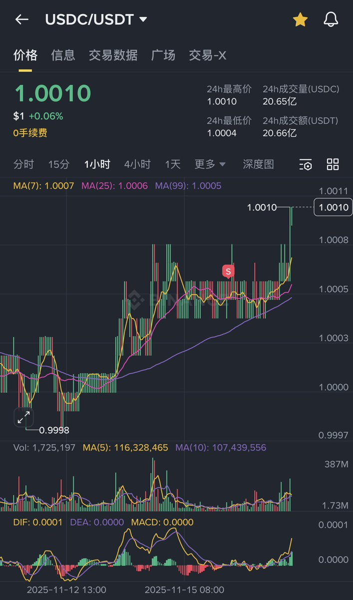

# USDC/USDT 千分之一價差套利機會

> **來源**: [@yourQuantGuy](https://x.com/yourQuantGuy/status/1990511461932937440) | [原文連結](https://twitter.com/yourQuantGuy/status/1990511461932937440/photo/1)
>
> **日期**: Mon Nov 17 20:04:49 +0000 2025
>
> **標籤**: `套利` `穩定幣` `交易機會`

---

## 套利機會說明

USDC/USDT 交易對出現千分之一（0.1%）的價差，這為持有 USDC 作為合約保證金的交易者提供了一個簡單的套利機會。

## 操作建議

對於使用 USDC 作為合約保證金的用戶，可以考慮將 USDC 換成 USDT，賺取這個價差收益。雖然利潤不大（作者形容為「一頓豬腳飯」的錢），但對於大資金來說仍是一個無風險的套利機會。

## 注意事項

- 需要持有 USDC 作為合約保證金
- 價差為千分之一（0.1%）
- 適合資金量較大的用戶操作
- 屬於低風險套利機會
