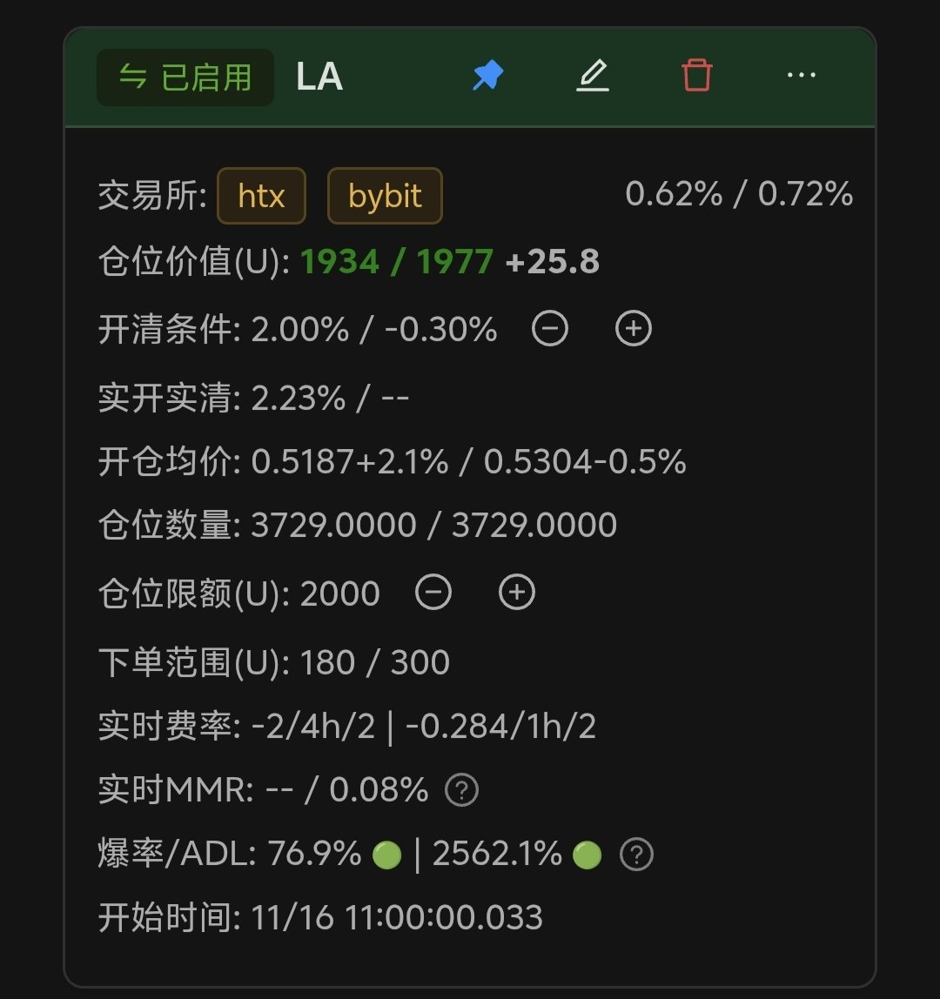
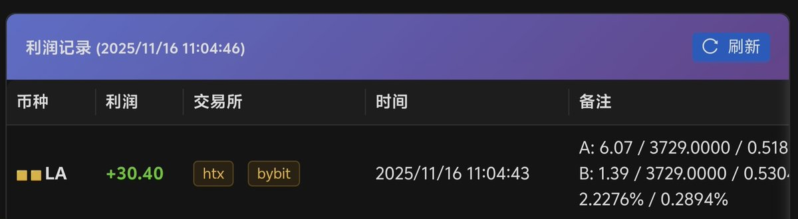

# HTX 資金費率套利交易實戰分享

> **來源**: [@0xZhouXiaoQi](https://x.com/0xZhouXiaoQi/status/1989923620530114952) | [原文連結](https://twitter.com/0xZhouXiaoQi/status/1989923620530114952/photo/1)
>
> **日期**: Sun Nov 16 05:08:56 +0000 2025
>
> **標籤**: `資金費率套利` `高頻交易` `現貨期貨對沖`

---

# HTX 資金費率套利交易實戰分享

> **來源**: [@0xZhouXiaoQi](https://twitter.com/0xZhouXiaoQi)
> **標籤**: `套利` `資金費率` `HTX` `思路分享`

---

## 策略背景

最近完善了 HTX 暴率、持倉等數據，開了個小單測試。

## 市場觀察

- **HTX**：LA 費率拉滿到 -2%，週期 4 小時
- **其他交易所**：-0.3% 到 -0.9% 不等，週期 1 小時

## 實戰操作

11 點整點搶單：
- **操作**：HTX 開多 + Bybit 空，直接打滿 2000U
- **實際費率差**：開倉時 2.2%
- **邏輯**：因為有 -2% 吊著，這個差價一定會迅速下跌
- **結果**：大概 4 分鐘後，費率差降到 0.3% 就清倉

## 獲利數據

- **操作時間**：快進快出
- **利潤**：30U
- **毛利潤率**：1.9%

