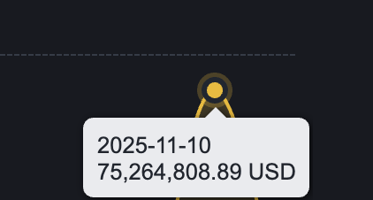

# EdgeX 跨交易所價差套利策略詳解

> **來源**: [@yourQuantGuy](https://x.com/yourQuantGuy/status/1988574934398816358)
>
> **日期**: Wed Nov 12 11:49:44 +0000 2025
>
> **標籤**: `價差套利` `量化交易` `交易所比較`

---

> **來源**: [@yourQuantGuy (Your Quant Guy)](https://twitter.com/yourQuantGuy)
> **日期**: 2026-02-17
> **標籤**: `EdgeX` `跨交易所套利` `價差套利` `去中心化永續合約` `量化交易`

---

## EdgeX 的獨特優勢

如果你現在還覺得這是一篇沒營養的廣告，看完下一篇詳細的技術分享，你就能理解，為什麼這個又吃又拿的策略只能在 @edgeX_exchange 上做，而無法在其他絕大多數的 perp dex 上複刻，包括 b、g、p、另一個 e。

EdgeX 比起其他的 perp dex 是有實質性的優勢的。比如，星期一我在幣安上套利的單日交易額達到了 $75M（見截圖），而這與幣安的流動性和深度息息相關。

## 即將分享的技術細節

這篇主要是鋪墊，下一篇我會詳細講解所有技術細節，幾乎是手把手教你如何從零搭建一個完整的價差套利架構：

- 從雲服務器的搭建
- 到核心代碼、參數調優
- 再到網絡與資金安全的處理

只要你是一個合格的程序員，你就能做到小資金至少 20% 的年化，小資金指的是 50 萬 U 以下。

## 作者觀點

評論區有人說我是廣告狗，把我拉黑了，我只是替你惋惜，斷了自己的財路。要是多年前的自己看到這麼有營養的廣告，能走不少彎路。
