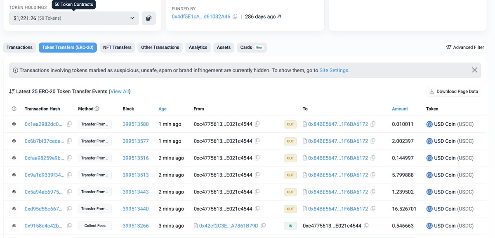
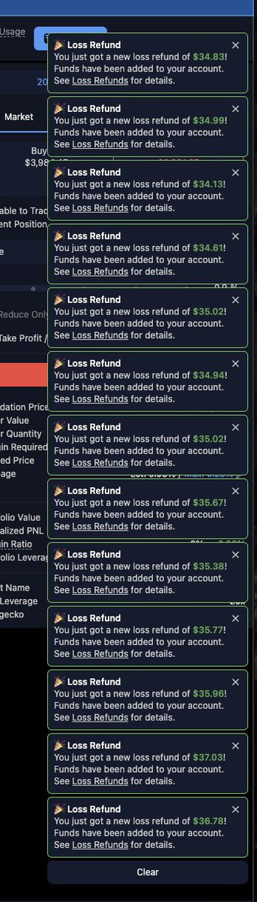

# Variational.io 虧損返還機制深度解析與套利策略

> **來源**: [@Metabape](https://x.com/Metabape/status/1988648519776047414) | [原文連結](https://arbiscan.io/address/0xc47756133753280c37b227c24782984e021c4544#tokentxns)
>
> **日期**: Wed Nov 12 16:42:09 +0000 2025
>
> **標籤**: `虧損返還` `套利策略` `風險管理`

---




```markdown
> **來源**: [@Metabape (Meta 猿 🦍)](https://twitter.com/Metabape)
> **日期**: 2026-02-17
> **標籤**: `Variational.io` `DeFi` `套利策略` `亏损返还` `OLP`

---

## 亏损返还机制核心要点

### 1. 资金池运作机制

- 池子资金来源：
  - 用户每笔交易点差利润的一部分自动转入
  - 官方每天手动补充
- 池子合约地址：`0xc4775613...e021c4544`（Arbitrum One）
- 交易记录透明：可查看每笔 OLP 点差利润流入和用户亏损返还

### 2. 使用时机建议

- 美区时间池子容易见底
- 大额亏损订单拆分平仓前，需提前检查池子余额是否充沛
- 可通过合约地址查看实时余额

### 3. 单笔返还上限机制

**返还上限 = 池子余额的 1/6**

**范例**：
- 平仓亏损 100U 的订单
- 触发复活甲机制
- 但池子只有 60U
- 实际只能拿到 10U

### 4. 机制设计目的

**防止池子枯竭 + 控制 OLP 成本**

**极端情况推演**：
- 假设平台上的 OI 全是 BTC 多单
- BTC 暴跌，用户平均本金亏损 30%
- 用户集体平仓时支付的点差无法覆盖亏损返还
- 另有套利者通过同平台等额对冲，赌波动率覆盖双边开关仓点差来掏池子

**目前状况**：官方尚未对任何行为做出限制

---

## 稳定获取亏损返还的套利策略

### 策略一：疯狂拆单

**核心逻辑**：
- 3% 概率返还 100% 亏损额 = 稳定返还 3% 亏损额
- 拆单足够多时会回归均值

**操作方法**：
- 大额亏损（如 5 万 U 浮亏）= 1500U 收益
- 尽可能拆成无限小单平仓（200 笔 → 1000 笔）
- 等开发完成点击脚本后可拆更多笔

### 策略二：疯狂垫刀

**核心逻辑**：
- 网游中的随机都是伪随机
- 用小额触发失败，为关键合成铺垫

**操作方法**：
- 小额亏损（1000U）拆单预期收益仅 30U，不划算
- 先用极小金额平仓（如 20 笔）
- 都未触发亏损返还 = 垫刀成功
- 剩余订单 10 笔平完，触发一次 = 100U 收益

**注意**：
- 目前无理论依据，仅体感存在
- 产品未将金额因子考虑进触发机制
- 此帖发出后可能被修复

### 策略三：真实套利数据

**配置**：
- 1.8M 配置在 LG 和 VAR 盘口
- 靠大小币种价差、费率、亏损返还

**收益**：
- 现金月化收益：10%-12%
- 作者评价：高得离谱

---

## 产品机制分析

### 设计巧妙之处

**为何选择「一定概率触发 100% 返还」而非「100% 返还亏损金额的一部分」？**

**核心价值：给予希望**
- 原地满血复活的希望
- 开单前的心理暗示：亏了可以申请未成年人退款

**游戏化设计**：
- 拆无数单平仓 = 拉动老虎机摇杆
- 每次触发十几 U 收益，但体验和情绪价值拉满
- **产品成瘾原动力 = 即时反馈 + 随机性**

### 用户粘性

只要真实交易者体验过一次亏损返还，很难切换到其他平台：

**完整体验链**：
1. 亏损返还（钩子，激发好奇心）
2. 发现核心优势：零手续费 + 低点差 + 多币种
3. 形成依赖

---

## 机制未来调整预测

### 作者判断：一定会被调整

**原因**：

**1. 产品角度**
- 真实交易者：有这个功能就可以，差异化即够用
- 跨所套利者：3% 收益做，1% 收益也做
- **当前受益者：只盯亏损返利池子的套利者（被养肥）**

**2. 利润分配考量**

这部分钱从 OLP 利润切出，可用于：
- 亏损返还
- 反佣体系
- 降低点差，让平台交易成本更低

**需要跑数据判断**：蛋糕切到哪个盘子对产品增长和留存更好

### 屁股决定脑袋

**现状**：
- OLP 未开放存款
- 只能靠亏损返还分享国库收益

**OLP 开放后预测**：
- 看到国库打那么多钱被聪明钱掏干
- 自己都会心疼
- 会想：这钱不打，算在存款 APY 上该有多香？

---

## 邀请码广告

**邀请码**：`OMNIMETABAPE`

**优势**：
- 开局白银段位
- 积分赛季开放后更多加成
- 作者交易数据保证车队永远顶格待遇
```
