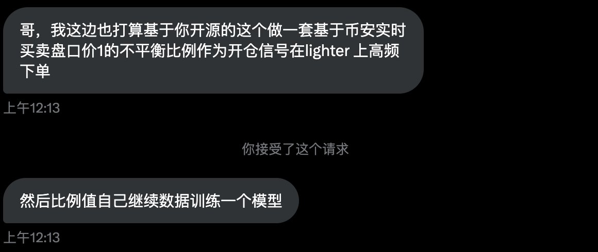
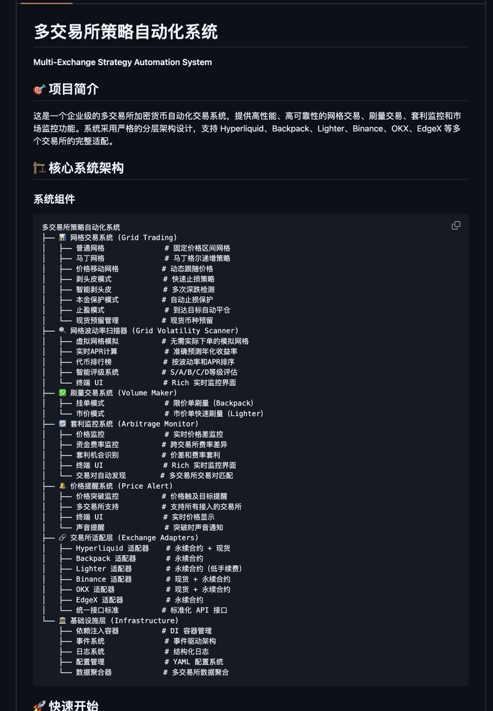

# 盤口微觀結構刷量策略：買賣一檔變化信號與高頻套利

> **來源**: [@gch_enbsbxbs](https://x.com/gch_enbsbxbs/status/1988281519983743308)
>
> **日期**: 
>
> **標籤**: `高頻交易` `盤口分析` `套利策略`

---

> **來源**: [@gch_enbsbxbs (C J)](https://twitter.com/gch_enbsbxbs)  
> **日期**: 2026-02-17  
> **標籤**: `盤口分析` `高頻交易` `刷量策略` `買賣一檔` `訂單簿微觀結構`

---

## 核心策略邏輯

分析盤口數據，（買 1 賣 1 的變化）決定開倉信號，然後預測下一刻的價格變化。這就是我的刷量腳本的核心邏輯。

信號可以使用任意一個交易所。

## 實測結果：Backpack 案例

在這套邏輯下，刷 Backpack，1000 刀免手續費，你還能再賺 100 刀。

如果你只是來回買賣，那麼每一筆都是虧錢的，你的勝率是 0。但是在這套邏輯下，胜率可以達到 60-70，最終盈利 100 刀。

### 為什麼只有 100 刀？

因為下一刻的價格變化實在太小了，盈利不了多少錢。

所以我為什麼買 SOL 手機？這下老鐵們都懂了吧？（我已經刷了 10 台手機的測試結果）

## 實測結果：Lighter 案例

用同樣的邏輯刷 Lighter，實測結果是無法盈利。磨損是 10 萬分之 1。（這是經過好幾天測試、下單次數達到萬次的測試結果。）

## 策略優勢

我相信這套刷量策略應該已經超過很多人的刷量方法了。只要你捨得本金，你想刷多少量就能刷多少量。

本來是不打算開源這個的，但是我最近已經不打算刷量了，索性就給開源了。

## 系統介紹

這套系統現在給老鐵們開源。我需要再忙其他的腳本了。

這個腳本經過長達 2 週的運行、調試和升級，已經穩定無 bug，加入了很多功能，且裡面包含了其他的系統：

- **輔助系統**
- **網格系統**
- **刷量監控**為一體的系統

功能很豐富，也比較複雜。

## 使用注意事項

用之前一定要讓 AI 幫你閱讀一遍功能，徹底理解清楚每個參數作用。特別是網格系統，我設計了很多的模式，對比早期版本變化非常大。

後續我會繼續升級，都會以這套系統的架構為基礎進行升級，做新功能。暫時先這樣。

**小白不要輕易嘗試實盤使用。不對任何結果負責。DYOR**（有任何疑問，你可以讓 AI 幫你回答）
