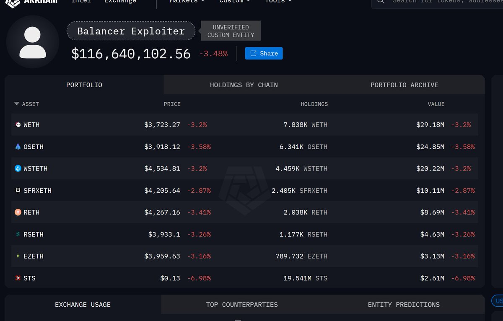

# Balancer 黑客事件套利策略分析

> **來源**: [@LumaoDoggie](https://x.com/LumaoDoggie/status/1985370807753957684)
>
> **日期**: Mon Nov 03 15:37:41 +0000 2025
>
> **標籤**: `套利` `流動性陷阱` `限價單`

---

> **來源**: [@LumaoDoggie](https://x.com/LumaoDoggie)
> **日期**: 2026-02-17
> **標籤**: `Balancer` `套利` `黑客事件` `限價單`

---

## 事件背景

Balancer 被黑，黑客手上現在有幾千萬美元的包裝 ETH。

其中需要關注的是 osETH 和 sfrxETH，這兩個代幣分別有 6 千多個和 2 千多個。

## 套利機會分析

### 市場條件

這兩個池子比較淺，如果黑客一次性 swap 出去的話，很容易把幣價砸個坑出來。

黑客不走官方渠道兌換，因為會怕被鎖。

### 套利策略

可以去掛限價單（用 USDT 或者 ETH 去換），按照當前價的 95% 接一些。

**掛單平台**：
- 1inch
- CowSwap

**預期時間**：期望接下來兩天黑客把價格砸下來。
