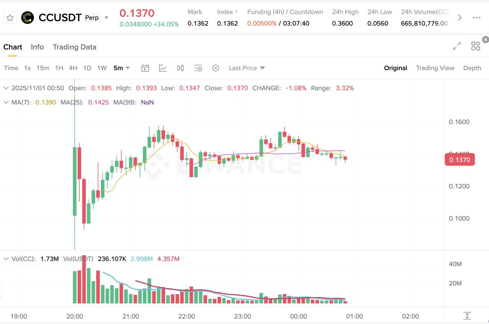
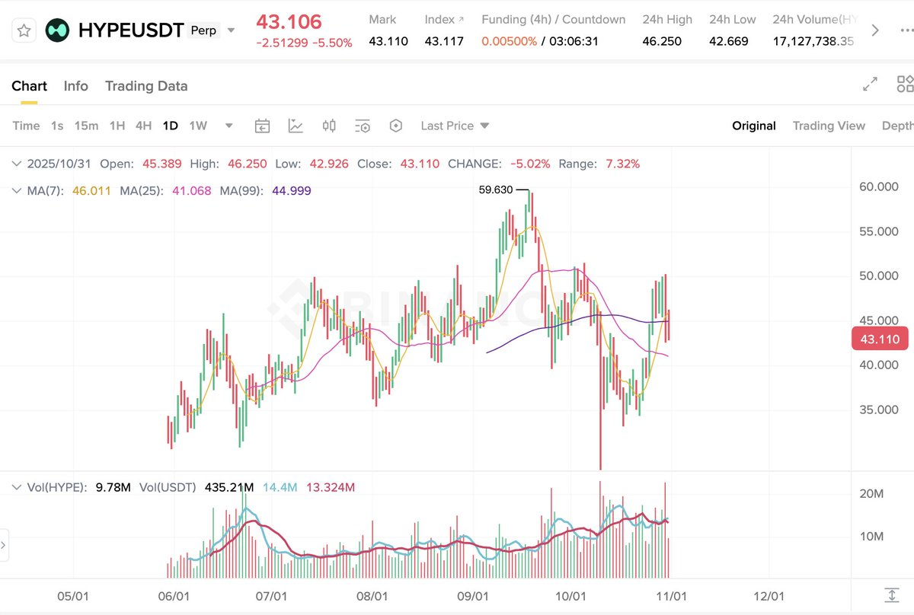

# 盤前合約交易策略：只上合約無現貨時的做多機制

> **來源**: [@nemoyue0607](https://x.com/nemoyue0607/status/1984303380072898919)
>
> **日期**: Fri Oct 31 16:56:07 +0000 2025
>
> **標籤**: `盤前合約` `做多策略` `風險管理`

---

> **來源**: [@nemoyue0607 (nemo小莫)](https://x.com/nemoyue0607)
> **日期**: 2026-02-17
> **標籤**: `盤前合約` `做多策略` `交易策略` `風險管理`

---

## 盤前合約交易核心發現

今天剛上線盤前合約的 $CC 看見一些朋友做空了，本來自己也躍躍欲試，但和二級大神 @007sjzt 討論後他調研發現盤前合約如下奧秘：

## 盤前合約市場特性

### 上漲機率與表現

1. **上盤前合約沒有現貨的，上漲比例有 70%**，有的甚至漲 2～3 倍，如最早的 $HYPE、$XPL 等。幾乎最後都拉盤高於開盤，有的盤前合約也砸，但是最後都拉盤了。

### 核心交易策略

2. **只上了盤前合約（沒有現貨），永遠不要做空。**
   - 盤前合約，堅持固定的倉位做多，勝率起碼有 80% 以上
   - 要密切關注什麼時候上現貨，會砸盤！

### 拉盤機制解析

3. **理由是很多人套保，沒有現貨砸盤的，哪個有實力的大戶都可以拉。**
   - 拉爆對手盤，相當於多頭
   - 做空的人越多，拉起來越猛

4. **可以去看交易所的合約持倉量**，相當於盤子幾百萬，只有拉盤才有更大的利潤空間。

### 交易注意事項

5. **開盤一分鐘，本來就沒深度，不好參考。**
   - 反正不管是不是垃圾幣，只上合約，沒上現貨的不要隨便做空
   - 策略要堅持做，進場位置也很關鍵

6. **盤前合約大部分情況下為什麼拉盤**：
   - 主要是給散戶一個錨定的價格
   - 畢竟合約拉幾倍容易，現貨沒那麼容易
   - 合約拉高了，到時現貨接盤的人才多

## 交易心得補充

### 交易理念

7. **追求做一筆好的交易**
   - 一筆好的交易虧了也是正常的
   - 合理的預期判斷以及健康的止損
   - 止損不一定是保本，因為只拉一點的話大部分時候都會止損
   - 你根據預期來，比如預期翻倍，止損就大一點，或者跌破盤整區域
   - 你不能說我想翻倍，我不能接受虧，或者虧一點就跑，賺一點就跑
   - 你要想一開單就盈利，不容易止損，只有那種盤整久的突破，一突破就幹進去，是計劃委託的，手動來不及

### 倉位管理

8. **不能說很看好這個幣就重倉，首先要考慮止損。**
   - 位置不好的只能輕倉，也可以分批建倉，或者要麼就等待
   - 不能出現太過於賭某一筆，重倉造成大虧損

## 關鍵總結

| 策略要點 | 說明 |
|---------|------|
| 只上合約無現貨 | 永遠不做空，做多勝率 80%+ |
| 上漲機率 | 70% 上漲，部分漲 2-3 倍 |
| 拉盤原因 | 做空者多、盤子小、套保需求、錨定價格 |
| 風險點 | 關注現貨上線時間（會砸盤） |
| 倉位管理 | 固定倉位、合理止損、分批建倉 |
| 進場時機 | 位置關鍵、盤整突破、計劃委託 |
