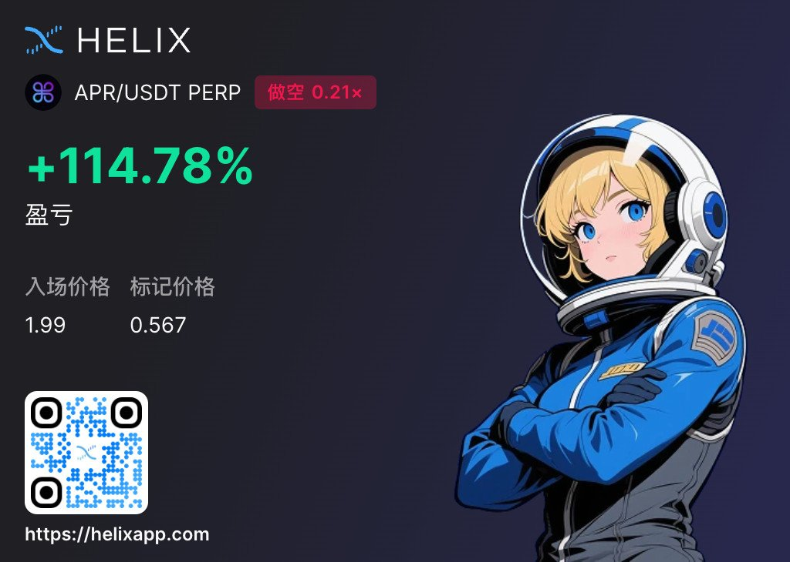

# Helix 盤前套利實戰：114.78% 單日套利收益分析與風險指南

> **來源**: [@cryptogator1121](https://x.com/cryptogator1121/status/1981824041817452915)
>
> **日期**: Fri Oct 24 20:44:06 +0000 2025
>
> **標籤**: `套利交易` `盤前交易` `風險管理`

---

> **來源**: [@cryptogator1121 (CryptoGator 小鱷魚🐊)](https://twitter.com/cryptogator1121)
> **日期**: 2024-10-17
> **標籤**: `套利` `Helix` `盤前交易` `風險管理` `做市商機制`

---

僅以 1 天時間成功在 Helix 實現了 114.78% 套利收益！本文介紹我花兩天鑽研的套利框架和風險分析🔥。文末附上 10% 報酬率套利教學，現在還能賺🪏

## 1️⃣ $APR 開盤時間軸

（詳細記錄 $APR 在 Helix 上的開盤時間與價格變化）

## 2️⃣ 套利交易介紹

本次套利是基於 Helix 盤前交易的價格差異。主要策略是利用市場定價不合理的機會，透過做空被高估的資產來獲利。

參考 @sukie234 在 10/17 發的推文：

> 可以在 Helix 盤前交易 Monad 上的大火車準太子 @aPriori 了
> 按照目前的 Monad 盤前合約 $10B FDV 定價，apriori 融了超過一半的生態融資，暫且估計 20%-30% 的估值，大概估值天花板就在 2B，看這個盤前價格已經 2B 了...這個行情 2B 確實是太貴了，開空撿錢

正是這篇文讓我注意到這個市場機會。

## 3️⃣ 風險及不確定性

套利交易並非無風險，主要風險包括：
- 市場流動性風險
- 價格波動風險
- 平台機制風險
- 時間成本風險

## 4️⃣ 風險分析：懶人包

快速總結版風險要點：
- 需要深入理解 Helix 做市商機制
- 爆空風險需要特別注意
- 資金管理極為重要
- 時機選擇是成功關鍵

## ❗️風險分析：Helix 做市商機制

Helix 的做市商機制有其特殊性，需要理解以下重點：
- 做市商如何提供流動性
- 價格發現機制
- 滑點與深度的關係
- 盤前交易的特殊規則

## ❗️風險分析：爆空誘因

做空交易存在爆倉風險，主要誘因包括：
- 突發性利多消息
- 流動性不足導致滑點過大
- 做市商價格操控可能性
- 市場情緒突然轉向

## 7️⃣ 結論：我的交易回顧

透過嚴謹的風險分析和時機把握，在 1 天內實現 114.78% 的套利收益。關鍵成功因素：
- 提前發現價格不合理的機會
- 深入研究 Helix 機制
- 嚴格的風險控制
- 適時進出場

## 8️⃣ 50% 低風險套利教學

（提供相對保守的套利策略，目標報酬率約 10-50%）

## 9️⃣ Helix 入金與下單教學

（詳細說明如何在 Helix 平台進行操作的步驟）

---

**風險提示**：套利交易涉及高風險，本文僅供教育參考，不構成投資建議。請務必做好風險管理，只投入可承受損失的資金。
