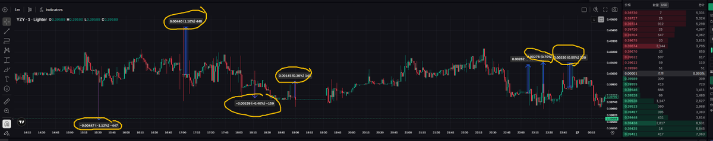

# Lighter 交易所流動性插針回歸策略

> **來源**: [@Wayne145591](https://x.com/Wayne145591/status/1982610899912523933)
>
> **日期**: Mon Oct 27 00:50:48 +0000 2025
>
> **標籤**: `插針交易` `市場微觀結構` `做市商對抗`

---

★ Insight ─────────────────────────────────────
1. **流動性插針回歸策略**：這是一種專門利用小型交易所深度不足、價格容易劇烈波動的特性，透過捕捉極端價格插針後的回歸來獲利的策略
2. **市價平倉的代價**：散戶使用市價單平倉會產生滑價損失，而做市商則透過提供流動性賺取價差、手續費返還和回歸利潤
3. **市場微觀結構**：這種策略的核心在於理解 order book 的動態變化，以及散戶情緒性交易行為如何創造做市商的獲利機會
─────────────────────────────────────────────────

## Lighter 交易所的流動性特性

在 @Lighter_xyz 上可以觀察到 YZY 等交易對經常出現極限插針的狀況，這種現象特別適合進行 Liquidity Spike Reversion 策略。這種策略專門偵測長下影線或上影線（插針），在影線底部/頂部掛反向限價單（limit order），捕捉針尖回彈。由於 Lighter 屬於較小深度的市場，這樣的價格異常特別明顯。

## 策略參數設定

### 觸發條件

- 單根 K 線波動超過平常標準差（如 > 0.7% 或 > 3σ）
- Order book 出現瞬間吃光一邊（bid/ask depletion）

### 執行邏輯

- 在距離 mid price ±Δ（例如 ±0.7%）掛反向限價單
- 成交後設 take-profit 回歸點（如回歸 50% 的插針幅度）
- 可搭配撤單條件（時間超過 3 秒未成交即撤）

## 市價平倉的陷阱

目前在 Lighter 上交易的散戶很多都還在使用市價平倉，但**市價平倉本身就是錯誤的**。市價平倉會吃掉掛在 orderbook 上的 maker 限價單，當買賣深度不夠時，價格會被掃穿多個檔位形成插針，而做市商在極端價位成交，立即成為多空的另一方。這樣做的結果是，散戶只會把利潤都讓給那些執行做市策略的人。

### 利潤流向分析

**做市商提供退出通道，散戶付出價格讓步**：

- 市價單的散戶損失：滑價 + 手續費
- 掛單做市者的利潤：spread + rebate + 回歸獲利

散戶平倉越急，做市商賺得越穩。做市商的利潤來源之一，就是散戶情緒性、市價型交易行為的對價損失。這不是陰謀論，而是市場機制的自然結果。

## 策略適用性

這種策略很適合在小交易所實施，因為：

1. 深度較淺，價格更容易出現異常波動
2. 散戶比例較高，情緒性交易行為更明顯
3. 做市商較少，競爭相對較小
