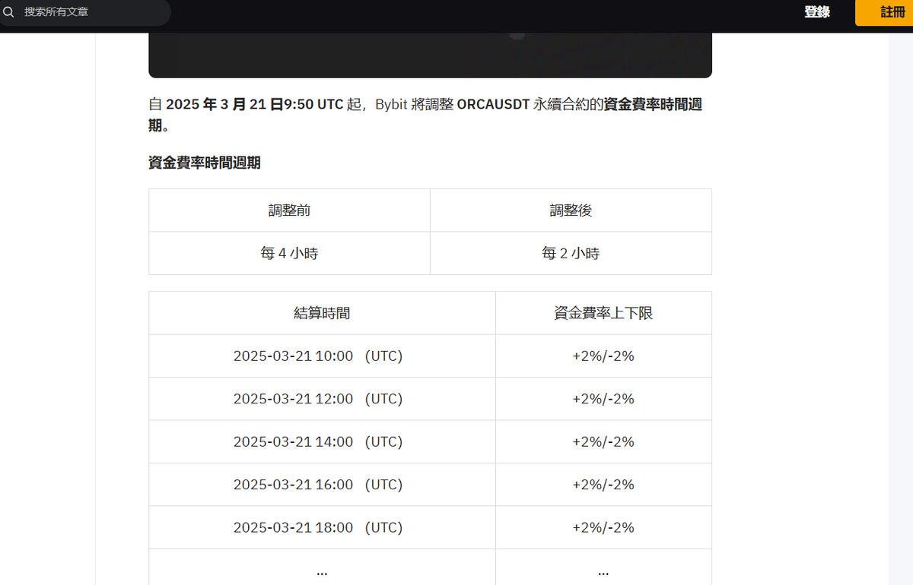

# 小資金套利策略：觀察費率溢價機會

> **來源**: [@daidaibtc](https://x.com/daidaibtc/status/1910941265711231270)
>
> **日期**: Sat Apr 12 06:21:15 +0000 2025
>
> **標籤**: `套利策略` `現貨期貨套利` `風險管理`

---

> **來源**: [@daidaibtc (带带带比特)](https://x.com/daidaibtc)
> **日期**: 2026-02-17
> **標籤**: `套利策略` `費率套利` `小資金` `ORCA` `溢價交易`

---

## 套利機會觀察流程

關於小資金如何套利的思路。舉個例子吧 ORCA。

昨天費率開始極端之後，你就應該去觀察還有哪個交易所有它。費率和溢價情況如何。

可以看到 BYBIT 上個月的公告是 2H/一次的。那麼這裡就有明顯的套利機會，頂格費率，必然是去 bybit 做多邊 / 幣安做空邊。

## 早期進場的重要性

那天 SPACE 我說做這些事情，你每天是要花一些時間在上面的，多觀察，進的一定要早。

這裡因為有明顯的套利機會，溢價必然會進一步擴大。你後面看別人賺錢 FOMO 進去就有不確定性了。

## 溢價回歸策略

這個時候今天，幣安也改了結算時間，就可以秒平。因為溢價一定會回歸。

又或者直接幣安做空邊，bybit 做多邊去賺這 3% 的價差。

多做正 EV 和延遲滿足的事情。
