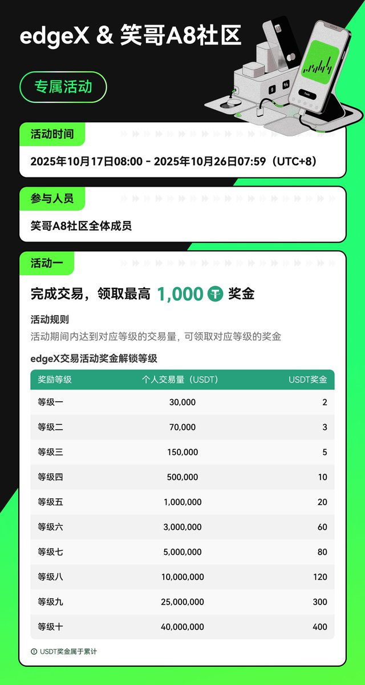
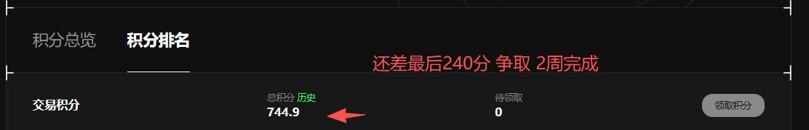

# Lighter 空投刷分策略與女巫檢測規則

> **來源**: [@tujie5678](https://x.com/tujie5678/status/1979401570061275382)
>
> **日期**: Sat Oct 18 04:18:04 +0000 2025
>
> **標籤**: `空投刷分` `對沖策略` `風控`

---

★ Insight ─────────────────────────────────────
- 這是一篇關於 Lighter 空投刷分的實戰策略分享，包含大量操作細節
- 需要保留所有數據（分數、金額、交易量）和具體策略，這些是核心價值
- 內容涉及女巫檢測規則，需要完整保留規避方法和技術細節
─────────────────────────────────────────────────

## 作者實戰成績

筆者一共拿了 110 分，加上賠償分 8 分，總計 118 分。可惜大號被女巫檢測了，少了起碼二十分。

目前做了六、七週左右，一共有五百多分。

## 上週策略詳解

### 大額對沖策略（3 個號）

- **資金配置**：每個號放 2000 刀
- **交易標的**：只刷 BTC
- **成績**：每個號拿了 30 分（大號被女巫除外）
- **成本分析**：70 萬左右交易量一分，損耗 1000 刀，33 刀一分有點不值得

**大號被女巫原因**：在蘋果電腦上用的快連 VPN

**改進計劃**：
- 三個號放大額 1000-2000 刀
- 對沖小幣種為主
- 不爆倉

### 小額爆倉流（40 個號）

**資金配置**：
- 每個號放 100-150 刀左右
- 分為主帳號和子帳號

**操作策略**：
- **主帳號**：按照未平倉合約從低到高的小幣種，不爆倉只持倉
- **子帳號**：用來爆倉，開波動比較大倍數比較高的小幣種
- **開單頻率**：每天開單兩次（因線上時間不長）
- **持倉時間**：3 小時到十幾個小時之間
- **帳號間對沖**：四十個號之間也有互相對沖

**成績**：
- 一週下來一個號的交易量估計在兩萬左右
- 每個號每週大概能拿到 1-2 分
- **成本相對很低**

## 女巫檢測規則總結

### 兩大女巫觸發條件

1. **交易行為不夠差異化**
   - 同台單號
   - 永遠只開空不開多，或永遠只開多不空

2. **VPN 問題**
   - 以快連為代表的 VPN
   - 建議自己搭建節點
   - 可以去 AWS 領免費伺服器（油管搜不良林，有手把手教學）

## 最佳拿分方式

**核心策略**：小幣種 + 長持倉

**成本分析**：
- 平均一分集中在 10 刀以內
- 證明現在雖然卷了，但門檻還不算太高
- 場外價格已衝到 100 刀 1 分

## 社群總結的進階技巧

### 對沖技巧

**不規則對沖（1V3/1V4）**：
- 全部打亂順序做
- 不會被女巫，但分不高、耗神費力

**權重優先策略**：
- Lighter 完全和交易量無關，只和權重有關
- 儘量小幣對沖
- 可以 1 個號開 5 倍多，另外 3 個號加起來 5 倍空
- 每次都隨機換，不要一直多或一直空

### EdgeX vs Lighter 對沖策略

**操作建議**：
- EdgeX 掛單（用推薦連結有 VIP 還有 30% 返現）
- Lighter 市價掛單，逐倉掛單
- **不要一直一個方向開 Lighter**（例如無腦掛 EdgeX 多單 + Lighter 空單）

**持倉建議**：
- 一個單子持倉 20-40 分鐘
- 儘量小幣持幣、倍數小、多掛單
- 可以同時持倉 3-10 張單子
- 掛止盈止損或手動平倉

**EdgeX 額外優勢**：
- 目前 OI 佔比最高，和交易量無關
- 這週都不卷
- 下個月就發幣
- 社群有返利活動（返佣 + VIP1 + 活動基本都是送錢）

## 其他項目動態

- **Paradex**：徹底停止了，不能秒開秒關了
- **GRVT**：繼續秒開秒關，性價比高

## 推薦連結

- Lighter: https://t.co/ewMdXtiVl5
- EdgeX: https://t.co/ahfZPsGz9Y

---

★ Insight ─────────────────────────────────────
- 完整保留了作者的數據和策略細節，包括資金配置、分數計算、成本分析
- 女巫檢測規則是核心重點，完整保留了觸發條件和規避方法
- EdgeX 對沖策略部分保留了社群討論的進階技巧，這是額外的價值
─────────────────────────────────────────────────
