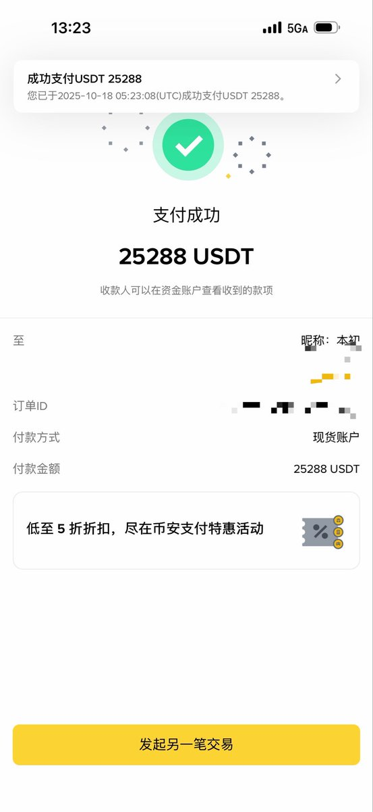
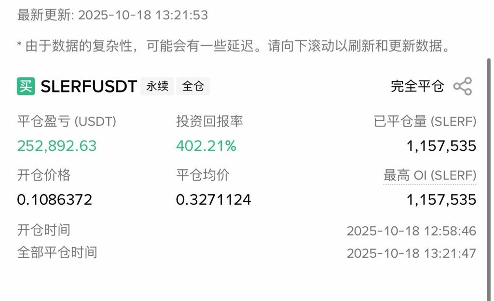
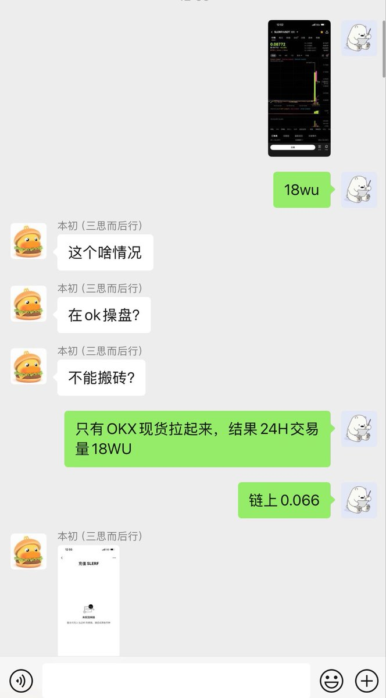
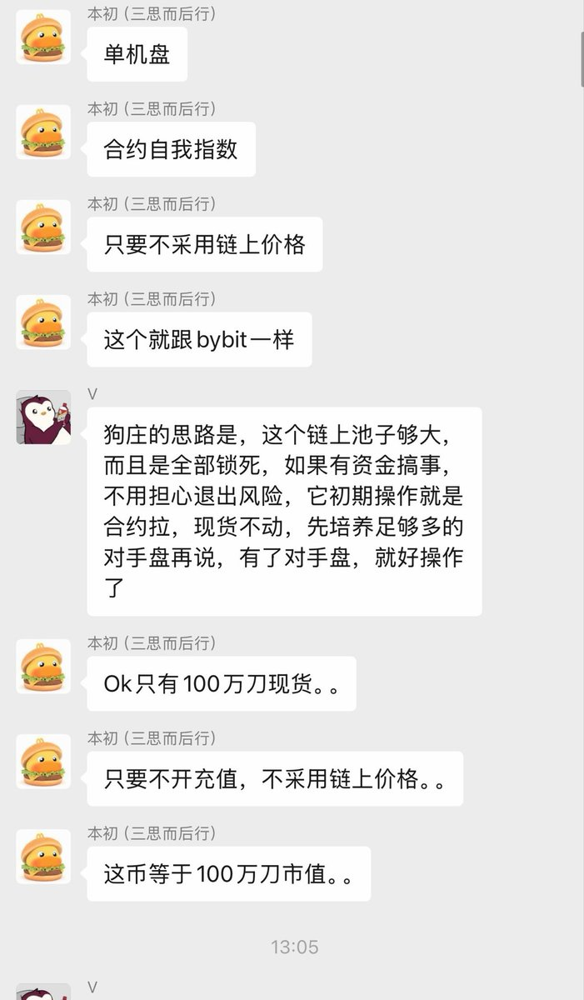

# SLERF 合約現貨套利案例：鏈上池子大小與價格不對稱分析

> **來源**: [@thankUcrypto](https://x.com/thankUcrypto/status/1979424217964908641)
>
> **日期**: Sat Oct 18 05:48:04 +0000 2025
>
> **標籤**: `合約現貨套利` `市場微觀結構` `單機幣交易`

---

> **來源**: [@thankUcrypto (allincrypto 熬鷹資本 🇨🇳)](https://twitter.com/thankUcrypto)
> **日期**: 2024
> **標籤**: `量化交易` `套利` `合約現貨` `SLERF` `鏈上分析`

---

## 初步判斷與轉機

這個 SLERF 一開始我們看是垃圾。真得感謝 @dotyyds1234 龍王眼光毒辣。

因為鏈上池子太大了 2000 萬，市值 3000 萬，理應拉不動才對。那時候鏈上價格 0.64，但是合約 0.71，我認為有點兒像 UPBIT 新幣和幣安現貨的關係——小馬拉大車，合約拉盤，現貨一直拉不動，可能很快就會下去，第一波開的單子就清了。

## 深入分析與發現異常

然後我查全網資金費率，只看到了幣安有合約。那幣安應該也要跟著指數價格拉盤才能拉這麼多才對，又去查了 OKX 現貨，OKX 現貨才 18 萬 U 交易量。

我感覺不對勁，但是我沒有這個「單機幣」意識。龍王三句話發完並且解釋完整邏輯以後，全都上車了。

## 結論

話不多說，帶單分潤 10%，收菜。

---

## 關鍵指標對比

| 指標 | 數值 |
|------|------|
| 鏈上池子規模 | 2000 萬 USD |
| 市值 | 3000 萬 USD |
| 鏈上價格 | 0.64 USD |
| 合約價格 | 0.71 USD |
| OKX 現貨交易量 | 18 萬 USD |

## 核心洞察

合約與現貨價格出現明顯偏離（0.71 vs 0.64），且現貨交易量極低，顯示這是一個「單機幣」——合約市場與現貨市場流動性嚴重不對稱，為套利提供了機會。
