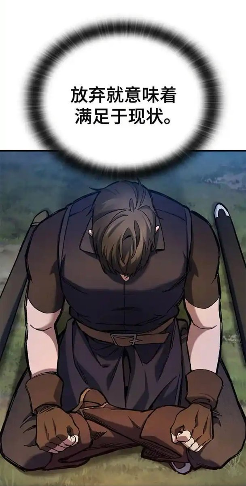

# 10/11 流動性真空去槓桿事件分析

> **來源**: [@cryptowilson_](https://x.com/cryptowilson_/status/1979119096127197263)
>
> **日期**: Fri Oct 17 09:35:37 +0000 2025
>
> **標籤**: `流動性危機` `風險管理` `做市商機制`

---

## TLDR（核心摘要）

- 10/10 - 10/11 的暴跌是市場槓桿過高引爆的流動性撤離事件，進而引起 USDe、BNSOL、WBETH 等資產的脫鉤，主流媒體統計此次全市場去槓桿規模約 $19B，為近年最劇烈之一

- 做市商（MM）在極端波動中出於風險/資本效率考量同步撤出掛單，幾十分鐘內 1% 深度縮水 90%+，形成流動性真空，之後才陸續回歸

- 多家數據顯示，本次去槓桿主戰場發生在加密原生交易所，非傳統機構主導；BTC OI 當天美元計值與合約數量皆大幅回落，為此輪牛市最大的清槓桿事件

- 幣安在官方說明中明確給出時間線：市場低點出現在 21:20 - 21:21（UTC），而 USDe / BNSOL / WBETH 的嚴重脫鉤發生在 21:36（UTC）之後，也就是先因為川普的關稅消息導致價格下跌

- 事件後，幣安公告對受影響的 USDe / BNSOL / WBETH 抵押清算用戶進行補償，並調整包裝資產的定價/轉換邏輯以降低後續風險

---

## 一、到底發生了什麼？（臺北時間軸）

**05:20（UTC+8）**：多數幣對觸及最低（對應 UTC 21:20 - 21:21）

**05:36 之後**：USDe、BNSOL、WBETH 在個別交易環境出現嚴重偏離（屬事後效應）

**06:05**：做市商逐步回補深度，1% 雙邊深度於數十分鐘回復至災前 80 - 90%，但傷害已造成

### 關鍵機制鏈條

- 高槓桿與集中風險（期貨主導、抵押物多元且高度相關）

- 價格下挫 → 清算機器人連續市價賣出 → MM 撤單（流動性真空）

- 保險基金承壓 → 觸發 ADL（自動減倉），對原本獲利的對沖腿先行強平，投資人瞬間失去避險，裸露部位續被擊穿

- 現貨抵押物與包裝資產被動砸盤，小幣/冷幣出現「插到不可思議低點」的長針（不代表有人能在最底成交）

---

## 二、做市商為何在那 20 - 40 分鐘選擇撤離？

### 非對稱風險
正常時賺點差幾個 bps；崩盤時一口吃到大量砸單、容易變無底洞

### 資本效率/抵押壓力
MM 自身也可能以山寨/包裝作抵押；當標的與抵押「雙殺」，賬戶權益急速縮水，觸發自我保全機制

### 行業慣例與責任邊界
加密市場沒有「指定做市商維持義務」的強制規範，撤單不會有監管罰則

### 跨所一體化
頭部 MM 同時覆蓋多家 CEX，當某主戰場風險劇烈上升時，往往是「全線撤」，因此你會看到跨所價差在最混亂時段無人搬磚

事件回溯顯示，流動性在峰值時段幾乎蒸發，之後才逐步回補。這也解釋了為何許多小幣能出現 80 - 90% 的瞬間插針。

---

## 三、為什麼很多人被「先 ADL 掃掉避險腿、再被反向端砍」？

ADL（Auto-Deleveraging）是清算最後一道防線：

1. 先嘗試市場搓合訂單
2. 不足則由保險基金承接
3. 再不足就 ADL 強制減倉，優先掃掉「高槓桿且高盈虧比」的一側

所以你會看到：賺錢的空腿先被 ADL，剩下裸多腿再被續殺，這不是陰謀，是規則本身的數學結果。

---

## 四、幣安官方動作與後續調整

- 幣安已宣布對在特定時段因 USDe / BNSOL / WBETH 脫鉤而被清算的保證金/合約/借貸用戶進行補償，並覆蓋相關手續費，共補償了將近 2.83 億 u，同時因抄底脫鉤資產而營利的部分並不回溯

- 公告調整包裝資產的定價與轉換機制、後續風控優化

- 幣安發起「同舟計劃」，投入 4 億美元幫助行業復甦與信心重建，包含：3 億美元用戶種子計劃及 1 億美元機構支持計劃

以交易所格局來說，幣安是真的很大了，因抵押資產虧錢的補償、賺錢的也讓你賺走，真正造成市場崩盤的原因來自於高槓桿的市場及做市機制的失效。

有許多三四線或無恥所，在上面虧錢都無處申冤。

---

## 五、給交易者的實戰建議

### 降低整體槓桿倍數，特別是多腿策略
注意 ADL 指示燈與有效槓桿，別讓避險腿先被掃掉。

其實這件事早在 23 年 $TRB 資費套利的時候就注意到了，很多群友因為多所的價格插針不一致而變成單邊交易大額虧損。

### 謹慎使用波動/包裝類資產作抵押
當標的與抵押同向下殺，清算風險是二次方放大。

### 避開極冷流動性對
小幣的 1% 深度在極端時段幾乎消失，市價單的「滑點地獄」真實存在。

特別是現在山寨幣如雨後春筍般冒出來，多到大部分的 ALTS 根本沒有流動性支持，目前我只玩主流幣 BES、熱點幣像之前的 $XPL、或是莊幣。

### 風控用「合約數量」看 OI，而非只看美元
價格下跌時，以 USD 計的 OI 會被動看起來更慘，容易誤判槓桿弧度。

### 分層止損與限價排程
保留「不成交就不救」的紀律，避免在流動性黑洞裡盲踩市價鍵。

### 研究交易所規則細節
保險基金規模、ADL 排序、組合保證金、資產風險係數，這些在黑天鵝時刻是決勝點。

很多時候人唯一可以改變的只有自己，像內求才更容易自洽圓滿。

---

## 作者的反思

睡醒之後去翻了各種目前待在的群組，刷了各種摸底賺錢 / 沒設止損爆倉的人的文章。

給自己的一段話就是「不要簡化別人走過的路」。

如果當下我醒著，我有勇氣抄底嗎？

拿了蠻多 USDe 的我腦子會怎麼想？

看到 bnsol、wbeth、usde 我敢買那個標的？

（事後看可能只敢買 bnsol 因為是 bn 的）

我目前的設備足夠滿足我做這些操作嗎？

（主要用的電腦送修中）

為什麼現在的我慣性放棄機會？除了天性偏懶以外，更多的是很像我的心裡沒辦法承擔更大的波動了。

雖然沒有財富自由，但比起承擔這種心理壓力，理理財等 AA 同花局很像更好。

寧可差不多的活著，不要完美的死去（更何況跟 IQ150 比我根本不完美）。
