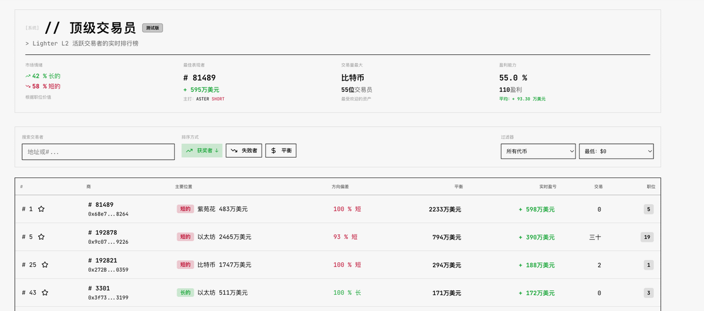
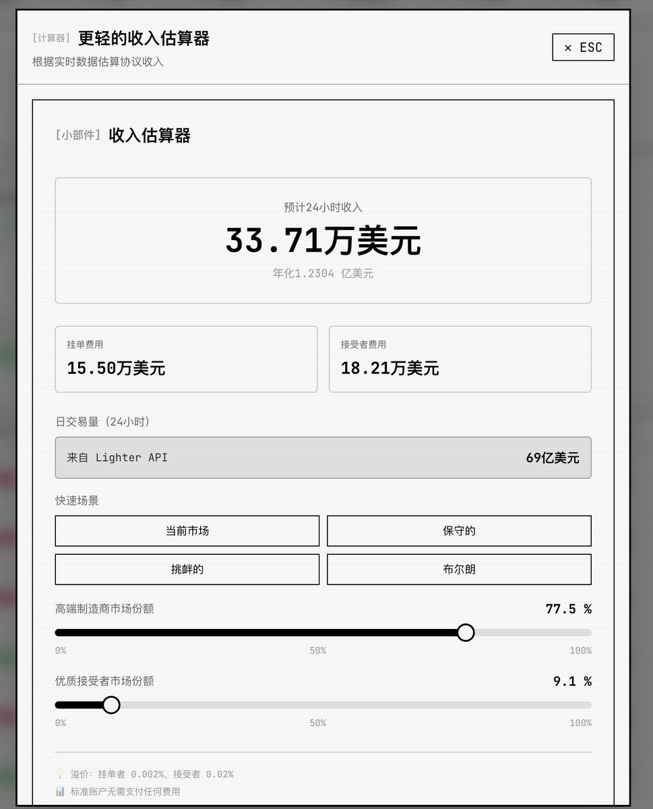
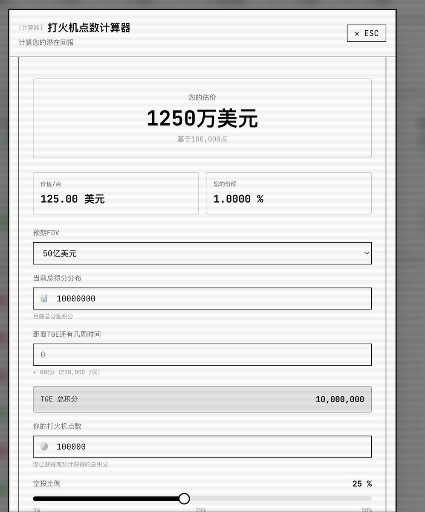

# Lighter 分析儀表板完整指南：查看交易員倉位、預估收入與空投

> **來源**: [@c_dylanber](https://x.com/c_dylanber/status/1979002654291562599) | [原文連結](https://lighter.gelora.study/)
>
> **日期**: Fri Oct 17 01:52:55 +0000 2025
>
> **標籤**: `Lighter協議` `交易分析工具` `空投預估`

---

> **來源**: [@c_dylanber (诺诺Dylan)](https://twitter.com/c_dylanber)  
> **日期**: 2026-02-17  
> **標籤**: `Lighter` `DeFi` `空投` `數據分析` `交易工具`

---

## 工具簡介

今天來介紹一個關於 @Lighter_xyz 由 @0xJaehaerys 製作的新網站：https://lighter.gelora.study

這個網站是之前幾個工具類網站的集大成者，整合了多項實用功能。

## 主要功能

### 1️⃣ 查看頂尖交易員的倉位、盈利、開的哪幾單

這個功能有什麼用呢？大家還記得 hyperliquid 上出現了好多老鼠倉吧

這個功能能方便我們看一些老鼠倉最新的動向和消息，方便來做自己的決策

### 2️⃣ 預估 Lighter 的收入

這個其實我覺得是最重要的，Lighter 收入的多少決定著我們對 Lighter 之後代幣價值的看好

這個功能能非常方便的直接接入 API 的總 volume，再可以直接用當前市場來決定 taker 和 maker 的比例，從而算出 Lighter 的收入

### 3️⃣ 預估個人空投

這個就不用多說了，決定預期的 FDV 和自己的 points 之後就能直接算出自己的空投價值

### 4️⃣ 市場數據

還能看 Lighter 的 volume、OI、TVL 甚至是每個幣種的詳細數據

## 總結

總的來說，這是一個 Lighter 工具的百寶箱，基本上之前工具網站上有的功能都被集合進來了，而且 @0xJaehaerys 做的網頁審美和格調也非常不錯！

大家可以用起來了
