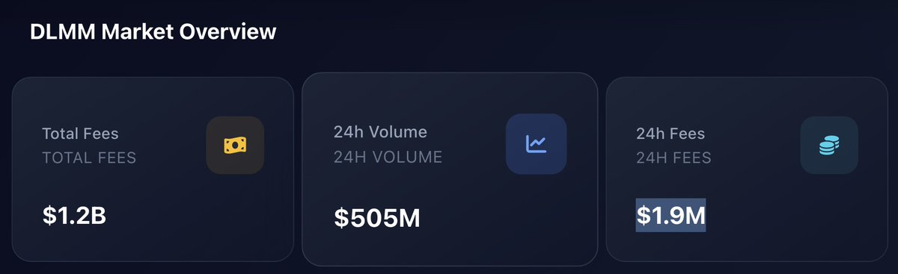
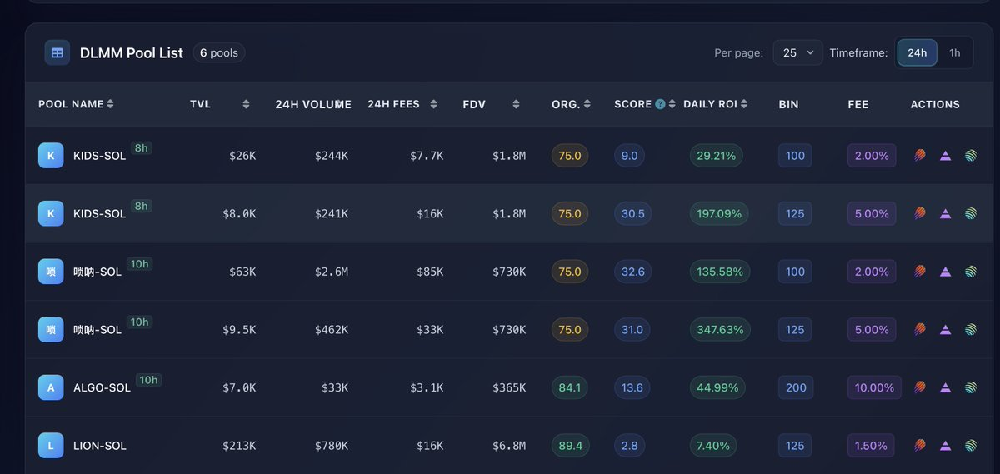

# 透過 24 小時手續費評估 Solana Meme 熱度

> **來源**: [@gm365](https://x.com/gm365/status/1978306171099603158)
>
> **日期**: Wed Oct 15 03:45:20 +0000 2025
>
> **標籤**: `Solana` `MEME 代幣` `市場指標`

---

> **來源**: [@gm365](https://twitter.com/gm365)  
> **日期**: 2026-02-17  
> **標籤**: `Solana` `Meme` `鏈上指標` `Meteora` `手續費分析`

---

## 核心指標：24 小時手續費收入

通過一個簡單指標來評估 Solana meme 熱度。

Meteora 官方 API 接口有一個大盤數據，包含了 TVL、交易量、歷史總手續費。

以及兩個更有用的短期指標：

1. **24 小時交易量**
2. **24 小時手續費收入**

如果只看一個指標，那麼推薦 **24 小時手續費收入數據**。

## 觀察數據

經過長期觀察，發現大部分時間這個數值都保持在 **$1M**。

也就是說，平均而言，DLMM 的 LP 用戶每天平均印鈔 $1M 💵

**如果這個數值開始大幅攀升，基本可以說明 Solana meme 短期熱度提升。**

因為大體上，這些手續費都來自於鏈上 MEME 代幣的 LP 做市。

## 當前數據分析

比如看今天數據，顯示 **$1.9M**，幾乎兩倍於均值。

但是否說明 Solana meme 迎來復甦？

這還不好說，可能需要持續觀察一段時間，再下結論。
