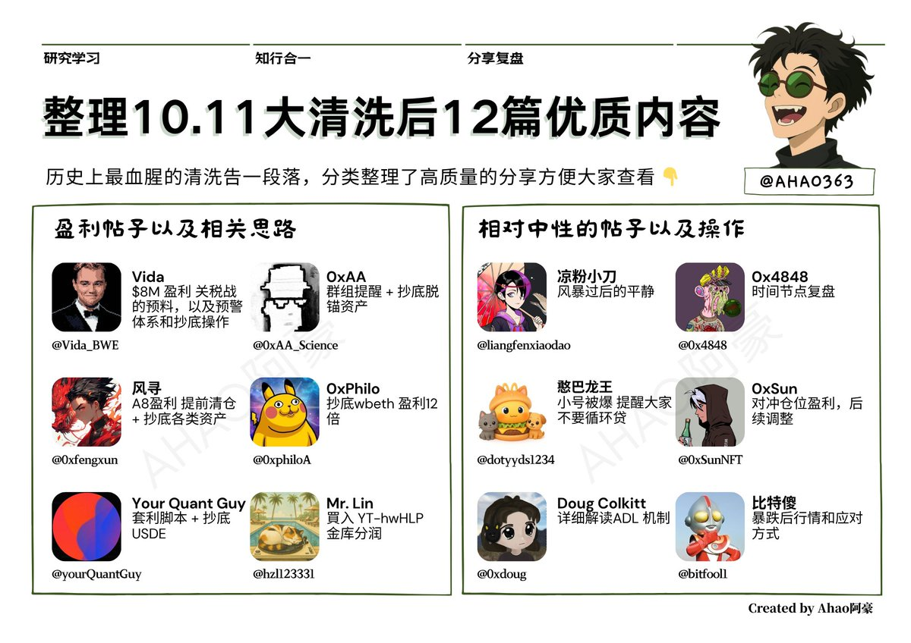

# 10月11日大清洗後的盈利策略與風險管理總結

> **來源**: [@Vegahao](https://x.com/Vegahao/status/1977341136479142118) | [原文連結](https://x.com/Vida_BWE/status/1976786239014527104)
>
> **日期**: Sun Oct 12 11:50:38 +0000 2025
>
> **標籤**: `閃跌套利` `抄底策略` `風險管理`

---

> **來源**: [@Vegahao (Vega Hao)](https://twitter.com/Vegahao)  
> **日期**: 2025-10-11  
> **標籤**: `閃崩套利` `風險管理` `脫錨資產` `USDE` `ADL機制` `關稅戰`

---

## 概述

歷史上最血腥的清洗告一段落，整理 10.11 大清洗後 11 篇優質內容，分為三類：盈利策略、中性操作、風險管理，建議收藏慢慢學習。

---

## 盈利帖子與相關思路

### Vida (@Vida_BWE) — $8M 盈利

**策略**：關稅戰的預料，以及預警體系和抄底操作

來源推文：https://t.co/CQHAV3Mgct

---

### 0xAA (@0xAA_Science) — 群組提醒 + 抄底脫錨資產

**策略**：群組提醒 + 抄底脫錨資產

來源推文：https://t.co/jZV6HBM2ZM

---

### 風尋 (@0xfengxun) — A8 盈利

**策略**：提前清倉 + 抄底各類資產

來源推文：https://t.co/1xX81kGBJQ

---

### 0xPhilo (@0xphiloA) — 抄底 wbeth 盈利 12 倍

**策略**：抄底 wbeth 盈利 12 倍

來源推文：https://t.co/Hg4cUayZSY

---

### Your Quant Guy (@yourQuantGuy) — 套利腳本 + 抄底 USDE

**策略**：套利腳本 + 抄底 USDE

來源推文：https://t.co/HSIibaxwsx

---

### Mr. Lin (@btclin) — 買入 YT-hwHLP

**策略**：買入 YT-hwHLP，hwHLP 金庫在 11 點則派發了一百多萬美金的利潤

來源推文：https://t.co/8rqkmfsaUw

---

## 相對中性的帖子與操作

### 涼粉小刀 (@liangfenxiaodao) — 風暴過後的平靜

來源推文：https://t.co/QgYWIArELG

---

### 0x4848 (@0x4848) — 時間節點複盤

來源推文：https://t.co/ETtgB6kgzw

---

### 憨巴龍王 (@dotyyds1234) — 小號被爆，提醒大家不要循環貸

**風險提醒**：小號被爆，提醒大家不要循環貸

來源推文：https://t.co/4GnP2w31sw

---

### 0xSun (@0xSunNFT) — 對沖倉位盈利，後續調整

**策略**：對沖倉位盈利，後續調整

來源推文：https://t.co/ba9mQHsGVX

---

### Doug Colkitt (@0xdoug) — 詳細解讀 ADL 機制

**機制解析**：詳細解讀 ADL 機制

來源推文：https://t.co/JTANGzOcqi

---

### 比特傻 (@bitfool1) — 暴跌後行情和應對方式

**行情分析**：暴跌後行情和應對方式

來源推文：https://t.co/PVcCpmSM3b

---

## 關鍵學習點

1. **預警體系**：建立有效的預警機制（如群組提醒、關稅戰預判）
2. **抄底脫錨資產**：在極端行情中抄底 USDE、wbeth 等脫錨資產獲利
3. **風險管理**：避免循環貸、使用對沖倉位、了解 ADL 機制
