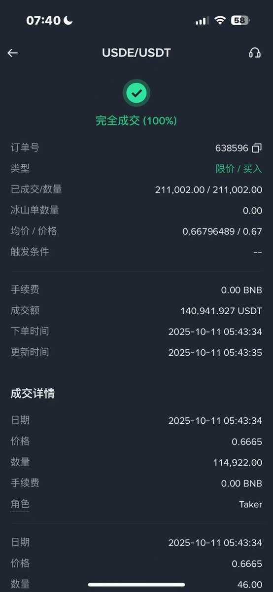

# 10月11日閃崩套利機會總結

> **來源**: [@LumaoDoggie](https://x.com/LumaoDoggie/status/1976969891518595331)
>
> **日期**: Sat Oct 11 11:15:27 +0000 2025
>
> **標籤**: `閃崩套利` `現貨套利` `跨鏈交易`

---

> **來源**: [@LumaoDoggie (撸毛小狗)](https://twitter.com/LumaoDoggie)
> **日期**: 2024-10-11
> **標籤**: `套利` `閃崩` `幣安` `USDe` `Pendle` `Hyperliquid`

---

## 1️⃣ 幣安 USDe 現貨價格暴跌

**時間**: 5:42 - 5:52 左右，底價 0.66 USDT = 1 USDe

**條件**:
- 鏈上或者幣安錢包現貨裡有 USDT
- 幣安理財的不行，已經取不出來了

**玩法**:
1. 直接幣安買 USDe
2. 買了之後再提到鏈上，swap 成 USDT
3. 然後再沖進幣安裡繼續買

**注意事項**:
- 不要直接主網直接沖 U，因為區塊確認時間超過半小時，黃花菜都涼了
- 要主網 USDT 跨到 Plasma U，再沖進幣安，三分鐘搞定

## 2️⃣ WBEth、BnSol（幣安包裝的 ETH 和 Sol）

**價格**: 原價的 1-2 折

**操作方式**:
- 錢包裡如果有 ETH 或者 Sol 的，直接 ETH/WBEth、Sol/BnSol swap
- 不需要走 USDT

## 3️⃣ Pendle + Hyperliquid

**標的**: 買入 YT-hwHLP（Hyperliquid 金庫的 YT）

**原因**: 因為大量爆倉，Hyperliquid 金庫收入暴漲

**收益**:
- 早上 6-10 點之內買入 1000U 的 YT
- 11 點收到 1200U 派發收益

## 4️⃣ 其他山寨幣

**低價機會**:
- 0.55 的 Sui
- 0.13 的 Ena
- 0.001 的 Atom

**注意**:
- 幣安裡 5:30am - 5:35am 左右這些幣你買應該會交易失敗
- 所以只是理論上可以買到而已
- 只有提前掛單，或者去其他 CEX（OKX），才能撿到最低價格

## 5️⃣ 出 U

早上 6 點，幣安 C2C 賣 U 7.20 的匯率

---

## 👋 其他重要經驗

- 能在今天早上 5 點半 6 點打電話通知你撿漏的，那不是鐵桿哥們了，簡直是義父。請珍惜。
- 萬年不聊的人，給你私信落井下石問你虧了多少，直接拉黑…
