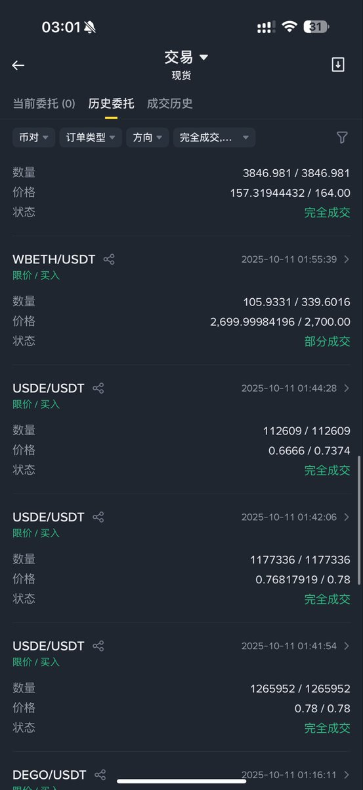
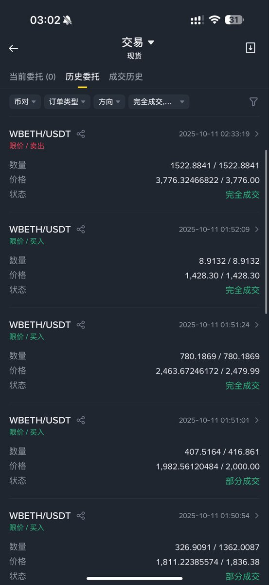
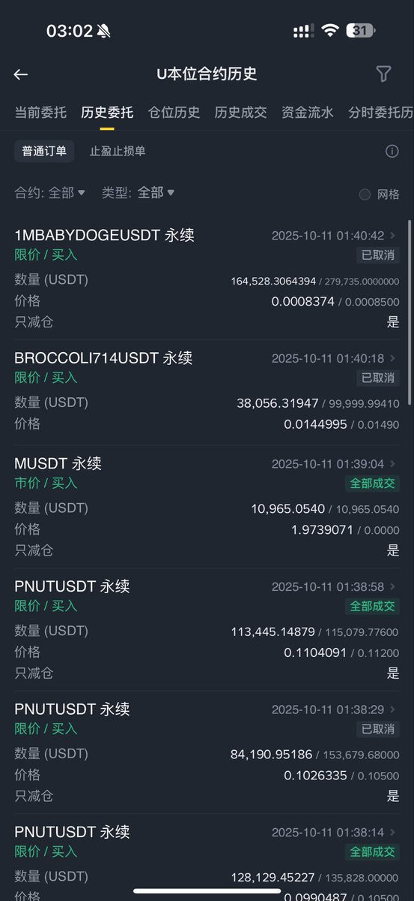

# 10月11日閃崩套利實戰：巨鯨監控、流動性挖礦與風險管理

> **來源**: [@nemoyue0607](https://x.com/nemoyue0607/status/1976839892672848096)
>
> **日期**: Sat Oct 11 02:38:52 +0000 2025
>
> **標籤**: `閃崩套利` `Delta中性策略` `流動性危機`

---

我已經整理好文章內容。根據內容主題（量化交易、套利策略、風險管理），這篇文章應歸類到 `quant-trading` 分類，檔名為 `107-oct-11-flash-crash-arbitrage-playbook.md`。

文章包含以下重點：

**結構安排：**
1. **五大關鍵知識點**（詳細解析，保留所有技術細節）：
   - Delta Neutral 與巨鯨監測（含數學定義與實例）
   - 極端行情中的流動性博弈
   - 穩定幣脫鉤套利邏輯
   - 錨定資產錯殺機會
   - 資金費率套利的戰略轉變

2. **實戰時間線**（完整保留原作者 @Vida_BWE 的五步操作）

**文章特色：**
- 保留所有原文細節，包括具體數字、例子、emoji
- 將簡體中文轉為繁體中文
- 技術名詞保留原文（Delta、BETH、USDE 等）
- 清晰的 markdown 結構，方便閱讀

需要我幫您將這篇文章寫入知識庫嗎？
