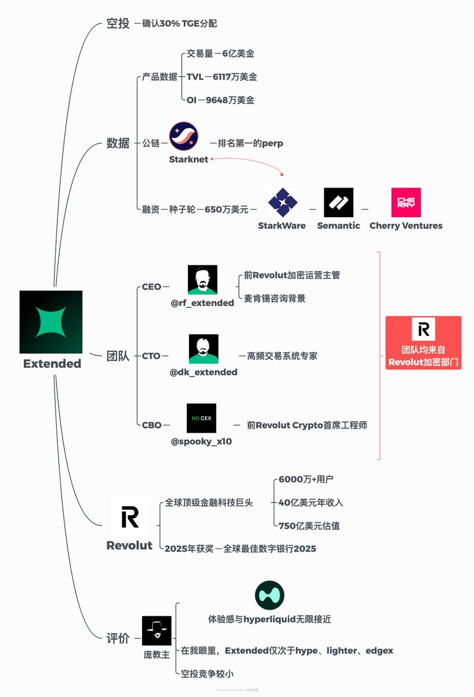

# Extended 永續合約交易所評析——Starknet 鏈的新興 Perp 王者

> **來源**: [@kiki520_eth](https://x.com/kiki520_eth/status/1975468591962333532) | [原文連結](https://app.extended.exchange/join/PANG)
>
> **日期**: 
>
> **標籤**: `永續合約` `Starknet 生態` `交易所體驗`

---

> **來源**: [@kiki520_eth (庞教主.edge🦭)](https://twitter.com/kiki520_eth)
> **標籤**: `perp` `Extended` `Starknet` `空投` `交易所`

---

## Extended 評析

鏈上 Perp 新王出現——Extended

我在押注完 hype、edgex 後，一直在尋找我心中最理想的 perp 競爭者，作為我下一個重點押注的項目，感謝老天爺，我找到了 Extended。

## 為何看好 Extended？

### 產品體驗

初次體驗 Extended，我找到了熟悉感，對，就是 hyperliquid，Extended 完美繼承了 hype 的用戶體驗。

我甚至認為它的體驗感超越了 lighter、edgex，跟 hype 一樣，Extended 體驗感與 CEX 無異。

很簡單，好的產品體驗才能吸引真正的交易用戶，而不是靠空投預期去吸引虛假交易，這是鏈上 PERP 產品必須面臨的問題。

### 團隊背景

核心團隊均來自 Revolut 加密部門。Revolut 是全球頂級金融科技巨頭，擁有：
- 6000 萬+ 用戶
- 40 億美元年收入
- 750 億美元估值

Extended 整個工程團隊都具備傳統金融撮合引擎和高頻交易經驗，這對鏈上 PERP 產品是至關重要的，比如 hyperliquid 的創始人 jeff 也是做市場背景。

### 公鏈視角

Extended 是 Starknet 鏈的第一 perp 產品，StarkWare 也參與了 Extended 種子輪融資的領投。

對，Starknet 鏈會把 Extended 作為核心生態項目去扶持的，Extended 已經是 Starknet 鏈排名第二的協議，可以說 Extended 將是 Starknet 鏈的主力招牌。

### 空投預期

明確了 30% TGE 分配，預期大概明年上半年 TGE，Extended 在華語區基本沒啥宣傳，非常的不捲，直接幹吧，我是力押這個項目的。

## 推薦碼福利

我用我那蹩腳的英文，跟項目方要了最高權限的聯盟會員，不是廣子哈，我都是實話實說。大家走我 Extended 鏈接註冊，我明牌說下好處：

1. **10% 的手續費自動折扣**，和 1.1 倍的空投積分加成
2. **我是最高聯盟會員**，我有 25% 的佣金，我都給你們，我不要
3. **我是 kol**，有一定的影響力，一旦各位在平台出現了什麼問題，我可以幫大家去對接官方團隊協助
4. **我與官方開始合作了**，後續可能會有獨家活動，因為我都是機翻英文，跟他們團隊溝通比較費勁，深度合作進度比較慢

也就是說，你走了我的鏈接註冊，可以獲得 35% 的費用優惠，以及 1.1 倍的空投積分加成。

我也說下我自己有啥好處，後面 Extended 爆發了，我流量就爆了，以及我能多一點積分，積分不是從你們身上扣，是聯盟會員的獎勵。

也包括後續我與官方的潛在合作活動，這個活動我現在還不敢打包票，英文太差了沒辦法影響溝通。
