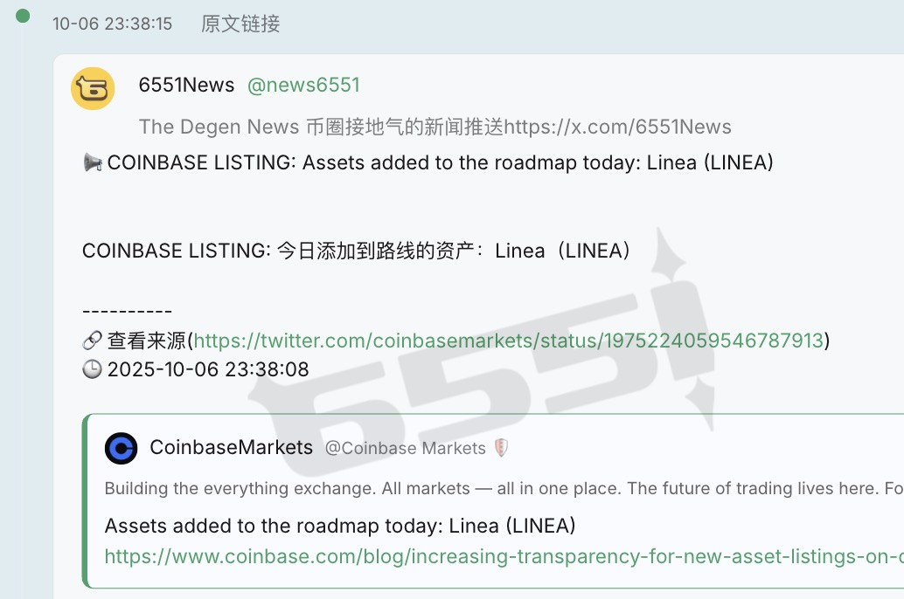
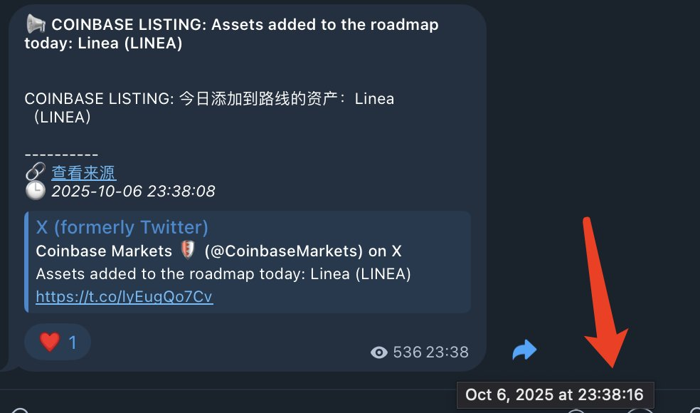

# 6551 Telegram 新聞監控面板：加快新聞交易速度

> **來源**: [@cryptoxiao](https://x.com/cryptoxiao/status/1975243330566135838) | [原文連結](https://6551.io/telegramMonitor)
>
> **日期**: Mon Oct 06 16:54:42 +0000 2025
>
> **標籤**: `新聞交易` `Telegram 監控` `交易工具`

---

> **來源**: [@cryptoxiao (Cryptoxiao)](https://twitter.com/cryptoxiao)
> **日期**: 2026-02-18
> **標籤**: `新聞交易` `Telegram` `交易工具` `6551`

---

## 簡介

教大家做新聞交易一個更快的方法（實測比 Telegram 客戶端快 1 秒）。

## 使用步驟

1. 打開 6551 的 Telegram 監控面板：https://t.co/ORZAUo8gji
2. 添加要監控的新聞源頻道，設置好分組
3. 等待推送

## 速度優勢

實測比 Telegram 客戶端快 1 秒，在新聞交易中這 1 秒的時間優勢可能帶來顯著的收益差異。
