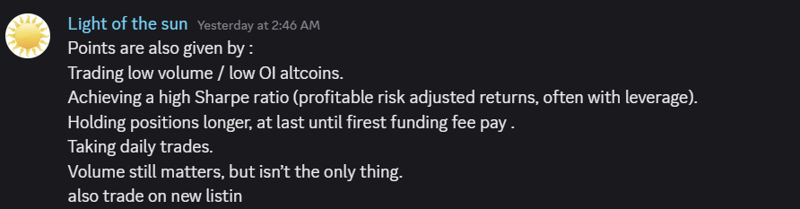

# Lighter 第二季積分策略與交易指南

> **來源**: [@Aravindxbt](https://x.com/Aravindxbt/status/1974850392262611394)
>
> **日期**: Sun Oct 05 14:53:19 +0000 2025
>
> **標籤**: `Lighter 積分` `OI 交易` `新幣上市`

---

## Lighter 第二季積分機制

> **來源**: [@Aravindxbt](https://twitter.com/Aravindxbt)  
> **日期**: 2024-10  
> **標籤**: `lighter` `積分策略` `perpetual` `空投挖礦`

---

## 官方確認的積分標準

Lighter 團隊確認的積分獲取標準如下：

1. **交易低 OI 幣種** - 選擇持倉量較低的交易對
2. **持倉時長** - 至少持有 1 小時以上，持倉時間很重要
3. **每日交易** - 保持日常交易活躍度
4. **交易新上架幣種** - 優先交易最新上架的幣種（目前最新為 $ZEC）
5. **夏普比率 + 交易量** - 兼顧風險調整後收益與交易量

## 個人策略

基於以上標準，建議採用以下策略：

- **產生交易量**：開幾筆高槓桿交易，每筆持有 1 小時以上
- **長期持倉**：低槓桿 + 低 OI + 新幣種交易，留倉過夜

## 第二季更新資訊

第一季已於週一正式結束，現在進入第二季。

### 第二季變更內容

1. **積分系統不變** - 每週交易，下週二獲得積分
2. **積分標準公開** - 團隊將提供如何賺取積分的提示（目前尚未公布）
3. **公開測試** - 不再是私人測試版，所有人都可使用
4. **現貨交易** - 預計 10 月底推出
5. **TGE 時間** - 預計 12 月

### 市場分析

如果 Lighter 團隊將第一季和第二季積分分開並給予不同權重，TGE 可能會非常混亂，因為預售市場上的積分已經在交易中。

**價格預期**：由於第二季積分可能權重較低，單點價格應該會下降（第一季高峰時超過 $50/點），現在大多數人會賣出的是第二季積分。

**行動建議**：時間不多了，該部署更多資金進場。

---

