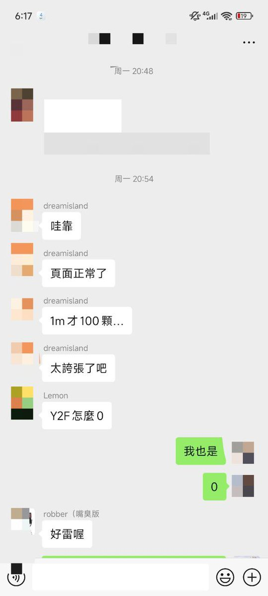
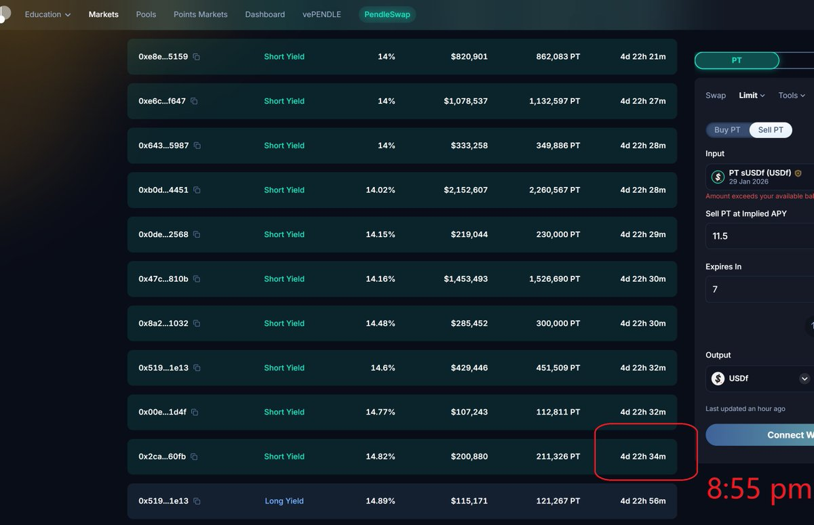
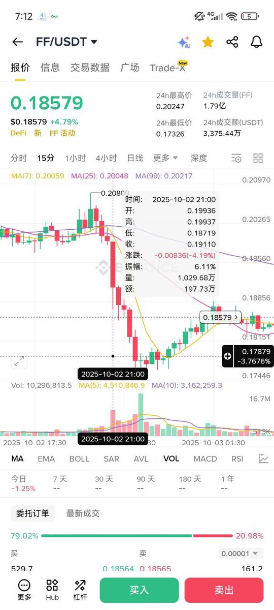

# Falcon Finance 空投套利機會復盤

> **來源**: [@LumaoDoggie](https://x.com/LumaoDoggie/status/1974445281153536404)
>
> **日期**: Sat Oct 04 12:03:33 +0000 2025
>
> **標籤**: `空投反撸` `Pendle YT 做空` `代幣解鎖拋壓`

---

## 背景

復盤上週錯過的兩個與 @falconfinance 代幣相關的套利機會。

## 套利機會一：做空 sUSDf 的 Pendle YT

### 事件經過

2024年9月29日晚上8:54左右（原定8pm），$FF 積分用戶開放查詢。

空投數量普遍反映只有預期的30%左右，社區很憤怒。事後證明項目方出爾反爾，原定的7%空投實際上只有2%。

因為明年一月到期的 sUSDf YT 價格，反映了大家對 Falcon 第二季的空投預期。在這種情況下，第二季空投顯然反擼概率大大增加。

一分鐘後，可以看到 sUSDf YT 密集賣出，從開始的 14.82%，兩小時後被砸到了 11.5%。

### 套利方法

**8:55的時候賣出你手裡的 YT**（如果已經有的話）。

如果沒有呢？這裡涉及一個 Pendle 的問題，Pendle 裡沒有辦法直接對 YT 開空。

我們只能買入 PT，但是 PT 是沒有槓桿的，資金效率比較低。

10000U 在 14.8% 買入，兩個小時後 11.5% 賣出，可以賺 100U，大概 1%。

**迂回辦法**：買入 PT 後，去 Euler 上抵押借入 USDf，再繼續循環買 PT。但是這在當時的 gas 下，循環一次估計 60U，已經逼近我們盈利了，所以並不適用。

### 經驗

1. 需要即時響應官方利好和利空消息，包括但不限於：官方宣布融資、被黑客攻擊、空投結果大毛/反擼
2. 你需要關注官方 DC、Twitter、潛水 DC 和用戶群，了解當前主流的預期
3. 考慮到各種磨損情況
4. 能夠根據主網擁堵程度，很快估算出 Pendle、Euler 等操作的 gas，也就是操作成本

當然，空投領取如果不在 ETH 主網一般就不會出現這種擁堵情況。

### 風險

1. 不熟悉操作，沒有考慮到磨損：gas、Pendle 池子深度 price impact、Euler 借款利息（循環貸的情況下）
2. 官方表示空投計算錯誤，後面給補上了，結果 YT 大漲。但這是小概率事件。

## 套利機會二：$FF 代幣解鎖拋壓 + 提前開空

### 第一個時間節點：10月2日晚上

前面說到，9月29日晚上 8:55 左右，55 積分空投實際開啟領取。

但是頁面誤導嚴重，很多人沒仔細看，選成了質押代幣（我估計20%的人選錯了）。

已質押的代幣 unstake，需要3天後才能領取。

於是我們可以合理預期，三天後也就是 **10月2日晚上 8:55-10點**，會有一個拋壓。之所以會持續到10點，因為有的人質押代幣這個動作可能比其他人晚一些，或者誤操作後，過了半個小時才發現怎麼提交解鎖。

因為這幾天整體還是處於做市方低價吸籌階段，這一個小時幣價忽然拉升的概率並不大。

這個消息，並不是官方的代幣解鎖週期，不被很多人知道，所以提前幣價波動 price in 的概率也不大。

**這個時候我們只要合約開空，就大概率可以賺一筆**。實際上幣安幣價走勢也印證了這一點：9點開啟的這個大陰線 10點結束。

### 第二個時間節點：10月10日

另外一個時間節點，很多人不知道的是，**10月10日還會有一批解鎖**，這次是 Kaito 嘴擼的 20% 部分，也就是 0.3% × 0.2% = 0.06% 的總代幣解鎖。

這個消息只有部分 Kaito 相關的人才會注意，也就是 Kaito 質押 + 嘴擼 top200 的人，不會超過500人，也算是一個小範圍消息。

根據目前幣價走勢，絕大部分人會直接賣掉。我猜測這個也是一個做空的好時機。

當然，具體幾點鐘領取，還要等官方進一步消息。

還有就是是不是提前預告。如果提前一天預告了，很多人會守著領取時間點，然後一起砸...效果更明顯。

如果沒有預告，可能有的人沒注意，第二天才來領取...抛壓就沒那麼集中。
