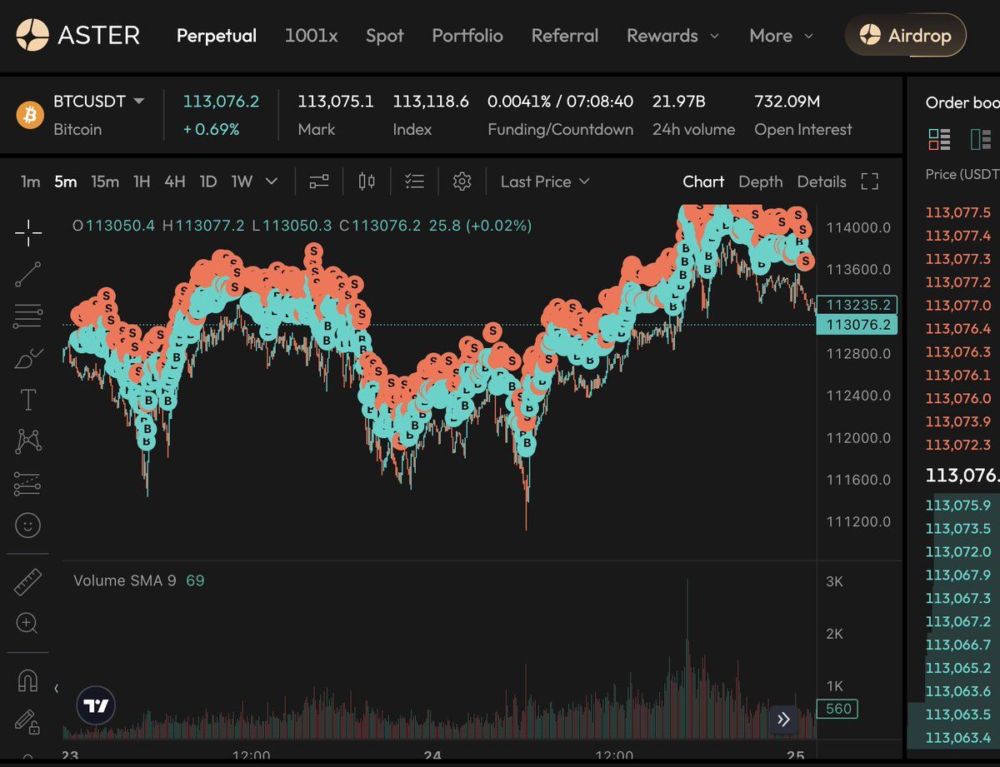

# DEX 開源網格交易腳本更新與多交易所支持

> **來源**: [@yourQuantGuy](https://x.com/yourQuantGuy/status/1971142704949051546) | [原文連結](https://pro.edgex.exchange/referral/QUANT)
>
> **日期**: 
>
> **標籤**: `網格交易` `量化策略` `交易所`

---

> **來源**: [@yourQuantGuy (Your Quant Guy)](https://twitter.com/yourQuantGuy)
> **日期**: 2025-02-18
> **標籤**: `DEX` `網格交易` `開源腳本` `做市` `刷量`

---

## 專案更新

自從兩週前開始開源後，目前腳本支援 4 個交易所，在接下來一週內會再增加 2-3 個其他交易所的支援。

## 支援交易所與返佣優惠

所有邀請連結提供全網最高的返佣和福利：

| 交易所 | 優惠內容 |
|--------|----------|
| **edgeX** | 永久享受 VIP 1 費率；10% 交易手續費返佣；10% 額外獎勵積分 |
| **Backpack** | 35% 交易手續費自動返佣 |
| **Paradex** | 10% 交易手續費返佣以及潛在未來福利 |
| **Aster** | 30% 交易手續費自動返佣 |

## 核心策略邏輯

腳本有很多參數可以調整，來適配你自己的風險偏好，但核心邏輯很簡單：

1. 用 maker 單掛單開倉
2. 開倉後馬上再掛單關倉，可以選擇掛單的價格來決定是磨損
3. 重複以上兩步

這個基礎的策略適用於目前支援的四個交易所。因為都是 maker only 的單子，所以相當於是在做市，基本排除了女巫的風險。

## Aster 暴力刷量策略

應群友的要求，另外單獨為 Aster 增加一個暴力刷量的策略。

**邏輯**：先掛單，成交後立馬市價單平倉

**特點**：
- 損耗在 0.025% 左右
- 因為是用市價單瞬間平倉，有被女巫的風險

## 風險提示

🚨 **這個策略不是中性策略**，本質上是一個以刷量為目的，從單向網格魔改的策略。

因為是單向網格，你需要自己選擇方向：

- **看多情況下**：在震盪或向上的市場中你都會有很高的交易量且可以有盈利
- **向下市場**：倉位會被套住有浮虧

## 聯絡方式

如果想要更詳細的腳本資訊或有任何問題，可以私信加入 Telegram 群組。群組永久免費，沒有設定公開只是為了防止詐騙和廣告。
