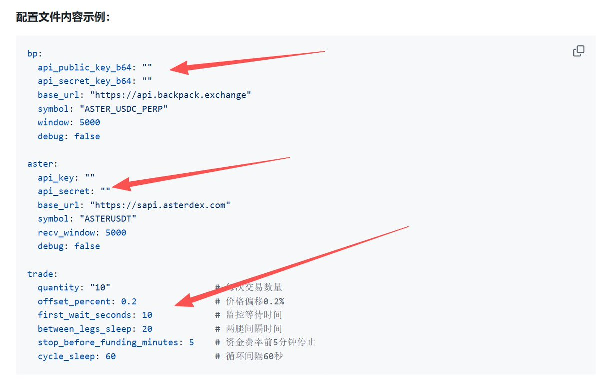
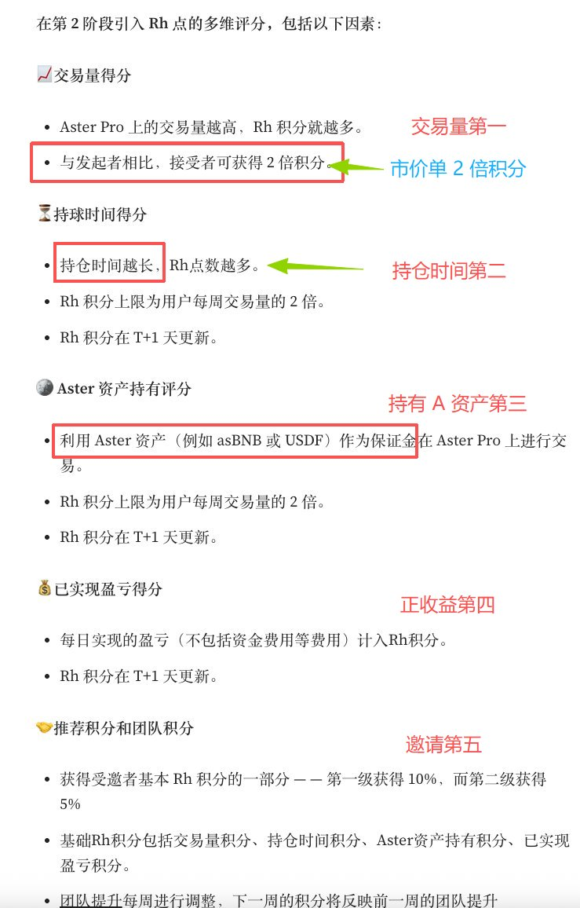

# Aster-Backpack 對沖交易機器人教程

> **來源**: [@ddazmon](https://x.com/ddazmon/status/1970524428758065228) | [原文連結](https://github.com/Dazmon00/aster-bp-bot)
>
> **日期**: 
>
> **標籤**: `對沖套利` `自動化交易` `ASTER空投`

---




★ Insight ─────────────────────────────────────
本文檔來自開源項目，涵蓋現貨與合約雙對沖策略
- 作者是專業工具開發者，提供完整的 Python 自動化腳本
- 核心亮點：BP 限價 + Aster 市價的雙交易所對沖，可吃 2 倍積分
─────────────────────────────────────────────────

---

> **來源**: [@ddazmon (Dazmon💢)](https://twitter.com/ddazmon)  
> **日期**: 2025-02-18  
> **標籤**: `Aster` `Backpack` `對沖機器人` `套利` `量化交易`

---

## 背景分析

Aster 二期空投釋出 **4% 代幣（5 億美金）**，交易量直接登頂，單日突破 60 億美金。雖然份額是一期的一半，但參與人數暴增 30 倍以上，競爭極度激烈。

### 關鍵風險

1. **時間週期**：二期空投從 9/8 開始持續 4 週至 10/5，但實際可刷可能僅剩 2 週（每週 1%）
2. **解鎖不確定性**：領取時間不明確（可能分批解鎖），參考 Hyperliquid 二期已持續一年仍未發放
3. **極度內卷**：參與人數激增但代幣份額減半，單位產出大幅稀釋

### 正面因素

- **幣安背書**：Aster 由幣安親自打造，目標對標並超越 Hyperliquid
- **產品實力**：幣安的研發與運營能力極強，長期潛力值得期待
- **高盈虧比**：雖然卷度高，但空投獵人仍處於食物鏈頂層

---

## 對沖策略工具

GitHub 開源項目：[Dazmon00/aster-bp-bot](https://github.com/Dazmon00/aster-bp-bot)

### 核心思路

透過 **Backpack 與 Aster 雙交易所對沖**，降低市場風險同時賺取積分：

- **BP 限價單 + Aster 市價單** → 市價單可吃 **2 倍積分**
- **自動監控訂單**：限價單 10 秒內未成交自動重掛
- **資金費率管理**：費率結算前 5 分鐘自動停止交易

---

## 兩種對沖方案

### 方案一：現貨對沖（現貨 vs 現貨）

| 步驟 | BP 操作 | Aster 操作 | 等待時間 |
|------|---------|-----------|----------|
| 第一腿 | 限價做空 ASTER (+0.2%) | 市價買入 ASTER 對沖 | 20 秒 |
| 第二腿 | 限價做多 ASTER (-0.2%) | 市價賣出 ASTER 對沖 | 60 秒循環 |

**配置文件**：`config/hedge.yaml`

```yaml
bp:
  api_public_key_b64: ""
  api_secret_key_b64: ""
  base_url: "https://api.backpack.exchange"
  symbol: "ASTER_USDC_PERP"
  
aster:
  api_key: ""
  api_secret: ""
  base_url: "https://sapi.asterdex.com"  # 現貨 API
  symbol: "ASTERUSDT"
  
trade:
  quantity: "10"                         # 每次交易數量
  offset_percent: 0.2                    # 價格偏移 0.2%
  first_wait_seconds: 10                 # 監控等待時間
  between_legs_sleep: 20                 # 兩腿間隔 20 秒
  stop_before_funding_minutes: 5         # 資金費率前 5 分鐘停止
  cycle_sleep: 60                        # 循環間隔 60 秒
```

**啟動指令**：
```bash
python scripts/hedge_bp_aster_loop.py config/hedge.yaml
```

---

### 方案二：合約對沖（現貨 vs 合約）**【推薦】**

| 步驟 | BP 操作 | Aster 操作 | 等待時間 |
|------|---------|-----------|----------|
| 第一腿 | 限價做空 ASTER (+0.2%) | 合約市價做多 ASTER | 60 秒 |
| 第二腿 | 限價做多 ASTER (-0.2%) | 合約市價做空 ASTER | 60 秒循環 |

**為何推薦合約對沖？**

1. **資金費率收益**：每 8 小時（00:00/08:00/16:00 UTC）可額外收取資金費率
2. **更好的流動性**：合約市場深度更佳，滑點更低
3. **更精確對沖**：不受現貨餘額限制，可精確控制倉位
4. **更低成本**：合約手續費通常低於現貨

**配置文件**：`config/hedge_futures.yaml`

```yaml
bp:
  api_public_key_b64: ""
  api_secret_key_b64: ""
  base_url: "https://api.backpack.exchange"
  symbol: "ASTER_USDC_PERP"
  
aster:
  api_key: ""
  api_secret: ""
  base_url: "https://fapi.asterdex.com"  # 合約 API
  symbol: "ASTERUSDT"
  
trade:
  quantity: "10"
  offset_percent: 0.2
  first_wait_seconds: 10
  between_legs_sleep: 60                 # 合約建議 60 秒
  stop_before_funding_minutes: 5
  cycle_sleep: 60
```

**啟動指令**：
```bash
python scripts/hedge_bp_aster_futures_loop.py config/hedge_futures.yaml
```

---

## 快速部署流程

### 第一步：環境準備

```bash
# 1. 克隆項目
git clone <repository-url>
cd aster-bp-bot

# 2. 創建虛擬環境
python -m venv .venv

# 3. 激活虛擬環境
# Windows: .venv\Scripts\activate
# Mac/Linux: source .venv/bin/activate

# 4. 安裝依賴
pip install -r requirements.txt
```

### 第二步：獲取 API 密鑰

#### Backpack 交易所

1. 訪問 [Backpack Exchange](https://backpack.exchange)
2. 進入 **Settings → API Keys**
3. 點擊 **Create New Key**，啟用 **Trading** 權限
4. 複製 **Public Key** 和 **Secret Key**（base64 格式）

#### Aster 交易所

1. 訪問 [Aster Exchange](https://aster.exchange)
2. 進入 **API Management**
3. 創建 API Key，根據需求選擇：
   - **現貨對沖**：啟用 Spot Trading
   - **合約對沖**：啟用 Futures Trading（推薦）
4. 複製 **API Key** 和 **Secret Key**

### 第三步：配置機器人

```bash
# 現貨對沖
cp config/hedge.example.yaml config/hedge.yaml
nano config/hedge.yaml  # 填入 API 密鑰

# 合約對沖（推薦）
cp config/hedge_futures.example.yaml config/hedge_futures.yaml
nano config/hedge_futures.yaml  # 填入 API 密鑰
```

### 第四步：小額測試

**建議首次運行參數**：

```yaml
trade:
  quantity: "5"          # 先用 5 個測試
  offset_percent: 0.1    # 降低價格偏移
  cycle_sleep: 120       # 增加循環間隔
```

**啟動後觀察日誌**：

```
[Cycle 1] 開始新一輪對沖策略
[Cycle 1] 距離資金費率時間 16:00 UTC 還有 120 分鐘
[Leg1] BP 限價做空價: 0.1236 (基於最新價 0.1234)
[Leg1] 開始監控 BP 做空訂單 12345，將持續監控直到成交...
[Leg1] BP 做空訂單 12345 已成交！總耗時 3 秒
[Leg1] BP 做空已成交，ASTER 市價買入對沖...
休眠 20 秒...
[Leg2] BP 限價做多價: 0.1232 (基於最新價 0.1234)
[Leg2] BP 做多訂單 12346 已成交！總耗時 2 秒
[Leg2] BP 做多已成交，ASTER 市價賣出對沖...
[Cycle 1] 完成，等待 60 秒後開始下一輪...
```

---

## 配置參數詳解

| 參數 | 說明 | 現貨建議值 | 合約建議值 | 注意事項 |
|------|------|------------|------------|----------|
| `quantity` | 每次交易數量 | 5-50 | 5-50 | 根據資金量調整 |
| `offset_percent` | 價格偏移百分比 | 0.1-0.5 | 0.1-0.5 | 太小不成交，太大利潤少 |
| `stop_before_funding_minutes` | 資金費率前停止時間 | 3-10 | 3-10 | 確保能吃到資金費率 |
| `cycle_sleep` | 循環間隔秒數 | 60-300 | 60-300 | 避免過於頻繁交易 |
| `between_legs_sleep` | 兩腿間隔時間 | 20-60 秒 | 60-120 秒 | 合約建議更長 |
| `debug` | 調試模式 | false | false | 生產環境關閉 |

---

## 拿分技巧

根據 Aster 官方文檔，以下策略可最大化積分：

1. **市價單優先**：市價單積分是限價單的 **2 倍** → Aster 用市價單
2. **持仓時間加權**：持有倉位時間越長權重越高 → 合約對沖可長期持倉
3. **資產權重**：使用 **USDF** 或 **asBNB** 作為保證金權重更高（注意贖回有 0.1% 手續費）
4. **盈利加權**：盈利單子權重更高，虧損不額外給分 → 對沖策略天然盈虧平衡
5. **邀請返利**：邀請他人可獲得 10% 積分，使用高返佣鏈接可省手續費

**返佣推薦**（原推文提到）：
- Backpack：40% 返現
- Aster：30% 返現

---

## 常見問題排查

### API 密鑰錯誤

```
HTTP 401: Unauthorized
```

**解決方案**：
1. 檢查 API 密鑰是否正確複製（無空格、無換行）
2. 確認 API 權限包含 **Trading** 權限
3. 檢查密鑰是否過期

### 訂單查詢 404

```
HTTP 404: RESOURCE_NOT_FOUND
```

**說明**：這是正常現象，表示訂單已成交，機器人會自動處理。

### 網絡連接問題

```
requests.exceptions.ConnectionError
```

**解決方案**：
1. 檢查網絡連接
2. 確認防火墻設置
3. 嘗試使用 VPN

### 交易對不存在

```
無法獲取最新價格
```

**解決方案**：
1. 檢查交易對符號是否正確（`ASTER_USDC_PERP` / `ASTERUSDT`）
2. 確認交易對在交易所存在
3. 檢查 API 權限

---

## 最佳實踐

### 資金管理

- 建議使用總資金的 **10-20%** 進行對沖
- 保持兩個交易所帳戶有足夠餘額
- 定期檢查帳戶餘額，避免爆倉

### 風險控制

- **從小額開始測試**（5-10 個 ASTER）
- 設置合理的價格偏移（0.1-0.2%）
- **啟用調試模式**觀察運行狀態：

```yaml
bp:
  debug: true   # 啟用 BP 調試日誌
aster:
  debug: true   # 啟用 Aster 調試日誌
```

### 參數調優

- **根據市場波動調整價格偏移**：波動大時可提高到 0.3-0.5%
- **根據流動性調整交易量**：深度不足時減少單次交易量
- **根據網絡狀況調整等待時間**：網絡延遲高時增加 `first_wait_seconds`

---

## 停止運行

按 `Ctrl+C` 停止機器人運行。

---

## 總結與風險提示

### 核心優勢

1. **開源透明**：代碼完全開源，可自行審計
2. **自動化對沖**：無需手動操作，降低人為失誤
3. **資金費率收益**：合約對沖可額外賺取資金費率
4. **智能重掛**：限價單未成交自動重新掛單，提高成交率

### 重要警告

⚠️ **加密貨幣交易存在高風險**，請務必：

1. **小額測試**：先用少量資金驗證策略有效性
2. **理解機制**：充分了解合約交易、資金費率、爆倉機制
3. **監控運行**：定期檢查日誌，避免異常損失
4. **控制倉位**：不要使用全部資金，保留應急儲備

**合約交易風險更高**，請確保充分理解合約交易機制後再使用。
