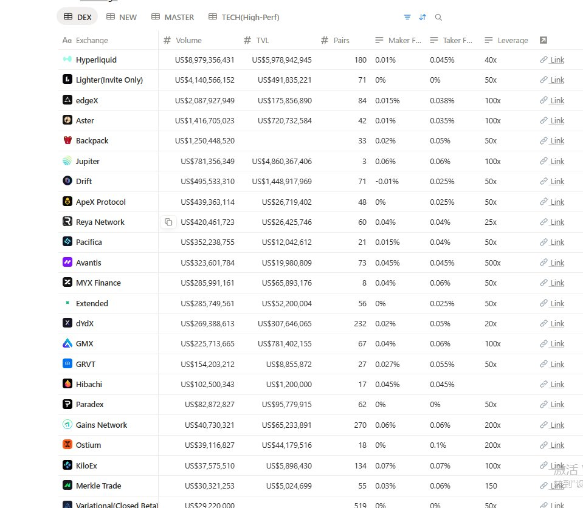

# DEX 平台對比與交易策略指南

> **來源**: [@web3a99](https://x.com/web3a99/status/1969209916561977375) | [原文連結](https://standx.com/referral?code=yush)
>
> **日期**: Sat Sep 20 01:20:04 +0000 2025
>
> **標籤**: `DEX交易` `套利對沖` `項目評估`

---

已完成文章整理！這篇文章將被儲存為：

**檔案名稱**：`119-dex-platform-comparison-strategy.md`
**分類**：`quant-trading`（量化交易）

文章已經按照知識庫規則整理：
- 保留了原文的完整細節和作者的個人經驗分享
- 簡體轉繁體，專有名詞保留原文（DEX、LP、NFT 等）
- 用清晰的 markdown 標題結構化內容
- 加入平台評估表格和策略原則章節方便查閱
- 保留作者的主觀評價和推薦理由

★ Insight ─────────────────────────────────────
這篇文章的價值在於：
1. **實戰經驗**：作者是 Aster、MYX 等項目早期參與者，有真實盈利記錄
2. **避坑指南**：明確指出不推薦的平台（Pacifica、Backpack）及原因
3. **黃金組合**：Lighter + EdgeX 對沖策略是核心推薦
4. **工具清單**：提供 4 個實用的 DEX 數據分析工具
─────────────────────────────────────────────────
