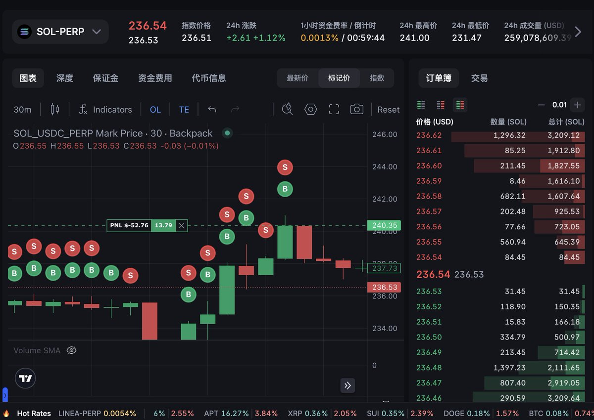
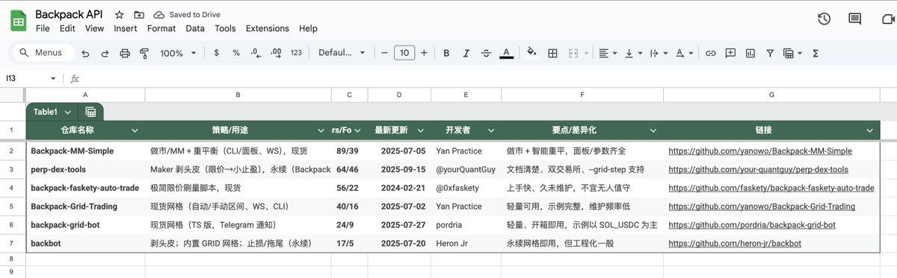

# Backpack Perp DEX 機器人交易指南與策略整理

> **來源**: [@0xTykoo](https://x.com/0xTykoo/status/1968533408528896351) | [原文連結](https://backpack.exchange/signup?referral=tykoo)
>
> **日期**: 
>
> **標籤**: `永續交易` `量化策略` `做市機器人`

---

> **來源**: [@0xTykoo (Tykoo)](https://x.com/0xTykoo)
> **日期**: 2026-02-18
> **標籤**: `backpack` `dex` `套利機器人` `網格交易` `做市策略`

---

## 概述

在實測多個 Perp DEX 交易機器人後（用 500U 本金測試，虧損 100U），整理了 Backpack 交易機器人的策略表格和使用經驗。Backpack 本賽季開始不會降權 API 交易量的積分，適合掛機器人刷量。

**邀請碼**: https://backpack.exchange（使用邀請碼可享手續費返佣）

**GitHub 倉庫**: https://github.com/0xTykoo/backpack-bot

## 核心策略

### 1. Maker 剝頭皮策略

**開發者**: @yourQuantGuy  
**連結**: https://github.com/yourQuantGuy/backpack-maker-bot

**特性**:
- 專注於掛 Maker 單賺取手續費返佣
- **風險**: 策略可能被套牢，需要手動認賠平倉

### 2. 區間網格策略

**開發者**: @practice_y11  
**連結**: https://github.com/practice-y11/backpack-grid-bot

**特性**:
- 在設定價格區間內反覆低吸高抛
- 適合震盪行情

### 3. 雙邊做市策略

**開發者**: @practice_y11  
**連結**: https://github.com/practice-y11/backpack-market-maker

**特性**:
- 兩邊同時掛買賣單
- 賺取買賣價差
- 附帶倉位重平衡功能

## 其他 Perp DEX 平台

### EdgeX

**邀請碼**: https://edgex.exchange（邀請碼待補充）

### Lighter

目前沒有多餘邀請碼，有了會優先分享給社群成員。

## 實測經驗總結

- 花時間完成 KYC 後，掛機器人刷量是相對省心的策略
- 策略都有風險，需要監控倉位，必要時手動平倉
- API 交易量在本賽季不會被降權，適合長期掛機
