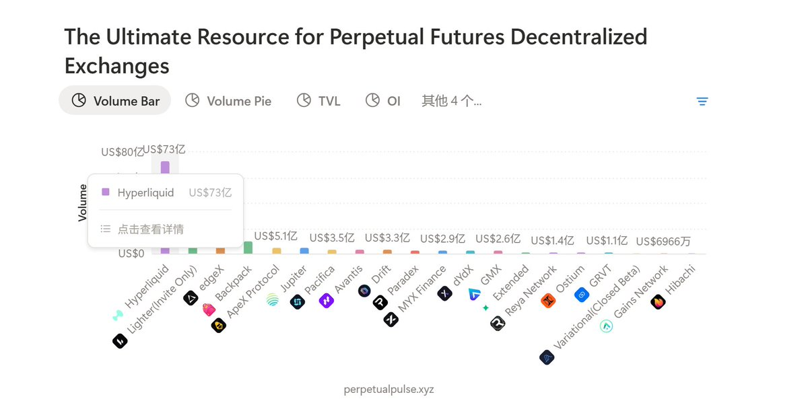

# Perp DEX 平台對比指南 — 七大交易所積分規則與盈利策略

> **來源**: [@0xKaKa03](https://x.com/0xKaKa03/status/1968371037441245564)
>
> **日期**: Wed Sep 17 17:46:40 +0000 2025
>
> **標籤**: `Perp DEX` `積分農耕` `高頻交易`

---

## 平台對比總覽

最近 perp dex 非常 fomo，噪音太多了，整理了一些相關資訊供參考，包括 TGE 時間、積分規則、費率、特點等：

## 1. edgeX (@edgeX_exchange)

算是近期最火的一個，協議收入高，專案方格局大，昨天故障給了 120% 超額賠償。

**TGE 預期**：Q4

**費率**：
- 走大使的連結註冊自帶 VIP1
- Maker 是萬分之 1.3 的費率
- Taker 是萬分之 3.6 的費率

**積分規則**：
- 積分規則明確，交易量和金庫存錢占大部分
- 目前 8 萬交易量一分
- 新手任務第一次完成額外一分
- 有一定金庫額度的每週保底多一分（基本都有）

## 2. paradex (@paradex)

中文區推廣少，英文區比較 fomo。

**TGE 預期**：有聲音說在下個月/Q4，最晚在明年 1 月（官方表示 s2 賽季最多延期 6 個月，時間成熟時可能提前 TGE）

**費率**：
- 自昨天起，web 端為 0 費率
- API 的 maker 為 0 費率，taker 為萬分之 2 的費率
- 深度很好，利好手動交易者

**積分規則**：
- 半黑盒的積分機制，給了部分規則
- 鼓勵提供流動性、持倉、支付手續費、存金庫、全天候交易
- 被清算同樣可以獲得積分
- 聲稱有創新的防女巫機制，鼓勵綁定推特帳戶以及禁止自推薦

## 3. based app (@BasedOneX)

這個比較特殊，屬於是 hyperliquid 的經銷商，前端是自己搭的後端就是 hyperliquid，定位是「a crypto trading and spending platform」，即做 perp dex 也做 visa 卡還幹類似 launchpad 的活。

同樣是中文圈沒推廣，相對早期，月初剛獲得了 ethena 的融資，目前交易量非常高，24 小時交易量已經占了 hyperliquid 的 20%。

**費率**：
- 很高，基礎帳戶 taker 萬分之 4.5，maker 萬分之 1.5
- 但是返傭可以返 76%，算下來後好很多

**積分規則**：
- 除了平台的空投預期，每月額外空投其他代幣
- 目前第二期進行中，這一期的空投快照截止 21 號，想參與的不要錯過

**特點**：理論上在上面交易跟在 hyperliquid 完全一樣，還能額外得積分，這也是 based 交易量增長如此迅猛的原因之一。

## 4. lighter (@Lighter_xyz)

據傳 33u 一分的場外炒得沸沸揚揚。

**TGE 預期**：Q4

**費率**：
- 普通 API 0 費率，但是吃單延遲 300ms，掛單延遲 200ms
- 無延遲的 api 接口 maker 費率萬分之 0.2，taker 費率萬分之 2

**積分規則**：
- 黑盒，對純刷交易量的權重很低
- Taker 類型的訂單權重很低
- 有很多人採用爆倉流打法，據說分數高

## 5. backpack (@Backpack)

當 perp dex 一起看吧，這個大家太熟悉了不再介紹。只提一點，s3 提高了交易量權重，對小資金更友好了。

**TGE 預期**：明年初

## 6. standX (@StandX_Official)

還在提交白名單的階段，不管看不看好早期的積分成本和性價比都是遠小於末期的。

## 7. astro (@astros_ag)

sui 生態的新 perp dex，sui 生態好像啥都來湊活但是從來沒跑贏過，不過鑑於早期還是值得看看。

## 個人看法

今天的 Aster 開了個好頭，6 月份我在最 fomo 的時候腳本刷了幾個號，基本都拿到了將近 1000% 的 ROI（感謝單機幣拉盤），關注 perp dex 的原因是短期的盈虧比很好：

1. **發幣預期集中在 Q4**，不出大問題的話到時市場熱度不會太差

2. **時間窗口適中**：發幣時間不會太遠一直占用資金，也不會太近導致所有人不顧成本硬卷積分，時間挺舒服

3. **小資金友好**：因為基本都是刷交易量的打法，對小資金相當友好，跑一些高頻策略有小馬拉大車的效果，1000u 能跑出超 10M 的交易量

4. **成本優勢**：大部隊的成本都在 maker 檔費率硬刷的成本線之上，能夠略微優化一些成本就不太會反擼，問題只在於能賺多少

雖然長期不認為這些 perp dex 能活下來，但是不影響我覺得短期可以參與，DYOR。
